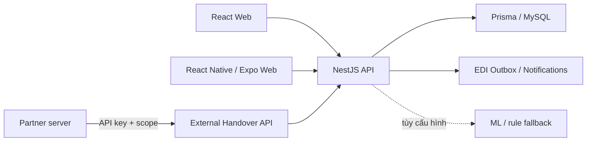
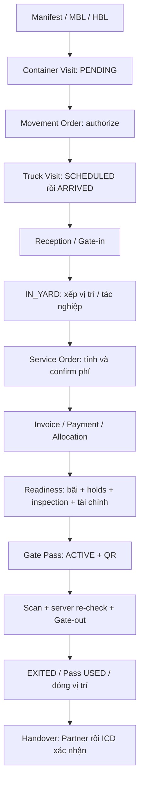
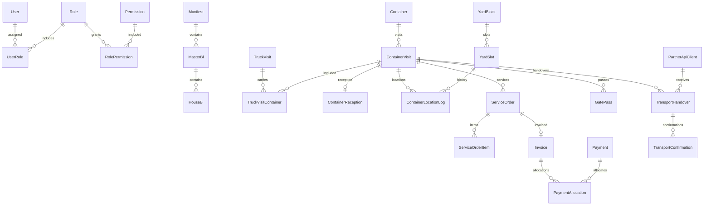

# ICD Management System - Tài liệu tổng hợp hệ thống

**Cập nhật: 04/10/2026.** Phạm vi là working tree hiện tại của monorepo `icd-management`: Web, Mobile, Backend, Prisma/MySQL và RBAC. Các bản dựng ngoài monorepo không được tính. README này thay mô tả skeleton cũ: hệ thống hiện có mã triển khai và kết nối API thật.

Số lượng màn hình, route/model là thống kê cấu trúc nguồn, không đồng nghĩa mọi chức năng đã nghiệm thu end-to-end. Trạng thái triển khai, contract và giới hạn kiểm chứng được phân biệt trong tài liệu.

## Mục lục

1. [Tổng quan](#1-tổng-quan)
2. [Kiến trúc và khởi động](#2-kiến-trúc-và-khởi-động)
3. [Nghiệp vụ xuyên suốt](#3-nghiệp-vụ-xuyên-suốt)
4. [Chức năng Web](#4-chức-năng-web)
5. [Chức năng Mobile](#5-chức-năng-mobile)
6. [Phân quyền](#6-phân-quyền)
7. [API và JSON](#7-api-và-json)
8. [Ví dụ payload JSON](#8-ví-dụ-payload-json)
9. [Database](#9-database)
10. [Kiểm chứng và bảo trì tài liệu](#10-kiểm-chứng-và-bảo-trì-tài-liệu)
11. [Danh mục đầy đủ API, DTO, database, permission và frontend](#11-danh-mục-đầy-đủ)

## 1. Tổng quan

ICD quản lý vòng đời container từ hồ sơ hàng hóa, lệnh vận chuyển, tiếp nhận cổng, vị trí bãi, dịch vụ và thanh toán tới phiếu ra cổng, bàn giao và tích hợp đối tác.

| Hạng mục | Số lượng | Phương pháp |
|---|---:|---|
| Nhóm API có endpoint | 22 | Nhóm theo thư mục module; roles gồm permission catalog |
| Nest module nội bộ trong cây đăng ký | 25 | Từ AppModule; gồm module gốc, Prisma và request context |
| Controller được đăng ký | 38 | Theo `@Module`; không cộng controller legacy chưa đăng ký |
| Endpoint HTTP | 205 | Cặp method + path có prefix `/api` |
| Tab điều hướng Web | 18 | Navigation và permission mapping |
| File Web `*View.tsx` | 18 | Gồm login; view đối tác dùng cho hai tab |
| File Mobile `*Screen.tsx` | 17 | Không cộng dialog, component và navigator |
| Tab Mobile có thể đăng ký | 6 | Tùy role/quyền; không phải tài khoản nào cũng thấy đủ |
| Prisma model / bảng nghiệp vụ | 53 | Schema hiện tại |
| Enum Prisma | 41 | Giá trị đầy đủ ở mục 11 |
| Role chuẩn / permission catalog | 7 / 56 | Seed ứng dụng, không tính role thử nghiệm |
| DTO class | 119 | Gồm DTO endpoint, lớp lồng/kế thừa và lớp còn trong source |

Nguồn máy đọc được: [system-inventory.json](docs/system/system-inventory.json), có source file:line và SHA-256. Snapshot DB riêng: [database-test-snapshot.json](docs/system/database-test-snapshot.json).

## 2. Kiến trúc và khởi động

### 2.1. Cấu trúc và stack

```text
apps/api/                 NestJS, DTO, guard, service, policy, Prisma
apps/web/                 React Web dành cho nghiệp vụ văn phòng/vận hành
apps/mobile/              React Native/Expo dành cho hiện trường
packages/api-client/      Client API dùng chung
packages/shared-types/    Kiểu dữ liệu dùng chung
packages/validation/      Tiện ích validation
services/ml-service/      Khung ML, không thuộc BAT mặc định
infra/mysql/              Hạ tầng MySQL
docs/business/            Đặc tả Business, Web, Mobile v1.7
docs/api/                 Contract và Partner API Spec
docs/system/              Inventory và snapshot thống kê
scripts/                  Khởi động và công cụ hỗ trợ
audit/                    Báo cáo, coverage, kết quả và bằng chứng
start-icd.bat              Khởi động Windows
```

| Thành phần | Dependency khai báo hiện tại |
|---|---|
| Backend | NestJS `12.0.3`, TypeScript, JWT, Swagger, class-validator/class-transformer, throttler |
| Database | MySQL 8/InnoDB; Prisma Client/CLI `7.10.0`, adapter MariaDB |
| Web | React `19.2.3`, Vite `^6.2.0`, Tailwind `^4.0.9`, Router `^7.3.0`, AppContext, TS `~5.9.3` |
| Mobile | RN `0.86.3`, React `19.2.3`, Expo `~57.0.18`, React Navigation 7, StyleSheet/theme nội bộ |
| Mobile thiết bị/storage | Camera, Image Picker, DateTimePicker, SecureStore, AsyncStorage |
| Workspace | pnpm `10.5.2`, Node root package `>=22.22.3` |

`^`/`~` là range khai báo, không khẳng định binary đang chạy đúng phiên bản cụ thể. Dependency hiện tại không dùng Tamagui.



### 2.2. Khởi động

Nhấp đúp [start-icd.bat](start-icd.bat), hoặc `Khoi-dong-ICD.bat` trong thư mục cha. Mặc định là môi trường **Audit/test cô lập**.

| Chế độ | Database | MySQL | API | Web | Mobile Expo Web |
|---|---|---:|---|---|---|
| Audit | `icd_ux_audit_20261003_e2e` | 3308 | `http://127.0.0.1:3001/api` | `http://127.0.0.1:5174` | `http://127.0.0.1:8081` |
| Local | `icd_management` | 3307 | `http://127.0.0.1:3000/api` | `http://127.0.0.1:5173` | `http://127.0.0.1:8081` |

```bat
start-icd.bat
start-icd.bat -Check
start-icd.bat -NoBrowser
start-icd.bat -Mode Local
```

BAT kiểm prerequisite, chờ API readiness rồi mở frontend, tái sử dụng đúng process và từ chối port/target xung đột. Không tự install, seed, reset hay migration. Cần dependency/database đã chuẩn bị; Audit cần cấu hình private của run. Mobile chung port 8081 nên cần đóng Metro cũ nếu đổi sang API target khác.

Hướng dẫn: [scripts/README.md](scripts/README.md). Log: `logs/launcher/`. Biến URL API: Web `VITE_API_URL`, Mobile `EXPO_PUBLIC_API_BASE_URL`. Expo Web là bản trình duyệt của app RN, khác với native Expo Go.

Runtime chuẩn có Swagger `/api/docs` và JSON `/api/docs-json` khi cấu hình bật Swagger trong [main.ts](apps/api/src/main.ts). Không tính hai route hạ tầng này vào 205 endpoint controller. Audit server dùng bootstrap test riêng; khả năng mở Swagger phải kiểm ở runtime đó.

## 3. Nghiệp vụ xuyên suốt



| Nghiệp vụ | Đầu vào / thao tác | Kết quả | Backend sở hữu |
|---|---|---|---|
| Hồ sơ | Manifest/MBL/HBL, nộp/hủy | Hồ sơ hàng hóa và liên kết | manifests |
| Container | Đăng ký visit, ISO/size/type, B/L, seal/weight; sửa/hủy | Một vòng đời và event | containers |
| Lệnh | Tạo, authorize, hạn hiệu lực, hủy | Điều kiện vận chuyển về ICD | movement-orders |
| Chuyến xe | Biển số/tài xế/transporter, container, arrive/cancel | Chuyến vật lý và liên kết container | truck-visits |
| Gate-in | Context, chuyến đủ điều kiện, seal/weight/tình trạng | Reception; visit IN_YARD; lịch sử | gate-in |
| Xếp bãi | Slot, check hợp lệ, assign | Vị trí canonical và location log | yard |
| Đảo chuyển | Request/start/complete/cancel | Movement và cập nhật vị trí | yard |
| Giám định | Loại kiểm tra/notes, PASS/FAIL/HOLD | Inspection và ảnh hưởng readiness | yard |
| Booking | STRIPPING/STUFFING/INSPECTION, lịch và thực tế | Booking và trạng thái tác nghiệp | yard |
| Cước | Tariff/rule, preview/create/recalculate/confirm/cancel | Order và các dòng phí | billing |
| Hóa đơn/tiền | Issue invoice, ghi payment/phân bổ | Invoice, Payment, Allocation, số dư | billing |
| Hold | Đặt/gỡ giữ và lý do | Blocker, người thao tác và audit | operational-holds |
| Gate Pass | Readiness, cấp/hủy, QR/hạn dùng | Phiếu đủ điều kiện xuất cổng | gate-pass |
| Gate-out | Scan token, xác nhận visit | EXITED, pass USED, đóng vị trí | gate-out |
| Bàn giao | Tạo/publish, Partner accept/transit/POD, ICD confirm/dispute | Lifecycle bàn giao độc lập | partner-handover |
| Điều phối/báo cáo | Queue theo quyền/SLA; bãi/cổng/tài chính | Projection từ nguồn nghiệp vụ | work-queue, reports |
| Tích hợp/truy vết | EDI route/outbox/ACK/alert, notification, audit | Trạng thái tích hợp và phục hồi | edi, notifications, audit |

- Container là thực thể; ContainerVisit là một lần lưu chuyển. ID visit, mã container và ID chuyến xe không hoán đổi.
- Gate-in có thể tạo trạng thái IN_YARD trước khi có slot; Queue YARD_ASSIGN/readiness phân biệt thiếu vị trí.
- Backend quyết định state, quyền, readiness, tài chính và validation cuối cùng. UI chỉ hiển thị hoàn thành sau server xác nhận.
- Readiness kiểm state/vị trí, tác nghiệp active, inspection HOLD, operational HOLD và billing, không chỉ “đã thanh toán”. Gate-out re-check điều kiện; QR hết hạn/đã dùng/hủy không tái sử dụng.
- Partner không sửa core Gate/Yard/Billing qua external API. EDI/email/push failure được theo dõi/retry, không coi là lý do rollback giao dịch cổng core đã hoàn tất.
- Map cảng là khung demo với block/slot/container backend. UI tối ưu xếp vị trí tiếp tục ghi **“Đang trong quá trình phát triển”**.

Nguồn: [Business Spec](docs/business/ICD_Business_Spec_v1.7_MySQL.md), [RULES](RULES.md), service/policy của từng module.

## 4. Chức năng Web

URL `/app/<tab>`. Context: visitId/handoverId/gatePassId/truckVisitId/action=create. Mở tab dùng OR giữa permission trong mapping; command kiểm riêng và backend kiểm lại.

| Tab | Chức năng trong source | API / dữ liệu | Component |
|---|---|---|---|
| dashboard | KPI, shortcut container/cổng/bãi/tài chính/bàn giao | Collection đọc API theo quyền; cấu hình free-day từ reports summary | [DashboardView](apps/web/src/components/DashboardView.tsx) |
| work-queue | Lọc loại/ưu tiên, mở context task | containers/work-queue | [WorkQueueView](apps/web/src/components/WorkQueueView.tsx) |
| manifests | List/detail, create/submit/cancel, MBL/HBL | manifests và nested B/L | [ManifestsView](apps/web/src/components/ManifestsView.tsx) |
| containers | Container360, create/update/cancel, liên kết lệnh/phí/Hold/pass/handover | containers/events/holds/passes và collections | [ContainersView](apps/web/src/components/ContainersView.tsx) |
| movement-orders | Create/authorize/cancel, hạn và trạng thái | movement-orders | [MovementOrdersView](apps/web/src/components/MovementOrdersView.tsx) |
| truck-visits | Tạo chuyến, chọn container, arrive/cancel | gate/truck-visits | [TruckVisitsView](apps/web/src/components/TruckVisitsView.tsx) |
| gate-in | Context/chọn chuyến, seal/weight/condition, tiếp nhận | gate-in-context/gate-in/reception | [GateInView](apps/web/src/components/GateInView.tsx) |
| yard | Map/Legend/slot detail, block/slot, xếp tay, movement/inspection/booking | yard/*, inspections/*, container yard/* | [YardView](apps/web/src/components/YardView.tsx), [yard](apps/web/src/components/yard) |
| billing | Preview/order/confirm/cancel/recalculate, invoice/payment, tariff/rule | service-orders/invoices/payments/tariffs | [BillingView](apps/web/src/components/BillingView.tsx) |
| gate-pass | Readiness, issue/QR/cancel, scan/Gate-out | gate-pass*, gate-pass/scan, gate-out | [GatePassView](apps/web/src/components/GatePassView.tsx) |
| edi | Route/outbox/snapshot, dispatch/retry, alerts | integrations/edi/* | [EDIView](apps/web/src/components/EDIView.tsx) |
| handovers | Create/publish/detail, ICD confirm/dispute | handovers/customer-warehouses | [HandoversView](apps/web/src/components/HandoversView.tsx) |
| partner-clients | List/create, key một lần, rotate/revoke | admin/partner-clients | [PartnerManagementView](apps/web/src/components/PartnerManagementView.tsx), mode CLIENTS |
| partner-api-logs | List/detail request/response redacted | admin/partner-api-logs | Cùng view, mode LOGS |
| master-data | ShippingLine/Consignee/ClearingAgent/Transporter, tạo/sửa | admin/master-data/* | [MasterDataView](apps/web/src/components/MasterDataView.tsx) |
| users-roles | User/role assignment, active/deactivate, permission mapping | admin/users/roles/permissions | [UsersRolesView](apps/web/src/components/UsersRolesView.tsx) |
| admin | Tổng TEU/phân bổ hãng tàu, occupancy, số tiền thu/hóa đơn, dwell time, số handover | Tính từ collection container/invoices/slots/handovers đã đọc API | [ReportsView](apps/web/src/components/ReportsView.tsx) |
| activity | Audit entity/request, filter/detail thay đổi | audit-logs* | [AuditsView](apps/web/src/components/AuditsView.tsx) |

Ngoài tab có [WebLoginView](apps/web/src/components/WebLoginView.tsx), restore/refresh/logout, notification panel và popup nghiệp vụ. Không tính MobileTerminalView của các bản mock ngoài monorepo là app đang chạy.

`AppContext` đọc API và mapper; resource có loading/ready/error/forbidden/stale, detail Manifest/Role/Handover có availability riêng. Không coi read lỗi là empty/số 0. CommandResult frontend khác backend JSON: phân biệt “đã lưu nhưng refresh lỗi” với write lỗi; outcome unknown cần kiểm trạng thái trước khi gửi lại. Nguồn: [AppContext](apps/web/src/context/AppContext.tsx), [operation](apps/web/src/services/api/operation.ts), [write permissions](apps/web/src/services/write-permissions.ts).

Catalogue API không phải catalogue UI: settings, reset password, một số PATCH/ACK/device và External Partner có thể tồn tại backend mà chưa có action tương ứng trên Web. Backend có 8 endpoint reports, gồm export XLSX, nhưng ReportsView hiện tổng hợp collection trong AppContext; chưa có nút export XLSX hay UI nối đủ từng endpoint báo cáo đó.

## 5. Chức năng Mobile

| Nhóm | Màn hình / thao tác | Backend |
|---|---|---|
| Auth | Login, restore/refresh, lỗi phục hồi, logout | auth/* |
| Cổng nhập | GateInScan/Form/Success, scanner/nhập tay, tìm container/chuyến, arrive, seal/weight/condition | containers, truck-visits/arrive, gate-in-context, gate-in |
| Cổng xuất | GatePassScan/GateOutConfirm, scan token/readiness, xác nhận | gate-pass/scan, gate-out |
| Bãi | YardHome/Assignment, slot/Legend, check/assign MANUAL | yard/slots, containers, yard/check/assign |
| Tác nghiệp | YardOperations/OperationDetail, movement/booking, start/complete/cancel | yard movements/bookings/inspections |
| Giám định | SurveyHome, loại kiểm tra/notes/hư hỏng, yêu cầu/lịch sử | container inspections, yard/inspections |
| Tra cứu | ContainerSearch/Detail, pagination, events/location/holds/readiness/pass/handover | Container reads và summary/detail theo quyền |
| Việc ca | WorkQueueScreen, filter/SLA, tổng/quá hạn, mở destination | containers/work-queue |
| Điều phối | MonitorScreen, giám sát bãi/container | Yard/container reads |
| Thông báo | NotificationsScreen, unread count, đọc một/tất cả, retry | notifications/history/read/read-all |
| Tài khoản | MoreScreen, danh tính/quyền, theme persist, thông tin API, logout | Auth; theme/storage local |

Đăng ký route: [RootNavigator](apps/mobile/src/navigation/RootNavigator.tsx), [GateNavigator](apps/mobile/src/navigation/GateNavigator.tsx), [YardNavigator](apps/mobile/src/navigation/YardNavigator.tsx), [MainTabNavigator](apps/mobile/src/navigation/MainTabNavigator.tsx). Danh sách đủ 17 file ở mục 11.

OPERATOR mặc định thấy **Việc ca / Tra cứu / Điều phối**; Cổng/Bãi/Giám định có thể vẫn đăng ký để mở từ task nếu đủ quyền. Role khác lọc tập Cổng/Bãi/Giám định/Tra cứu/Việc ca theo permission. Zero-tab có thông báo và lối mở Tài khoản/logout.

Mobile chưa có màn quản trị users/roles/settings/tariff, tạo Manifest/B/L hay thanh toán đầy đủ. Handover là tra cứu; không giữ Partner key hoặc giả Partner confirm. Permission billing.manage không tự tạo màn thu tiền.

Cache đọc theo user + API URL + ICD: Queue 5 phút, container đã xem 10 phút, profile 30 phút. Query/quyền còn phân biệt cache queue. Hiển thị thời gian/stale; không có queue giao dịch offline. Write quan trọng khóa theo connection gate; reconnect cần tải lại dữ liệu/quyền, không tự replay giao dịch chưa xác định kết quả. Nguồn: [read-cache](apps/mobile/src/storage/read-cache.ts), [connection-gate](apps/mobile/src/services/api/connection-gate.ts).

Native scanner có camera/permission/fallback; Expo Web hiện dùng fallback nhập tay. DateTimePicker native khác [BookingDateField.web](apps/mobile/src/components/BookingDateField.web.tsx). Kiểm camera/permission/TalkBack/font scale/Back native chưa được thay bằng smoke trình duyệt.

## 6. Phân quyền

### 6.1. Cơ chế

User thuộc ICD, có nhiều role qua UserRole; backend hợp nhất permission active của role active vào authenticated user. JWT guard chạy trước PermissionsGuard. Endpoint có nhiều permission đòi **tất cả** quyền; tab frontend thường dùng OR. JWT endpoint không có decorator riêng vẫn có thể kiểm ownership/scope trong service.

Mapping seed là mặc định, DB có thể được quản trị thay đổi. Tên ADMIN không tự thay permission thiếu. Nguồn: [AuthService](apps/api/src/modules/auth/auth.service.ts), [PermissionsGuard](apps/api/src/modules/auth/guards/permissions.guard.ts), [seed mapping](apps/api/prisma/seed/data/role-permissions.data.ts).

### 6.2. Chức năng theo role mặc định

| Role | Quyền seed | Web | Mobile | Giới hạn |
|---|---:|---|---|---|
| ADMIN | 56 | Toàn bộ chức năng đã có UI, quản trị/tích hợp | Cổng/Bãi/Giám định/Tra cứu/Việc ca | Vẫn kiểm state/readiness/validation |
| MANAGER | 25 | Đọc hồ sơ/cổng/phí; tác nghiệp/cấu hình bãi; report/audit/log; handover create/confirm/dispute; EDI alert | Bãi/Giám định/Tra cứu/Việc ca | Không Gate-in/Gate-out/cấp pass, billing write hay quản trị user/key |
| OPERATOR | 41 | Hồ sơ/lệnh/chuyến, Gate-in/bãi/phí/pass/Gate-out/handover/EDI/reports | Việc ca/Tra cứu/Điều phối; mở tác nghiệp theo task | **Không có truck_visit.arrive hoặc yard.configure trong seed** |
| GATE_STAFF | 12 | Container/lệnh/chuyến arrive/cancel/Gate-in/scan/Gate-out, đọc holds/handover/danh mục | Cổng/Tra cứu/Việc ca | Không cấp pass/thu tiền/xếp bãi |
| YARD_STAFF | 10 | Container read/update, chuyến read, xếp/đảo chuyển/giám định/booking, holds/handover read | Bãi/Giám định/Tra cứu/Việc ca | Không cổng, cấu hình block/slot hay billing write |
| AGENT | 5 | Seed dự kiến Manifest read/create, Container read, Gate Pass create, Handover read | Mapping có thể mở Tra cứu/Việc ca | **Nghiệp vụ external-only hiện bị chặn do thiếu binding dữ liệu** |
| CONSIGNEE | 2 | Seed dự kiến Container/Handover read | Mapping có thể mở Tra cứu/Việc ca | **Nghiệp vụ external-only hiện bị chặn do thiếu binding dữ liệu** |

Dashboard mở khung cho phiên đã login nhưng dữ liệu bên trong tùy quyền. Notification endpoints dùng JWT/ownership, không đòi hai mã notification.read/manage bằng decorator. Catalog có truck_visit.update nhưng controller hiện không có PATCH chuyến. Không suy diễn chức năng từ tên permission.

### 6.3. Khách hàng và Partner

Schema chưa liên kết User tới Consignee/ClearingAgent để scope theo khách hàng. Backend trả CUSTOMER_SCOPE_NOT_CONFIGURED cho account AGENT/CONSIGNEE không có role nội bộ khi gọi API cần permission; WorkQueueService tự chặn cùng phạm vi. Auth/notification cá nhân theo quy tắc riêng. Không quảng bá portal chủ hàng/đại lý đã hoàn thiện.

Partner server-to-server dùng X-API-Key/client ownership/scope, không dùng role AGENT thay Partner principal:

| Scope | Chức năng |
|---|---|
| handover.read | List/detail thuộc client |
| handover.accept | Tiếp nhận |
| handover.transit | Xác nhận vận chuyển |
| handover.confirm_warehouse | Kho nhận / proof |
| handover.failure | Từ chối / giao thất bại |

Test DB còn AUDIT_READ_ONLY (17 quyền) và AUDIT_NONE (0), không phải role chuẩn thứ 8/9. Ma trận **đủ 56 permission x 7 role** và tab theo quyền nằm ở mục 11.

## 7. API và JSON

- Prefix `/api`; nội bộ dùng Bearer JWT trừ PUBLIC. X-Request-Id dùng truy vết.
- Input theo DTO: whitelist/forbidNonWhitelisted/transform bật. Không gửi object UI nguyên khối; field thừa có thể bị từ chối.
- Internal field camelCase, enum/code giữ nguyên; external Partner DTO riêng có snake_case.
- Timestamp ISO 8601, lưu UTC, UI UTC+7; date-only không tự chuyển thành instant.
- Pagination phổ biến page/pageSize/sortBy/sortOrder; base mặc định 1/20, pageSize tối đa 200. Endpoint có thể override; DTO/service là nguồn chính.
- Prisma Decimal có thể serialize chuỗi. Không parseInt tiền hoặc coi thiếu dữ liệu là 0.
- POST mặc định Nest thường 201; auth login/refresh/logout có HttpCode 200. Mã HTTP khác error code nghiệp vụ.

Resource:

```json
{ "data": { "id": "11111111-1111-4111-8111-111111111111" } }
```

List chuẩn:

```json
{ "data": [], "meta": { "page": 1, "pageSize": 20, "total": 0, "totalPages": 0 } }
```

Ngoại lệ: một số service bãi trả items/meta và interceptor bọc data; client/mapper cần đọc đúng `{data:{items,meta}}`. Queue còn summary. StreamableFile XLSX không bọc JSON. Xem [ResponseInterceptor](apps/api/src/common/interceptors/response.interceptor.ts) và service của route.

Lỗi nội bộ, details có thể vắng:

```json
{ "error": { "code": "VALIDATION_FAILED", "message": "Dữ liệu đầu vào không hợp lệ.", "details": { "fields": [] } }, "requestId": "example-request-id" }
```

Shape fields thực tế theo validation utility. Nguồn: [configureApp](apps/api/src/bootstrap/configure-app.ts), [GlobalExceptionFilter](apps/api/src/common/filters/global-exception.filter.ts). Tài liệu frontend mock tháng 09 có envelope cũ, không thay contract này.

External `/api/v1/external/handovers` bypass JWT bằng Public nhưng bắt buộc PartnerApiKeyGuard/PartnerScopeGuard, **không phải API vô danh**. Command dùng Idempotency-Key pattern `[A-Za-z0-9._:-]{8,200}`; replay phải giữ key/payload theo executor, key cũ với payload khác bị từ chối.

```text
X-API-Key: <partner-api-key>
Idempotency-Key: example-handover-20261004-01
X-Request-Id: example-request-id
Content-Type: application/json
```

Envelope lỗi external riêng:

```json
{ "request_id": "example-request-id", "error_code": "HANDOVER_STATE_CONFLICT", "message": "Request could not be processed.", "details": null }
```

Nguồn: [external controller](apps/api/src/modules/partner-handover/external/controllers/external-handovers.controller.ts), [error util](apps/api/src/modules/partner-handover/external/utils/partner-api-error.util.ts), [Partner Spec](docs/api/ICD_Partner_Handover_API_Spec_v1.7_MySQL.md).

## 8. Ví dụ payload JSON

**Các ví dụ là dữ liệu tổng hợp minh họa contract**, không phải production hay fixture có sẵn. Thay UUID/code bằng resource hợp lệ. Payload đúng hình dạng chưa đồng nghĩa đúng state/readiness. DTO/validator đầy đủ ở mục 11.

### 8.1. Auth

POST auth/login:

```json
{ "email": "operator@example.test", "password": "<your-password>" }
```

Response đúng vị trí field; TTL chỉ minh họa, theo config thật:

```json
{
  "data": {
    "accessToken": "<access-token>", "refreshToken": "<refresh-token>", "tokenType": "Bearer",
    "expiresIn": 900, "refreshExpiresIn": 604800,
    "user": {
      "id": "11111111-1111-4111-8111-111111111111", "icdId": "22222222-2222-4222-8222-222222222222",
      "sessionId": "33333333-3333-4333-8333-333333333333", "name": "Nhân viên ví dụ", "email": "operator@example.test",
      "roleCodes": ["GATE_STAFF"], "permissionCodes": ["container.read", "gate_in.create", "gate_pass.use"]
    }
  }
}
```

GET auth/me trả data là authenticated user. Refresh body `{ "refreshToken": "<refresh-token>" }`; không có object session riêng trong response login hiện tại.

### 8.2. Hồ sơ và container

POST manifests:

```json
{ "shippingLineId": "11111111-1111-4111-8111-111111111111", "vesselName": "VESSEL DEMO", "voyageNo": "V001", "eta": "2026-10-05T02:00:00.000Z", "portOfLoading": "SGSIN", "portOfDischarge": "VNSGN" }
```

MBL/HBL dùng nested route với mblNumber/hblNumber và ID danh mục. POST containers:

```json
{ "containerNumber": "MSCU1234567", "isoCode": "22G1", "size": "SIZE_20", "type": "DRY", "sealNo": "SEAL001", "grossWeight": 18000.5, "fullEmptyStatus": "FULL", "category": "IMPORT", "manifestId": "22222222-2222-4222-8222-222222222222", "houseBlId": "33333333-3333-4333-8333-333333333333" }
```

Container number chỉ minh họa pattern DTO, không chứng nhận ISO check digit. Backend còn kiểm liên kết hồ sơ.

### 8.3. Lệnh / chuyến / Gate-in

Tạo order ở containers/:visitId/movement-orders với `{}` hoặc expiresAt. Authorize body:

```json
{ "expiresAt": "2026-10-05T09:00:00.000Z" }
```

POST gate/truck-visits:

```json
{ "visitType": "GATE_IN", "vehiclePlate": "51C-000.01", "driverName": "Tài xế ví dụ", "appointmentAt": "2026-10-04T03:00:00.000Z", "containerVisitIds": ["11111111-1111-4111-8111-111111111111"] }
```

Sau arrive, POST containers/:visitId/gate-in:

```json
{ "truckVisitId": "22222222-2222-4222-8222-222222222222", "actualSeal": "SEAL001", "actualWeight": 18000.5, "conditionCode": "NORMAL", "conditionNotes": "Tình trạng khi tiếp nhận" }
```

Tài xế/biển số thuộc TruckVisit, không nhét vào Reception để thay chuyến. Field photoRef có tồn tại nhưng không chứng minh pipeline media upload đã nghiệm thu.

### 8.4. Bãi / giám định / booking

Check slot body `{ "yardSlotId": "11111111-1111-4111-8111-111111111111" }`. Assign manual:

```json
{ "yardSlotId": "11111111-1111-4111-8111-111111111111", "source": "MANUAL" }
```

Inspection request và complete là hai command:

```json
{ "inspectionType": "DAMAGE_CHECK", "notes": "Mô tả cần kiểm tra" }
```

```json
{ "result": "PASS", "notes": "Kết quả kiểm tra" }
```

Booking:

```json
{ "bookingType": "STRIPPING", "scheduledAt": "2026-10-04T07:00:00.000Z", "conditionNotes": "Lịch rút hàng" }
```

Movement request dùng toSlotId. Start/complete/cancel path khác nhau theo operation; không dùng một endpoint đổi status chung.

### 8.5. Billing / payment

Preview hoặc tạo Service Order dùng containerVisitId và lựa chọn asOfDate/tariffId theo DTO. Route create containers/:visitId/service-orders cần body visit tương ứng:

```json
{ "containerVisitId": "11111111-1111-4111-8111-111111111111" }
```

Invoice issue body `{ "dueAt": "2026-10-06T10:00:00.000Z" }`. POST invoices/:invoiceId/payments:

```json
{ "amount": 150000.5, "method": "BANK_TRANSFER", "paidAt": "2026-10-04T04:00:00.000Z", "referenceNo": "PAY-DEMO-001" }
```

Amount dương/tối đa hai chữ số thập phân. Enum backend CASH/BANK_TRANSFER; không tự coi “thẻ” là phương thức backend hỗ trợ.

### 8.6. Readiness / pass / Gate-out

Readiness response **rút gọn**, details đầy đủ còn chứa vị trí/operations/holds/billing:

```json
{ "data": { "containerVisitId": "11111111-1111-4111-8111-111111111111", "ready": false, "isReady": false, "blockers": ["NO_YARD_POSITION"], "details": { "containerStatus": "IN_YARD" } } }
```

Issue pass:

```json
{ "ttlHours": 24, "vehiclePlate": "51C-000.01", "receiverName": "Người nhận ví dụ", "receiverIdNumber": "EXAMPLE001" }
```

QR từ issue hoặc GET gate-passes/:gatePassId/qr theo quyền; list không trả hash token. Scan body `{ "qrToken": "<backend-issued-qr-token>" }`. Gate-out:

```json
{ "visitId": "11111111-1111-4111-8111-111111111111", "qrToken": "<backend-issued-qr-token>" }
```

### 8.7. Handover

Internal POST handovers:

```json
{ "containerVisitId": "11111111-1111-4111-8111-111111111111", "partnerApiClientId": "22222222-2222-4222-8222-222222222222", "warehouseId": "33333333-3333-4333-8333-333333333333", "transportCode": "TRANSPORT-DEMO-001", "expectedDeliveryAt": "2026-10-05T07:00:00.000Z" }
```

Sau publish/accept/transit đúng state, External POST v1/external/handovers/:handoverId/warehouse-received:

```json
{ "received_at": "2026-10-05T06:30:00.000Z", "receiver_name": "Người nhận ví dụ", "warehouse_code": "WH-DEMO", "condition": "NORMAL", "note": "Kho xác nhận đã nhận" }
```

Location/proof theo nested DTO. ICD confirm dùng note tùy chọn; dispute dùng DTO riêng. Không dùng nút Web giả thao tác Partner.

### 8.8. JSON persistence

| Field JSON | Ý nghĩa |
|---|---|
| ContainerEvent.metadata | Ngữ cảnh event |
| AuditLog.oldDataJson/newDataJson | Snapshot thay đổi |
| EdiOutboxMessage.payloadSnapshot/routingSnapshot | Nội dung/tuyến tại lúc phát sinh |
| EdiAcknowledgement.parsedPayload | ACK parse |
| PartnerApiClient.scopes | Scope client |
| TransportConfirmation.payloadSnapshot | Nội dung confirmation |
| PartnerApiLog.requestBodyRedacted/responseBodyRedacted | Log loại field nhạy cảm |
| Notification.dataJson | Context thông báo |

Snapshot không phải contract cho client tự sửa toàn bộ domain. JSON canonical EDI không tự đồng nghĩa bản EDIFACT wire đã gửi.

## 9. Database

| Nhóm | Số bảng | Model |
|---|---:|---|
| Site/Auth/RBAC/Settings | 8 | IcdSite, User, AuthSession, Role, Permission, UserRole, RolePermission, IcdSetting |
| Danh mục | 4 | ShippingLine, Consignee, ClearingAgent, Transporter |
| Manifest/B/L | 3 | Manifest, MasterBl, HouseBl |
| Container/Hold | 4 | Container, ContainerVisit, ContainerEvent, OperationalHold |
| Lệnh/chuyến/Gate-in | 4 | MovementOrder, TruckVisit, TruckVisitContainer, ContainerReception |
| Yard | 6 | YardBlock, YardSlot, ContainerLocationLog, YardMovement, ContainerInspection, InYardBooking |
| Billing | 8 | ServiceType, Tariff, TariffRule, ServiceOrder, ServiceOrderItem, Invoice, Payment, PaymentAllocation |
| Gate Pass | 1 | GatePass |
| Audit | 1 | AuditLog |
| EDI | 4 | EdiRoute, EdiOutboxMessage, EdiAcknowledgement, EdiAlert |
| Gợi ý bãi | 2 | YardRecommendation, YardRecommendationCandidate |
| Partner | 5 | PartnerApiClient, CustomerWarehouse, TransportHandover, TransportConfirmation, PartnerApiLog |
| Notifications | 3 | Notification, NotificationDevice, NotificationDelivery |
| **Tổng** | **53** | Tên bảng vật lý/field/constraint đầy đủ ở mục 11 |



Sơ đồ là tập quan hệ chính, toàn bộ cardinality/FK theo schema. UUID CHAR(36), timestamp DATETIME(3)/UTC, monetary/weight Decimal theo precision. Prisma `?` nghĩa nullable; relation/`[]` là ORM navigation, không phải cột JSON. Location hiện tại lấy log chưa endedAt; không đồng nhất state slot và visit. PaymentAllocation là phân bổ tiền. Work Queue là service projection, không có model WorkQueue riêng.

Lượt này chỉ đọc **test DB** `icd_ux_audit_20261003_e2e` trên 3308: MySQL **8.0.46**, **53 bảng**, **950 dòng**. Exact COUNT(*) trong transaction read-only consistent snapshot; không seed/xóa/sửa, không xuất dữ liệu cá nhân/credential. Đây không phải số liệu Local/production. Bản chụp có thời điểm UTC và row count từng bảng trong mục 11/[JSON snapshot](docs/system/database-test-snapshot.json).

## 10. Kiểm chứng và bảo trì tài liệu

### 10.1. Giới hạn và phần chưa hoàn thiện

| Nội dung | Hiện trạng |
|---|---|
| Tối ưu xếp bãi | UI placeholder phát triển; backend có recommendation/fallback không đồng nghĩa tối ưu đã nghiệm thu |
| HANDOVER_REVIEW queue | Frontend có type/destination dự kiến; backend hiện chỉ producer 5 nhóm Gate-in/Yard assign/Yard operations/Billing/Gate-out. Spec ghi “nếu bật” |
| AGENT/CONSIGNEE | Thiếu User-company binding, backend chặn nghiệp vụ external-only |
| Mobile billing/admin | Chưa có màn thực hiện đầy đủ; dùng Web theo quyền |
| API có/UI chưa có | Settings, một số update/reset/ACK/device, report chi tiết/export XLSX và External Partner phải đối chiếu call site, không suy diễn từ route |
| FastAPI ML | main.py và API recommendation còn khung comment; không có endpoint FastAPI thực thi được cộng vào catalogue NestJS |
| Import Manifest Excel | Không có route import/upload đăng ký; bản UI mock cũ không chứng minh nghiệp vụ hiện tại |
| Ảnh/media/POD | Field photoRef/proof không thay kiểm upload-storage end-to-end |
| Mobile native | Một số case chưa verify OS permission/TalkBack/font/Back; iOS chưa nghiệm thu. Expo Web không thay native |
| External delivery | Audit cô lập email/push/EDI provider; không chứng minh gửi ra hệ thống ngoài |
| BAT | Preflight/reuse runtime đã kiểm, cold-start toàn bộ chưa kiểm |
| Performance/accessibility | Lab/DOM/source không thay field metrics hoặc screen reader thực tế |
| Tài liệu cũ | RULES/README cũ còn skeleton, báo cáo tháng 09 về mock có phạm vi khác; đối chiếu source hiện tại |

Catalogue source không phải kết quả chạy từng route lần này. Không đồng nhất 205 endpoint với 205 endpoint đã test. Bằng chứng: [re-audit 04/10](audit/2026-10-04-reaudit-01-report.md), [Mobile Web smoke](audit/2026-10-04-mobile-web-preview-report.md), [run improvement-02](audit/runs/2026-10-03-improvement-02), [audit README](audit/README.md).

### 10.2. Kiểm tra kỹ thuật và tái tạo danh mục

Lệnh hướng dẫn, không khẳng định đã chạy toàn bộ trong lượt viết README:

```powershell
pnpm --filter @icd/web typecheck
pnpm --filter @icd/web build
pnpm --filter @icd/mobile typecheck
pnpm --filter @icd/mobile test
pnpm --filter @icd/api typecheck
pnpm exec eslint apps/web/src apps/mobile/src --max-warnings 0
```

E2E dùng DB cô lập đúng config; script test:e2e API có target riêng, không chạy vào DB đang vận hành. BAT không thay lệnh seed/migrate. [Schema](apps/api/prisma/schema.prisma), [API README](apps/api/README.md).

```powershell
node scripts/export-system-inventory.cjs
node scripts/render-system-inventory.cjs
```

Export chỉ đọc source, không đọc env/kết nối DB. Render chỉ thay phần giữa marker trong mục 11, giữ mô tả thủ công. Sau thay đổi UI/contract/seed cần cập nhật các chương 1-10; snapshot DB không tự làm mới theo hai lệnh này. Date/hash của inventory phải ghi đúng lượt export.

Nguồn nền: [Business Spec](docs/business/ICD_Business_Spec_v1.7_MySQL.md), [Web Spec](docs/business/ICD_Web_Spec_v1.7_MySQL.md), [Mobile Spec](docs/business/ICD_Mobile_Spec_v1.7_MySQL.md), [Partner Spec](docs/api/ICD_Partner_Handover_API_Spec_v1.7_MySQL.md), [development rules](docs/development/DEVELOPMENT_RULES.md).

## 11. Danh mục đầy đủ

Các bảng dưới đây tái tạo từ source; link #L ghi dòng lúc export, cần cập nhật nếu mã đổi. Có trong catalogue không đồng nghĩa acceptance đã đạt.

<!-- SYSTEM-INVENTORY:START -->

Source export: **2026-10-04**, UTC `2026-10-04T14:16:00.191Z`. Phạm vi: source working tree, không chạy giao dịch.

### 11.1. Số lượng API theo module

| Module | GET | POST | PATCH | PUT | DELETE | Tổng |
| --- | --- | --- | --- | --- | --- | --- |
| `audit` | 3 | 0 | 0 | 0 | 0 | 3 |
| `auth` | 1 | 3 | 0 | 0 | 0 | 4 |
| `billing` | 10 | 11 | 1 | 0 | 1 | 23 |
| `containers` | 3 | 2 | 1 | 0 | 0 | 6 |
| `edi` | 7 | 6 | 0 | 1 | 0 | 14 |
| `gate-in` | 2 | 1 | 0 | 0 | 0 | 3 |
| `gate-out` | 0 | 1 | 0 | 0 | 0 | 1 |
| `gate-pass` | 4 | 3 | 0 | 0 | 0 | 7 |
| `health` | 3 | 0 | 0 | 0 | 0 | 3 |
| `manifests` | 4 | 5 | 3 | 0 | 2 | 14 |
| `master-data` | 9 | 13 | 5 | 0 | 0 | 27 |
| `movement-orders` | 2 | 3 | 1 | 0 | 0 | 6 |
| `notifications` | 1 | 2 | 1 | 0 | 1 | 5 |
| `operational-holds` | 2 | 2 | 0 | 0 | 0 | 4 |
| `partner-handover` | 11 | 13 | 1 | 0 | 0 | 25 |
| `reports` | 8 | 0 | 0 | 0 | 0 | 8 |
| `roles` | 3 | 1 | 1 | 1 | 0 | 6 |
| `settings` | 1 | 0 | 1 | 0 | 0 | 2 |
| `truck-visits` | 2 | 3 | 0 | 0 | 0 | 5 |
| `users` | 2 | 3 | 1 | 2 | 0 | 8 |
| `work-queue` | 2 | 0 | 0 | 0 | 0 | 2 |
| `yard` | 11 | 16 | 2 | 0 | 0 | 29 |

### 11.2. Toàn bộ endpoint đã đăng ký

JWT = phiên nội bộ; PUBLIC = không đòi JWT; PARTNER_API_KEY = bypass JWT nhưng bắt buộc key/scope. Permission liệt kê trong một dòng phải cùng được thỏa mãn. Dấu `-` ở Body/Query là không có DTO loại đó trong signature, không phải lời khẳng định action không kiểm nghiệp vụ. Header/Param được ghi kèm nếu có.

Return type suy luận được ghi ở inventory JSON; response thực tế theo service/mapper và interceptor. Controller thường không có DTO response tường minh, nên không phát minh JSON Schema response từ tên model Prisma.
#### API audit (3)

| Method / path | Auth / quyền / scope | Input | Handler / nguồn |
| --- | --- | --- | --- |
| `GET /api/audit-logs` | `JWT`<br>`audit.read` | Query: [QueryAuditLogDto](apps/api/src/modules/audit/dto/query-audit-log.dto.ts) | `list` [source](apps/api/src/modules/audit/audit.controller.ts#L16) |
| `GET /api/audit-logs/entity/:entityType/:entityId` | `JWT`<br>`audit.read` | Param(`entityType`): `string`<br>Param(`entityId`): `string` | `findByEntity` [source](apps/api/src/modules/audit/audit.controller.ts#L34) |
| `GET /api/audit-logs/request/:requestId` | `JWT`<br>`audit.read` | Param(`requestId`): `string` | `findByRequestId` [source](apps/api/src/modules/audit/audit.controller.ts#L25) |

#### API auth (4)

| Method / path | Auth / quyền / scope | Input | Handler / nguồn |
| --- | --- | --- | --- |
| `POST /api/auth/login` | `PUBLIC` | Body: [LoginDto](apps/api/src/modules/auth/dto/login.dto.ts) | `login` [source](apps/api/src/modules/auth/auth.controller.ts#L22) |
| `POST /api/auth/logout` | `JWT` | - | `logout` [source](apps/api/src/modules/auth/auth.controller.ts#L59) |
| `GET /api/auth/me` | `JWT` | - | `me` [source](apps/api/src/modules/auth/auth.controller.ts#L48) |
| `POST /api/auth/refresh` | `PUBLIC` | Body: [RefreshTokenDto](apps/api/src/modules/auth/dto/refresh-token.dto.ts) | `refresh` [source](apps/api/src/modules/auth/auth.controller.ts#L35) |

#### API billing (23)

| Method / path | Auth / quyền / scope | Input | Handler / nguồn |
| --- | --- | --- | --- |
| `GET /api/admin/service-types` | `JWT`<br>`billing.read` | - | `listServiceTypes` [source](apps/api/src/modules/billing/tariff.controller.ts#L16) |
| `GET /api/admin/tariffs` | `JWT`<br>`billing.read` | Query: [QueryTariffsDto](apps/api/src/modules/billing/dto/query-tariffs.dto.ts) | `findTariffs` [source](apps/api/src/modules/billing/tariff.controller.ts#L30) |
| `POST /api/admin/tariffs` | `JWT`<br>`tariff.manage` | Body: [CreateTariffDto](apps/api/src/modules/billing/dto/create-tariff.dto.ts) | `createTariff` [source](apps/api/src/modules/billing/tariff.controller.ts#L23) |
| `GET /api/admin/tariffs/:id` | `JWT`<br>`billing.read` | Param(`id`): `string` | `findTariffById` [source](apps/api/src/modules/billing/tariff.controller.ts#L36) |
| `PATCH /api/admin/tariffs/:id` | `JWT`<br>`tariff.manage` | Param(`id`): `string`<br>Body: [UpdateTariffDto](apps/api/src/modules/billing/dto/update-tariff.dto.ts) | `updateTariff` [source](apps/api/src/modules/billing/tariff.controller.ts#L43) |
| `POST /api/admin/tariffs/:id/activate` | `JWT`<br>`tariff.manage` | Param(`id`): `string` | `activateTariff` [source](apps/api/src/modules/billing/tariff.controller.ts#L76) |
| `POST /api/admin/tariffs/:id/retire` | `JWT`<br>`tariff.manage` | Param(`id`): `string` | `retireTariff` [source](apps/api/src/modules/billing/tariff.controller.ts#L83) |
| `POST /api/admin/tariffs/:id/rules` | `JWT`<br>`tariff.manage` | Param(`id`): `string`<br>Body: [AddTariffRuleDto](apps/api/src/modules/billing/dto/add-tariff-rule.dto.ts) | `addTariffRule` [source](apps/api/src/modules/billing/tariff.controller.ts#L54) |
| `DELETE /api/admin/tariffs/:id/rules/:ruleId` | `JWT`<br>`tariff.manage` | Param(`id`): `string`<br>Param(`ruleId`): `string` | `removeTariffRule` [source](apps/api/src/modules/billing/tariff.controller.ts#L65) |
| `GET /api/containers/:containerVisitId/billing` | `JWT`<br>`billing.read` | Param(`containerVisitId`): `string` | `checkReadiness` [source](apps/api/src/modules/billing/billing-readiness.controller.ts#L12) |
| `POST /api/containers/:visitId/service-orders` | `JWT`<br>`billing.manage` | Param(`visitId`): `string`<br>Body: [CreateServiceOrderDto](apps/api/src/modules/billing/dto/create-service-order.dto.ts) | `createDraftOrder` [source](apps/api/src/modules/billing/billing.controller.ts#L23) |
| `GET /api/invoices` | `JWT`<br>`billing.read` | Query: [QueryInvoicesDto](apps/api/src/modules/billing/dto/invoice/query-invoices.dto.ts) | `findMany` [source](apps/api/src/modules/billing/invoices.controller.ts#L25) |
| `GET /api/invoices/:id` | `JWT`<br>`billing.read` | Param(`id`): `string` | `findById` [source](apps/api/src/modules/billing/invoices.controller.ts#L31) |
| `POST /api/invoices/:invoiceId/payments` | `JWT`<br>`billing.manage` | Param(`invoiceId`): `string`<br>Body: [RecordInvoicePaymentDto](apps/api/src/modules/billing/dto/payment/record-invoice-payment.dto.ts) | `create` [source](apps/api/src/modules/billing/payments.controller.ts#L14) |
| `GET /api/payments` | `JWT`<br>`billing.read` | Query: [QueryPaymentsDto](apps/api/src/modules/billing/dto/payment/query-payments.dto.ts) | `findMany` [source](apps/api/src/modules/billing/payments.controller.ts#L29) |
| `GET /api/payments/:id` | `JWT`<br>`billing.read` | Param(`id`): `string` | `findById` [source](apps/api/src/modules/billing/payments.controller.ts#L35) |
| `GET /api/service-orders` | `JWT`<br>`billing.read` | Query: [QueryServiceOrdersDto](apps/api/src/modules/billing/dto/query-service-orders.dto.ts) | `findServiceOrders` [source](apps/api/src/modules/billing/billing.controller.ts#L37) |
| `GET /api/service-orders/:id` | `JWT`<br>`billing.read` | Param(`id`): `string` | `findServiceOrderById` [source](apps/api/src/modules/billing/billing.controller.ts#L46) |
| `POST /api/service-orders/:id/cancel` | `JWT`<br>`billing.manage` | Param(`id`): `string`<br>Body: [CancelServiceOrderDto](apps/api/src/modules/billing/dto/cancel-service-order.dto.ts) | `cancelOrder` [source](apps/api/src/modules/billing/billing.controller.ts#L67) |
| `POST /api/service-orders/:id/confirm` | `JWT`<br>`billing.manage` | Param(`id`): `string` | `confirmOrder` [source](apps/api/src/modules/billing/billing.controller.ts#L60) |
| `POST /api/service-orders/:id/recalculate` | `JWT`<br>`billing.manage` | Param(`id`): `string` | `recalculateDraftOrder` [source](apps/api/src/modules/billing/billing.controller.ts#L53) |
| `POST /api/service-orders/:serviceOrderId/invoice` | `JWT`<br>`billing.manage` | Param(`serviceOrderId`): `string`<br>Body: [IssueInvoiceDto](apps/api/src/modules/billing/dto/invoice/issue-invoice.dto.ts) | `issueInvoice` [source](apps/api/src/modules/billing/invoices.controller.ts#L14) |
| `POST /api/service-orders/preview` | `JWT`<br>`billing.read` | Body: [PreviewBillingDto](apps/api/src/modules/billing/dto/preview-billing.dto.ts) | `previewBilling` [source](apps/api/src/modules/billing/billing.controller.ts#L16) |

#### API containers (6)

| Method / path | Auth / quyền / scope | Input | Handler / nguồn |
| --- | --- | --- | --- |
| `GET /api/containers` | `JWT`<br>`container.read` | Query: [QueryContainerVisitsDto](apps/api/src/modules/containers/dtos/query-container-visits.dto.ts) | `findAll` [source](apps/api/src/modules/containers/containers.controller.ts#L28) |
| `POST /api/containers` | `JWT`<br>`container.create` | Body: [CreateContainerVisitDto](apps/api/src/modules/containers/dtos/create-container-visit.dto.ts) | `createVisit` [source](apps/api/src/modules/containers/containers.controller.ts#L52) |
| `GET /api/containers/:visitId` | `JWT`<br>`container.read` | Param(`visitId`): `string` | `findById` [source](apps/api/src/modules/containers/containers.controller.ts#L34) |
| `PATCH /api/containers/:visitId` | `JWT`<br>`container.update` | Param(`visitId`): `string`<br>Body: [UpdateContainerVisitDto](apps/api/src/modules/containers/dtos/update-container-visit.dto.ts) | `updateVisit` [source](apps/api/src/modules/containers/containers.controller.ts#L59) |
| `POST /api/containers/:visitId/cancel` | `JWT`<br>`container.cancel` | Param(`visitId`): `string`<br>Body: [CancelContainerVisitDto](apps/api/src/modules/containers/dtos/cancel-container-visit.dto.ts) | `cancelVisit` [source](apps/api/src/modules/containers/containers.controller.ts#L69) |
| `GET /api/containers/:visitId/events` | `JWT`<br>`container.read` | Param(`visitId`): `string` | `getEvents` [source](apps/api/src/modules/containers/containers.controller.ts#L43) |

#### API edi (14)

| Method / path | Auth / quyền / scope | Input | Handler / nguồn |
| --- | --- | --- | --- |
| `GET /api/integrations/edi/acks` | `JWT`<br>`edi.read` | Query: [QueryEdiAckDto](apps/api/src/modules/edi/dto/query-edi-ack.dto.ts) | `listAcks` [source](apps/api/src/modules/edi/edi.controller.ts#L112) |
| `GET /api/integrations/edi/acks/:id` | `JWT`<br>`edi.read` | Param(`id`): `string` | `getAckById` [source](apps/api/src/modules/edi/edi.controller.ts#L121) |
| `POST /api/integrations/edi/acks/ingest` | `JWT`<br>`edi.ack.ingest` | Body: [IngestEdiAckDto](apps/api/src/modules/edi/dto/ingest-edi-ack.dto.ts) | `ingestAck` [source](apps/api/src/modules/edi/edi.controller.ts#L102) |
| `GET /api/integrations/edi/alerts` | `JWT`<br>`edi.read` | Query: [QueryEdiAlertDto](apps/api/src/modules/edi/dto/query-edi-alert.dto.ts) | `listAlerts` [source](apps/api/src/modules/edi/edi.controller.ts#L135) |
| `GET /api/integrations/edi/alerts/:id` | `JWT`<br>`edi.read` | Param(`id`): `string` | `getAlertById` [source](apps/api/src/modules/edi/edi.controller.ts#L144) |
| `POST /api/integrations/edi/alerts/:id/acknowledge` | `JWT`<br>`edi.alert.manage` | Param(`id`): `string` | `acknowledgeAlert` [source](apps/api/src/modules/edi/edi.controller.ts#L154) |
| `POST /api/integrations/edi/alerts/:id/resolve` | `JWT`<br>`edi.alert.manage` | Param(`id`): `string`<br>Body: [ResolveEdiAlertDto](apps/api/src/modules/edi/dto/resolve-edi-alert.dto.ts) | `resolveAlert` [source](apps/api/src/modules/edi/edi.controller.ts#L164) |
| `POST /api/integrations/edi/alerts/sync` | `JWT`<br>`edi.alert.manage` | - | `syncAlerts` [source](apps/api/src/modules/edi/edi.controller.ts#L175) |
| `POST /api/integrations/edi/dispatch` | `JWT`<br>`edi.dispatch` | - | `triggerDispatch` [source](apps/api/src/modules/edi/edi.controller.ts#L91) |
| `GET /api/integrations/edi/outbox` | `JWT`<br>`edi.read` | Query: [QueryEdiOutboxDto](apps/api/src/modules/edi/dto/query-edi-outbox.dto.ts) | `listOutbox` [source](apps/api/src/modules/edi/edi.controller.ts#L62) |
| `GET /api/integrations/edi/outbox/:id` | `JWT`<br>`edi.read` | Param(`id`): `string` | `getOutboxById` [source](apps/api/src/modules/edi/edi.controller.ts#L71) |
| `POST /api/integrations/edi/outbox/:id/retry` | `JWT`<br>`edi.manage` | Param(`id`): `string` | `retryOutbox` [source](apps/api/src/modules/edi/edi.controller.ts#L81) |
| `GET /api/integrations/edi/routes` | `JWT`<br>`edi.read` | - | `getRoutes` [source](apps/api/src/modules/edi/edi.controller.ts#L40) |
| `PUT /api/integrations/edi/routes/:shippingLineId` | `JWT`<br>`edi.manage` | Param(`shippingLineId`): `string`<br>Body: [UpdateEdiRouteDto](apps/api/src/modules/edi/dto/update-edi-route.dto.ts) | `updateRoute` [source](apps/api/src/modules/edi/edi.controller.ts#L47) |

#### API gate-in (3)

| Method / path | Auth / quyền / scope | Input | Handler / nguồn |
| --- | --- | --- | --- |
| `POST /api/containers/:visitId/gate-in` | `JWT`<br>`gate_in.create` | Param(`visitId`): `string`<br>Body: [CreateContainerReceptionDto](apps/api/src/modules/gate-in/dto/create-container-reception.dto.ts) | `gateIn` [source](apps/api/src/modules/gate-in/gate-in.controller.ts#L32) |
| `GET /api/containers/:visitId/gate-in-context` | `JWT`<br>`gate_in.create` | Param(`visitId`): `string` | `getContext` [source](apps/api/src/modules/gate-in/gate-in.controller.ts#L23) |
| `GET /api/containers/:visitId/reception` | `JWT`<br>`container.read` | Param(`visitId`): `string` | `getReception` [source](apps/api/src/modules/gate-in/gate-in.controller.ts#L43) |

#### API gate-out (1)

| Method / path | Auth / quyền / scope | Input | Handler / nguồn |
| --- | --- | --- | --- |
| `POST /api/gate-out` | `JWT`<br>`gate_pass.use` | Body: [ConfirmGateOutDto](apps/api/src/modules/gate-out/dto/confirm-gate-out.dto.ts) | `confirmGateOut` [source](apps/api/src/modules/gate-out/gate-out.controller.ts#L13) |

#### API gate-pass (7)

| Method / path | Auth / quyền / scope | Input | Handler / nguồn |
| --- | --- | --- | --- |
| `GET /api/containers/:visitId/gate-pass` | `JWT`<br>`container.read` | Param(`visitId`): `string` | `findActiveGatePass` [source](apps/api/src/modules/gate-pass/gate-pass.controller.ts#L28) |
| `POST /api/containers/:visitId/gate-pass` | `JWT`<br>`gate_pass.create` | Param(`visitId`): `string`<br>Body: [IssueGatePassDto](apps/api/src/modules/gate-pass/dto/issue-gate-pass.dto.ts) | `issue` [source](apps/api/src/modules/gate-pass/gate-pass.controller.ts#L48) |
| `GET /api/containers/:visitId/gate-pass/readiness` | `JWT`<br>`container.read` | Param(`visitId`): `string` | `checkReadiness` [source](apps/api/src/modules/gate-pass/gate-pass.controller.ts#L21) |
| `GET /api/containers/:visitId/gate-passes` | `JWT`<br>`container.read` | Param(`visitId`): `string` | `findManyForVisit` [source](apps/api/src/modules/gate-pass/gate-pass.controller.ts#L38) |
| `POST /api/gate-pass/scan` | `JWT`<br>`gate_pass.use` | Body: [ScanGatePassDto](apps/api/src/modules/gate-pass/dto/scan-gate-pass.dto.ts) | `scan` [source](apps/api/src/modules/gate-pass/gate-pass.controller.ts#L77) |
| `POST /api/gate-passes/:gatePassId/cancel` | `JWT`<br>`gate_pass.create` | Param(`gatePassId`): `string`<br>Body: [CancelGatePassDto](apps/api/src/modules/gate-pass/dto/cancel-gate-pass.dto.ts) | `cancel` [source](apps/api/src/modules/gate-pass/gate-pass.controller.ts#L66) |
| `GET /api/gate-passes/:gatePassId/qr` | `JWT`<br>`gate_pass.create` | Param(`gatePassId`): `string` | `getQr` [source](apps/api/src/modules/gate-pass/gate-pass.controller.ts#L59) |

#### API health (3)

| Method / path | Auth / quyền / scope | Input | Handler / nguồn |
| --- | --- | --- | --- |
| `GET /api/health` | `PUBLIC` | - | `check` [source](apps/api/src/modules/health/health.controller.ts#L14) |
| `GET /api/health/live` | `PUBLIC` | - | `live` [source](apps/api/src/modules/health/health.controller.ts#L22) |
| `GET /api/health/ready` | `PUBLIC` | - | `ready` [source](apps/api/src/modules/health/health.controller.ts#L29) |

#### API manifests (14)

| Method / path | Auth / quyền / scope | Input | Handler / nguồn |
| --- | --- | --- | --- |
| `GET /api/manifests` | `JWT`<br>`manifest.read` | Query: [QueryManifestsDto](apps/api/src/modules/manifests/dto/manifest/query-manifests.dto.ts) | `list` [source](apps/api/src/modules/manifests/controllers/manifests.controller.ts#L34) |
| `POST /api/manifests` | `JWT`<br>`manifest.create` | Body: [CreateManifestDto](apps/api/src/modules/manifests/dto/manifest/create-manifest.dto.ts) | `create` [source](apps/api/src/modules/manifests/controllers/manifests.controller.ts#L49) |
| `GET /api/manifests/:manifestId` | `JWT`<br>`manifest.read` | Param(`manifestId`): `string` | `getDetail` [source](apps/api/src/modules/manifests/controllers/manifests.controller.ts#L40) |
| `PATCH /api/manifests/:manifestId` | `JWT`<br>`manifest.update` | Param(`manifestId`): `string`<br>Body: [UpdateManifestDto](apps/api/src/modules/manifests/dto/manifest/update-manifest.dto.ts) | `update` [source](apps/api/src/modules/manifests/controllers/manifests.controller.ts#L56) |
| `POST /api/manifests/:manifestId/cancel` | `JWT`<br>`manifest.cancel` | Param(`manifestId`): `string` | `cancel` [source](apps/api/src/modules/manifests/controllers/manifests.controller.ts#L76) |
| `GET /api/manifests/:manifestId/master-bls` | `JWT`<br>`manifest.read` | Param(`manifestId`): `string`<br>Query: [QueryMasterBlsDto](apps/api/src/modules/manifests/dto/master-bl/query-master-bls.dto.ts) | `list` [source](apps/api/src/modules/manifests/controllers/master-bls.controller.ts#L35) |
| `POST /api/manifests/:manifestId/master-bls` | `JWT`<br>`manifest.update` | Param(`manifestId`): `string`<br>Body: [CreateMasterBlDto](apps/api/src/modules/manifests/dto/master-bl/create-master-bl.dto.ts) | `create` [source](apps/api/src/modules/manifests/controllers/master-bls.controller.ts#L45) |
| `DELETE /api/manifests/:manifestId/master-bls/:mblId` | `JWT`<br>`manifest.update` | Param(`manifestId`): `string`<br>Param(`mblId`): `string` | `remove` [source](apps/api/src/modules/manifests/controllers/master-bls.controller.ts#L67) |
| `PATCH /api/manifests/:manifestId/master-bls/:mblId` | `JWT`<br>`manifest.update` | Param(`manifestId`): `string`<br>Param(`mblId`): `string`<br>Body: [UpdateMasterBlDto](apps/api/src/modules/manifests/dto/master-bl/update-master-bl.dto.ts) | `update` [source](apps/api/src/modules/manifests/controllers/master-bls.controller.ts#L56) |
| `GET /api/manifests/:manifestId/master-bls/:mblId/house-bls` | `JWT`<br>`manifest.read` | Param(`manifestId`): `string`<br>Param(`mblId`): `string`<br>Query: [QueryHouseBlsDto](apps/api/src/modules/manifests/dto/house-bl/query-house-bls.dto.ts) | `list` [source](apps/api/src/modules/manifests/controllers/house-bls.controller.ts#L35) |
| `POST /api/manifests/:manifestId/master-bls/:mblId/house-bls` | `JWT`<br>`manifest.update` | Param(`manifestId`): `string`<br>Param(`mblId`): `string`<br>Body: [CreateHouseBlDto](apps/api/src/modules/manifests/dto/house-bl/create-house-bl.dto.ts) | `create` [source](apps/api/src/modules/manifests/controllers/house-bls.controller.ts#L46) |
| `DELETE /api/manifests/:manifestId/master-bls/:mblId/house-bls/:hblId` | `JWT`<br>`manifest.update` | Param(`manifestId`): `string`<br>Param(`mblId`): `string`<br>Param(`hblId`): `string` | `remove` [source](apps/api/src/modules/manifests/controllers/house-bls.controller.ts#L70) |
| `PATCH /api/manifests/:manifestId/master-bls/:mblId/house-bls/:hblId` | `JWT`<br>`manifest.update` | Param(`manifestId`): `string`<br>Param(`mblId`): `string`<br>Param(`hblId`): `string`<br>Body: [UpdateHouseBlDto](apps/api/src/modules/manifests/dto/house-bl/update-house-bl.dto.ts) | `update` [source](apps/api/src/modules/manifests/controllers/house-bls.controller.ts#L58) |
| `POST /api/manifests/:manifestId/submit` | `JWT`<br>`manifest.submit` | Param(`manifestId`): `string` | `submit` [source](apps/api/src/modules/manifests/controllers/manifests.controller.ts#L66) |

#### API master-data (27)

| Method / path | Auth / quyền / scope | Input | Handler / nguồn |
| --- | --- | --- | --- |
| `GET /api/admin/master-data` | `JWT`<br>`master_data.read` | - | `findAll` [source](apps/api/src/modules/master-data/controllers/master-data.controller.ts#L16) |
| `POST /api/admin/master-data/:type` | `JWT`<br>`master_data.manage` | Param(`type`): `string`<br>Body: [CreateMasterDataDto](apps/api/src/modules/master-data/dto/create-master-data.dto.ts) | `create` [source](apps/api/src/modules/master-data/controllers/master-data.controller.ts#L34) |
| `PATCH /api/admin/master-data/:type/:id` | `JWT`<br>`master_data.manage` | Param(`type`): `string`<br>Param(`id`): `string`<br>Body: [UpdateMasterDataDto](apps/api/src/modules/master-data/dto/update-master-data.dto.ts) | `update` [source](apps/api/src/modules/master-data/controllers/master-data.controller.ts#L82) |
| `GET /api/admin/master-data/clearing-agents` | `JWT`<br>`master_data.read` | Query: [QueryMasterDataDto](apps/api/src/modules/master-data/dto/query-master-data.dto.ts) | `findMany` [source](apps/api/src/modules/master-data/controllers/clearing-agents.controller.ts#L19) |
| `POST /api/admin/master-data/clearing-agents` | `JWT`<br>`master_data.manage` | Body: [CreateClearingAgentDto](apps/api/src/modules/master-data/dto/clearing-agent/create-clearing-agent.dto.ts) | `create` [source](apps/api/src/modules/master-data/controllers/clearing-agents.controller.ts#L39) |
| `GET /api/admin/master-data/clearing-agents/:id` | `JWT`<br>`master_data.read` | Param(`id`): `string` | `findById` [source](apps/api/src/modules/master-data/controllers/clearing-agents.controller.ts#L28) |
| `PATCH /api/admin/master-data/clearing-agents/:id` | `JWT`<br>`master_data.manage` | Param(`id`): `string`<br>Body: [UpdateClearingAgentDto](apps/api/src/modules/master-data/dto/clearing-agent/update-clearing-agent.dto.ts) | `update` [source](apps/api/src/modules/master-data/controllers/clearing-agents.controller.ts#L50) |
| `POST /api/admin/master-data/clearing-agents/:id/activate` | `JWT`<br>`master_data.manage` | Param(`id`): `string` | `activate` [source](apps/api/src/modules/master-data/controllers/clearing-agents.controller.ts#L64) |
| `POST /api/admin/master-data/clearing-agents/:id/deactivate` | `JWT`<br>`master_data.manage` | Param(`id`): `string` | `deactivate` [source](apps/api/src/modules/master-data/controllers/clearing-agents.controller.ts#L72) |
| `GET /api/admin/master-data/consignees` | `JWT`<br>`master_data.read` | Query: [QueryMasterDataDto](apps/api/src/modules/master-data/dto/query-master-data.dto.ts) | `findMany` [source](apps/api/src/modules/master-data/controllers/consignees.controller.ts#L19) |
| `POST /api/admin/master-data/consignees` | `JWT`<br>`master_data.manage` | Body: [CreateConsigneeDto](apps/api/src/modules/master-data/dto/consignee/create-consignee.dto.ts) | `create` [source](apps/api/src/modules/master-data/controllers/consignees.controller.ts#L39) |
| `GET /api/admin/master-data/consignees/:id` | `JWT`<br>`master_data.read` | Param(`id`): `string` | `findById` [source](apps/api/src/modules/master-data/controllers/consignees.controller.ts#L28) |
| `PATCH /api/admin/master-data/consignees/:id` | `JWT`<br>`master_data.manage` | Param(`id`): `string`<br>Body: [UpdateConsigneeDto](apps/api/src/modules/master-data/dto/consignee/update-consignee.dto.ts) | `update` [source](apps/api/src/modules/master-data/controllers/consignees.controller.ts#L50) |
| `POST /api/admin/master-data/consignees/:id/activate` | `JWT`<br>`master_data.manage` | Param(`id`): `string` | `activate` [source](apps/api/src/modules/master-data/controllers/consignees.controller.ts#L64) |
| `POST /api/admin/master-data/consignees/:id/deactivate` | `JWT`<br>`master_data.manage` | Param(`id`): `string` | `deactivate` [source](apps/api/src/modules/master-data/controllers/consignees.controller.ts#L72) |
| `GET /api/admin/master-data/shipping-lines` | `JWT`<br>`master_data.read` | Query: [QueryMasterDataDto](apps/api/src/modules/master-data/dto/query-master-data.dto.ts) | `findMany` [source](apps/api/src/modules/master-data/controllers/shipping-lines.controller.ts#L19) |
| `POST /api/admin/master-data/shipping-lines` | `JWT`<br>`master_data.manage` | Body: [CreateShippingLineDto](apps/api/src/modules/master-data/dto/shipping-line/create-shipping-line.dto.ts) | `create` [source](apps/api/src/modules/master-data/controllers/shipping-lines.controller.ts#L39) |
| `GET /api/admin/master-data/shipping-lines/:id` | `JWT`<br>`master_data.read` | Param(`id`): `string` | `findById` [source](apps/api/src/modules/master-data/controllers/shipping-lines.controller.ts#L28) |
| `PATCH /api/admin/master-data/shipping-lines/:id` | `JWT`<br>`master_data.manage` | Param(`id`): `string`<br>Body: [UpdateShippingLineDto](apps/api/src/modules/master-data/dto/shipping-line/update-shipping-line.dto.ts) | `update` [source](apps/api/src/modules/master-data/controllers/shipping-lines.controller.ts#L50) |
| `POST /api/admin/master-data/shipping-lines/:id/activate` | `JWT`<br>`master_data.manage` | Param(`id`): `string` | `activate` [source](apps/api/src/modules/master-data/controllers/shipping-lines.controller.ts#L64) |
| `POST /api/admin/master-data/shipping-lines/:id/deactivate` | `JWT`<br>`master_data.manage` | Param(`id`): `string` | `deactivate` [source](apps/api/src/modules/master-data/controllers/shipping-lines.controller.ts#L72) |
| `GET /api/admin/master-data/transporters` | `JWT`<br>`master_data.read` | Query: [QueryMasterDataDto](apps/api/src/modules/master-data/dto/query-master-data.dto.ts) | `findMany` [source](apps/api/src/modules/master-data/controllers/transporters.controller.ts#L19) |
| `POST /api/admin/master-data/transporters` | `JWT`<br>`master_data.manage` | Body: [CreateTransporterDto](apps/api/src/modules/master-data/dto/transporter/create-transporter.dto.ts) | `create` [source](apps/api/src/modules/master-data/controllers/transporters.controller.ts#L39) |
| `GET /api/admin/master-data/transporters/:id` | `JWT`<br>`master_data.read` | Param(`id`): `string` | `findById` [source](apps/api/src/modules/master-data/controllers/transporters.controller.ts#L28) |
| `PATCH /api/admin/master-data/transporters/:id` | `JWT`<br>`master_data.manage` | Param(`id`): `string`<br>Body: [UpdateTransporterDto](apps/api/src/modules/master-data/dto/transporter/update-transporter.dto.ts) | `update` [source](apps/api/src/modules/master-data/controllers/transporters.controller.ts#L50) |
| `POST /api/admin/master-data/transporters/:id/activate` | `JWT`<br>`master_data.manage` | Param(`id`): `string` | `activate` [source](apps/api/src/modules/master-data/controllers/transporters.controller.ts#L64) |
| `POST /api/admin/master-data/transporters/:id/deactivate` | `JWT`<br>`master_data.manage` | Param(`id`): `string` | `deactivate` [source](apps/api/src/modules/master-data/controllers/transporters.controller.ts#L72) |

#### API movement-orders (6)

| Method / path | Auth / quyền / scope | Input | Handler / nguồn |
| --- | --- | --- | --- |
| `POST /api/containers/:visitId/movement-orders` | `JWT`<br>`movement_order.create` | Param(`visitId`): `string`<br>Body: [CreateMovementOrderDto](apps/api/src/modules/movement-orders/dto/create-movement-order.dto.ts) | `createForContainer` [source](apps/api/src/modules/movement-orders/movement-orders.controller.ts#L44) |
| `GET /api/movement-orders` | `JWT`<br>`movement_order.read` | Query: [QueryMovementOrdersDto](apps/api/src/modules/movement-orders/dto/query-movement-orders.dto.ts) | `findAll` [source](apps/api/src/modules/movement-orders/movement-orders.controller.ts#L29) |
| `GET /api/movement-orders/:orderId` | `JWT`<br>`movement_order.read` | Param(`orderId`): `string` | `findById` [source](apps/api/src/modules/movement-orders/movement-orders.controller.ts#L35) |
| `PATCH /api/movement-orders/:orderId` | `JWT`<br>`movement_order.update` | Param(`orderId`): `string`<br>Body: [UpdateMovementOrderDto](apps/api/src/modules/movement-orders/dto/update-movement-order.dto.ts) | `update` [source](apps/api/src/modules/movement-orders/movement-orders.controller.ts#L55) |
| `POST /api/movement-orders/:orderId/authorize` | `JWT`<br>`movement_order.authorize` | Param(`orderId`): `string`<br>Body: [AuthorizeMovementOrderDto](apps/api/src/modules/movement-orders/dto/authorize-movement-order.dto.ts) | `authorize` [source](apps/api/src/modules/movement-orders/movement-orders.controller.ts#L65) |
| `POST /api/movement-orders/:orderId/cancel` | `JWT`<br>`movement_order.cancel` | Param(`orderId`): `string`<br>Body: [CancelMovementOrderDto](apps/api/src/modules/movement-orders/dto/cancel-movement-order.dto.ts) | `cancel` [source](apps/api/src/modules/movement-orders/movement-orders.controller.ts#L76) |

#### API notifications (5)

| Method / path | Auth / quyền / scope | Input | Handler / nguồn |
| --- | --- | --- | --- |
| `PATCH /api/notifications/:id/read` | `JWT` | Param(`id`): `string` | `markAsRead` [source](apps/api/src/modules/notifications/controllers/notifications.controller.ts#L53) |
| `GET /api/notifications/history` | `JWT` | Query: [NotificationHistoryQueryDto](apps/api/src/modules/notifications/dto/notification-history-query.dto.ts) | `getHistory` [source](apps/api/src/modules/notifications/controllers/notifications.controller.ts#L45) |
| `POST /api/notifications/read-all` | `JWT` | - | `markAllAsRead` [source](apps/api/src/modules/notifications/controllers/notifications.controller.ts#L61) |
| `POST /api/notifications/register-device` | `JWT` | Body: [RegisterDeviceDto](apps/api/src/modules/notifications/dto/register-device.dto.ts) | `registerDevice` [source](apps/api/src/modules/notifications/controllers/notifications.controller.ts#L27) |
| `DELETE /api/notifications/unregister-device` | `JWT` | Body: [UnregisterDeviceDto](apps/api/src/modules/notifications/dto/unregister-device.dto.ts) | `unregisterDevice` [source](apps/api/src/modules/notifications/controllers/notifications.controller.ts#L36) |

#### API operational-holds (4)

| Method / path | Auth / quyền / scope | Input | Handler / nguồn |
| --- | --- | --- | --- |
| `GET /api/containers/:visitId/holds` | `JWT`<br>`operational_hold.read` | Param(`visitId`): `string` | `findManyForVisit` [source](apps/api/src/modules/operational-holds/operational-holds.controller.ts#L14) |
| `POST /api/containers/:visitId/holds` | `JWT`<br>`operational_hold.manage` | Param(`visitId`): `string`<br>Body: [CreateOperationalHoldDto](apps/api/src/modules/operational-holds/dto/create-operational-hold.dto.ts) | `create` [source](apps/api/src/modules/operational-holds/operational-holds.controller.ts#L31) |
| `POST /api/containers/:visitId/holds/:holdId/release` | `JWT`<br>`operational_hold.manage` | Param(`visitId`): `string`<br>Param(`holdId`): `string`<br>Body: [ReleaseOperationalHoldDto](apps/api/src/modules/operational-holds/dto/release-operational-hold.dto.ts) | `release` [source](apps/api/src/modules/operational-holds/operational-holds.controller.ts#L42) |
| `GET /api/operational-holds/:holdId` | `JWT`<br>`operational_hold.read` | Param(`holdId`): `string` | `findById` [source](apps/api/src/modules/operational-holds/operational-holds.controller.ts#L24) |

#### API partner-handover (25)

| Method / path | Auth / quyền / scope | Input | Handler / nguồn |
| --- | --- | --- | --- |
| `GET /api/admin/partner-api-logs` | `JWT`<br>`partner_api_log.read` | Query: [QueryPartnerApiLogsDto](apps/api/src/modules/partner-handover/dto/query-partner-api-logs.dto.ts) | `findMany` [source](apps/api/src/modules/partner-handover/controllers/internal/partner-api-log.controller.ts#L11) |
| `GET /api/admin/partner-api-logs/:id` | `JWT`<br>`partner_api_log.read` | Param(`id`): `string` | `findById` [source](apps/api/src/modules/partner-handover/controllers/internal/partner-api-log.controller.ts#L17) |
| `GET /api/admin/partner-clients` | `JWT`<br>`partner_client.manage` | Query: [QueryPartnerClientDto](apps/api/src/modules/partner-handover/dto/query-partner-client.dto.ts) | `findMany` [source](apps/api/src/modules/partner-handover/controllers/internal/partner-client.controller.ts#L35) |
| `POST /api/admin/partner-clients` | `JWT`<br>`partner_client.manage` | Body: [CreatePartnerClientDto](apps/api/src/modules/partner-handover/dto/create-partner-client.dto.ts) | `create` [source](apps/api/src/modules/partner-handover/controllers/internal/partner-client.controller.ts#L21) |
| `GET /api/admin/partner-clients/:id` | `JWT`<br>`partner_client.manage` | Param(`id`): `string` | `findById` [source](apps/api/src/modules/partner-handover/controllers/internal/partner-client.controller.ts#L41) |
| `POST /api/admin/partner-clients/:id/revoke` | `JWT`<br>`partner_client.manage` | Param(`id`): `string` | `revoke` [source](apps/api/src/modules/partner-handover/controllers/internal/partner-client.controller.ts#L62) |
| `POST /api/admin/partner-clients/:id/rotate` | `JWT`<br>`partner_client.manage` | Param(`id`): `string` | `rotateKey` [source](apps/api/src/modules/partner-handover/controllers/internal/partner-client.controller.ts#L48) |
| `GET /api/containers/:visitId/handover-summary` | `JWT`<br>`handover.read` | Param(`visitId`): `string` | `findSummary` [source](apps/api/src/modules/partner-handover/controllers/internal/transport-handover.controller.ts#L115) |
| `GET /api/customer-warehouses` | `JWT`<br>`master_data.read` | Query: [QueryCustomerWarehouseDto](apps/api/src/modules/partner-handover/dto/query-customer-warehouse.dto.ts) | `findMany` [source](apps/api/src/modules/partner-handover/controllers/internal/customer-warehouse.controller.ts#L38) |
| `POST /api/customer-warehouses` | `JWT`<br>`master_data.manage` | Body: [CreateCustomerWarehouseDto](apps/api/src/modules/partner-handover/dto/create-customer-warehouse.dto.ts) | `create` [source](apps/api/src/modules/partner-handover/controllers/internal/customer-warehouse.controller.ts#L25) |
| `GET /api/customer-warehouses/:id` | `JWT`<br>`master_data.read` | Param(`id`): `string` | `findById` [source](apps/api/src/modules/partner-handover/controllers/internal/customer-warehouse.controller.ts#L47) |
| `PATCH /api/customer-warehouses/:id` | `JWT`<br>`master_data.manage` | Param(`id`): `string`<br>Body: [UpdateCustomerWarehouseDto](apps/api/src/modules/partner-handover/dto/update-customer-warehouse.dto.ts) | `update` [source](apps/api/src/modules/partner-handover/controllers/internal/customer-warehouse.controller.ts#L57) |
| `GET /api/handovers` | `JWT`<br>`handover.read` | Query: [QueryTransportHandoverDto](apps/api/src/modules/partner-handover/dto/query-transport-handover.dto.ts) | `findMany` [source](apps/api/src/modules/partner-handover/controllers/internal/transport-handover.controller.ts#L44) |
| `POST /api/handovers` | `JWT`<br>`handover.create` | Body: [CreateTransportHandoverDto](apps/api/src/modules/partner-handover/dto/create-transport-handover.dto.ts) | `create` [source](apps/api/src/modules/partner-handover/controllers/internal/transport-handover.controller.ts#L27) |
| `GET /api/handovers/:id` | `JWT`<br>`handover.read` | Param(`id`): `string` | `findById` [source](apps/api/src/modules/partner-handover/controllers/internal/transport-handover.controller.ts#L53) |
| `POST /api/handovers/:id/dispute` | `JWT`<br>`handover.dispute` | Param(`id`): `string`<br>Body: [DisputeHandoverDto](apps/api/src/modules/partner-handover/dto/handover/dispute-handover.dto.ts) | `dispute` [source](apps/api/src/modules/partner-handover/controllers/internal/transport-handover.controller.ts#L94) |
| `POST /api/handovers/:id/icd-confirm` | `JWT`<br>`handover.confirm` | Param(`id`): `string`<br>Body: [IcdConfirmHandoverDto](apps/api/src/modules/partner-handover/dto/handover/icd-confirm-handover.dto.ts) | `icdConfirm` [source](apps/api/src/modules/partner-handover/controllers/internal/transport-handover.controller.ts#L80) |
| `POST /api/handovers/:id/publish` | `JWT`<br>`handover.create` | Param(`id`): `string` | `publish` [source](apps/api/src/modules/partner-handover/controllers/internal/transport-handover.controller.ts#L63) |
| `GET /api/v1/external/handovers` | `PARTNER_API_KEY`<br>scope: `handover.read` | Query: [ExternalHandoverQueryDto](apps/api/src/modules/partner-handover/external/dto/external-handover-query.dto.ts) | `list` [source](apps/api/src/modules/partner-handover/external/controllers/external-handovers.controller.ts#L48) |
| `GET /api/v1/external/handovers/:handoverId` | `PARTNER_API_KEY`<br>scope: `handover.read` | Param(`handoverId`): `string` | `getDetail` [source](apps/api/src/modules/partner-handover/external/controllers/external-handovers.controller.ts#L57) |
| `POST /api/v1/external/handovers/:handoverId/accept` | `PARTNER_API_KEY`<br>scope: `handover.accept` | Param(`handoverId`): `string`<br>Headers(`idempotency-key`): `string \| undefined`<br>Body: [AcceptHandoverDto](apps/api/src/modules/partner-handover/external/dto/accept-handover.dto.ts) | `accept` [source](apps/api/src/modules/partner-handover/external/controllers/external-handovers.controller.ts#L66) |
| `POST /api/v1/external/handovers/:handoverId/delivery-failed` | `PARTNER_API_KEY`<br>scope: `handover.failure` | Param(`handoverId`): `string`<br>Headers(`idempotency-key`): `string \| undefined`<br>Body: [DeliveryFailedDto](apps/api/src/modules/partner-handover/external/dto/delivery-failed.dto.ts) | `deliveryFailed` [source](apps/api/src/modules/partner-handover/external/controllers/external-handovers.controller.ts#L153) |
| `POST /api/v1/external/handovers/:handoverId/in-transit` | `PARTNER_API_KEY`<br>scope: `handover.transit` | Param(`handoverId`): `string`<br>Headers(`idempotency-key`): `string \| undefined`<br>Body: [MarkInTransitDto](apps/api/src/modules/partner-handover/external/dto/mark-in-transit.dto.ts) | `markInTransit` [source](apps/api/src/modules/partner-handover/external/controllers/external-handovers.controller.ts#L120) |
| `POST /api/v1/external/handovers/:handoverId/reject` | `PARTNER_API_KEY`<br>scope: `handover.accept` | Param(`handoverId`): `string`<br>Headers(`idempotency-key`): `string \| undefined`<br>Body: [RejectHandoverDto](apps/api/src/modules/partner-handover/external/dto/reject-handover.dto.ts) | `reject` [source](apps/api/src/modules/partner-handover/external/controllers/external-handovers.controller.ts#L93) |
| `POST /api/v1/external/handovers/:handoverId/warehouse-received` | `PARTNER_API_KEY`<br>scope: `handover.confirm_warehouse` | Param(`handoverId`): `string`<br>Headers(`idempotency-key`): `string \| undefined`<br>Body: [WarehouseReceivedDto](apps/api/src/modules/partner-handover/external/dto/warehouse-received.dto.ts) | `warehouseReceived` [source](apps/api/src/modules/partner-handover/external/controllers/external-handovers.controller.ts#L186) |

#### API reports (8)

| Method / path | Auth / quyền / scope | Input | Handler / nguồn |
| --- | --- | --- | --- |
| `GET /api/reports/container-turnover` | `JWT`<br>`reports.read` | Query: [ReportRangeDto](apps/api/src/modules/reports/dto/report-range.dto.ts) | `getContainerTurnover` [source](apps/api/src/modules/reports/reports.controller.ts#L56) |
| `GET /api/reports/export.xlsx` | `JWT`<br>`reports.read` | Query: [ExportReportsDto](apps/api/src/modules/reports/dto/export-reports.dto.ts) | `exportExcel` [source](apps/api/src/modules/reports/reports.controller.ts#L100) |
| `GET /api/reports/gate-activity` | `JWT`<br>`reports.read` | Query: [ReportRangeDto](apps/api/src/modules/reports/dto/report-range.dto.ts) | `getGateActivity` [source](apps/api/src/modules/reports/reports.controller.ts#L46) |
| `GET /api/reports/outstanding-debt` | `JWT`<br>`reports.read` | - | `getOutstandingDebt` [source](apps/api/src/modules/reports/reports.controller.ts#L93) |
| `GET /api/reports/revenue` | `JWT`<br>`reports.read` | Query: [RevenueReportDto](apps/api/src/modules/reports/dto/revenue-report.dto.ts) | `getRevenue` [source](apps/api/src/modules/reports/reports.controller.ts#L83) |
| `GET /api/reports/summary` | `JWT`<br>`reports.read` | Query(`timeZone`): `string` | `getDashboardSummary` [source](apps/api/src/modules/reports/reports.controller.ts#L36) |
| `GET /api/reports/yard-inventory/current` | `JWT`<br>`reports.read` | - | `getCurrentYardInventory` [source](apps/api/src/modules/reports/reports.controller.ts#L66) |
| `GET /api/reports/yard-inventory/eod` | `JWT`<br>`reports.read` | Query: [YardInventoryEodDto](apps/api/src/modules/reports/dto/yard-inventory-eod.dto.ts) | `getYardInventoryEod` [source](apps/api/src/modules/reports/reports.controller.ts#L73) |

#### API roles (6)

| Method / path | Auth / quyền / scope | Input | Handler / nguồn |
| --- | --- | --- | --- |
| `GET /api/admin/permissions` | `JWT`<br>`roles.read` | - | `findMany` [source](apps/api/src/modules/roles/permissions.controller.ts#L13) |
| `GET /api/admin/roles` | `JWT`<br>`roles.read` | - | `findMany` [source](apps/api/src/modules/roles/roles.controller.ts#L19) |
| `POST /api/admin/roles` | `JWT`<br>`roles.manage` | Body: [CreateRoleDto](apps/api/src/modules/roles/dto/create-role.dto.ts) | `create` [source](apps/api/src/modules/roles/roles.controller.ts#L42) |
| `GET /api/admin/roles/:roleId` | `JWT`<br>`roles.read` | Param(`roleId`): `string` | `findById` [source](apps/api/src/modules/roles/roles.controller.ts#L29) |
| `PATCH /api/admin/roles/:roleId` | `JWT`<br>`roles.manage` | Param(`roleId`): `string`<br>Body: [UpdateRoleDto](apps/api/src/modules/roles/dto/update-role.dto.ts) | `update` [source](apps/api/src/modules/roles/roles.controller.ts#L55) |
| `PUT /api/admin/roles/:roleId/permissions` | `JWT`<br>`roles.manage` | Param(`roleId`): `string`<br>Body: [ReplaceRolePermissionsDto](apps/api/src/modules/roles/dto/replace-role-permissions.dto.ts) | `replacePermissions` [source](apps/api/src/modules/roles/roles.controller.ts#L71) |

#### API settings (2)

| Method / path | Auth / quyền / scope | Input | Handler / nguồn |
| --- | --- | --- | --- |
| `GET /api/admin/settings` | `JWT`<br>`settings.read` | - | `findMany` [source](apps/api/src/modules/settings/settings.controller.ts#L13) |
| `PATCH /api/admin/settings/:key` | `JWT`<br>`settings.manage` | Param(`key`): `string`<br>Body: [UpdateSettingDto](apps/api/src/modules/settings/dto/update-setting.dto.ts) | `update` [source](apps/api/src/modules/settings/settings.controller.ts#L19) |

#### API truck-visits (5)

| Method / path | Auth / quyền / scope | Input | Handler / nguồn |
| --- | --- | --- | --- |
| `GET /api/gate/truck-visits` | `JWT`<br>`truck_visit.read` | Query: [QueryTruckVisitsDto](apps/api/src/modules/truck-visits/dto/query-truck-visits.dto.ts) | `findAll` [source](apps/api/src/modules/truck-visits/truck-visits.controller.ts#L27) |
| `POST /api/gate/truck-visits` | `JWT`<br>`truck_visit.create` | Body: [CreateTruckVisitDto](apps/api/src/modules/truck-visits/dto/create-truck-visit.dto.ts) | `create` [source](apps/api/src/modules/truck-visits/truck-visits.controller.ts#L42) |
| `GET /api/gate/truck-visits/:visitId` | `JWT`<br>`truck_visit.read` | Param(`visitId`): `string` | `findById` [source](apps/api/src/modules/truck-visits/truck-visits.controller.ts#L33) |
| `POST /api/gate/truck-visits/:visitId/arrive` | `JWT`<br>`truck_visit.arrive` | Param(`visitId`): `string`<br>Body: [ArriveTruckVisitDto](apps/api/src/modules/truck-visits/dto/arrive-truck-visit.dto.ts) | `arrive` [source](apps/api/src/modules/truck-visits/truck-visits.controller.ts#L49) |
| `POST /api/gate/truck-visits/:visitId/cancel` | `JWT`<br>`truck_visit.cancel` | Param(`visitId`): `string`<br>Body: [CancelTruckVisitDto](apps/api/src/modules/truck-visits/dto/cancel-truck-visit.dto.ts) | `cancel` [source](apps/api/src/modules/truck-visits/truck-visits.controller.ts#L60) |

#### API users (8)

| Method / path | Auth / quyền / scope | Input | Handler / nguồn |
| --- | --- | --- | --- |
| `GET /api/admin/users` | `JWT`<br>`users.read` | Query: [QueryUsersDto](apps/api/src/modules/users/dto/query-users.dto.ts) | `findMany` [source](apps/api/src/modules/users/users.controller.ts#L27) |
| `POST /api/admin/users` | `JWT`<br>`users.manage` | Body: [CreateUserDto](apps/api/src/modules/users/dto/create-user.dto.ts) | `create` [source](apps/api/src/modules/users/users.controller.ts#L55) |
| `GET /api/admin/users/:userId` | `JWT`<br>`users.read` | Param(`userId`): `string` | `findById` [source](apps/api/src/modules/users/users.controller.ts#L39) |
| `PATCH /api/admin/users/:userId` | `JWT`<br>`users.manage` | Param(`userId`): `string`<br>Body: [UpdateUserDto](apps/api/src/modules/users/dto/update-user.dto.ts) | `update` [source](apps/api/src/modules/users/users.controller.ts#L71) |
| `POST /api/admin/users/:userId/activate` | `JWT`<br>`users.manage` | Param(`userId`): `string` | `activate` [source](apps/api/src/modules/users/users.controller.ts#L90) |
| `POST /api/admin/users/:userId/deactivate` | `JWT`<br>`users.manage` | Param(`userId`): `string` | `deactivate` [source](apps/api/src/modules/users/users.controller.ts#L103) |
| `PUT /api/admin/users/:userId/password` | `JWT`<br>`users.manage` | Param(`userId`): `string`<br>Body: [ResetUserPasswordDto](apps/api/src/modules/users/dto/reset-user-password.dto.ts) | `resetPassword` [source](apps/api/src/modules/users/users.controller.ts#L135) |
| `PUT /api/admin/users/:userId/roles` | `JWT`<br>`users.manage` | Param(`userId`): `string`<br>Body: [ReplaceUserRolesDto](apps/api/src/modules/users/dto/replace-user-roles.dto.ts) | `replaceRoles` [source](apps/api/src/modules/users/users.controller.ts#L116) |

#### API work-queue (2)

| Method / path | Auth / quyền / scope | Input | Handler / nguồn |
| --- | --- | --- | --- |
| `GET /api/containers/work-queue` | `JWT` | Query: [QueryWorkQueueDto](apps/api/src/modules/work-queue/dto/query-work-queue.dto.ts) | `getWorkQueue` [source](apps/api/src/modules/work-queue/work-queue.controller.ts#L13) |
| `GET /api/containers/work-queue/stats` | `JWT` | - | `getStats` [source](apps/api/src/modules/work-queue/work-queue.controller.ts#L21) |

#### API yard (29)

| Method / path | Auth / quyền / scope | Input | Handler / nguồn |
| --- | --- | --- | --- |
| `POST /api/containers/:visitId/inspections` | `JWT`<br>`yard.inspect` | Param(`visitId`): `string`<br>Body: [RequestContainerInspectionDto](apps/api/src/modules/yard/dto/request-container-inspection.dto.ts) | `requestInspection` [source](apps/api/src/modules/yard/yard.controller.ts#L233) |
| `POST /api/containers/:visitId/yard-bookings` | `JWT`<br>`yard.booking` | Param(`visitId`): `string`<br>Body: [CreateInYardBookingDto](apps/api/src/modules/yard/dto/create-in-yard-booking.dto.ts) | `createBooking` [source](apps/api/src/modules/yard/yard.controller.ts#L295) |
| `POST /api/containers/:visitId/yard/assign` | `JWT`<br>`yard.update` | Param(`visitId`): `string`<br>Body: [AssignYardSlotDto](apps/api/src/modules/yard/dto/assign-yard-slot.dto.ts) | `assign` [source](apps/api/src/modules/yard/yard.controller.ts#L131) |
| `POST /api/containers/:visitId/yard/check` | `JWT`<br>`yard.update` | Param(`visitId`): `string`<br>Body: [CheckYardSlotDto](apps/api/src/modules/yard/dto/check-yard-slot.dto.ts) | `checkSlot` [source](apps/api/src/modules/yard/yard.controller.ts#L119) |
| `GET /api/containers/:visitId/yard/location` | `JWT`<br>`yard.read` | Param(`visitId`): `string` | `currentLocation` [source](apps/api/src/modules/yard/yard.controller.ts#L143) |
| `POST /api/containers/:visitId/yard/movements` | `JWT`<br>`yard.move` | Param(`visitId`): `string`<br>Body: [RequestYardMovementDto](apps/api/src/modules/yard/dto/request-yard-movement.dto.ts) | `requestMovement` [source](apps/api/src/modules/yard/yard.controller.ts#L172) |
| `GET /api/containers/:visitId/yard/operations/active-summary` | `JWT`<br>`yard.read` | Param(`visitId`): `string` | `getActiveSummary` [source](apps/api/src/modules/yard/yard.controller.ts#L343) |
| `GET /api/containers/:visitId/yard/recommendations` | `JWT`<br>`yard.read` | Param(`visitId`): `string` | `recommendations` [source](apps/api/src/modules/yard/yard.controller.ts#L108) |
| `POST /api/inspections/:id/cancel` | `JWT`<br>`yard.inspect` | Param(`id`): `string`<br>Body: [CancelContainerInspectionDto](apps/api/src/modules/yard/dto/cancel-container-inspection.dto.ts) | `cancelInspection` [source](apps/api/src/modules/yard/yard.controller.ts#L265) |
| `POST /api/inspections/:id/complete` | `JWT`<br>`yard.inspect` | Param(`id`): `string`<br>Body: [CompleteContainerInspectionDto](apps/api/src/modules/yard/dto/complete-container-inspection.dto.ts) | `completeInspection` [source](apps/api/src/modules/yard/yard.controller.ts#L253) |
| `POST /api/inspections/:id/start` | `JWT`<br>`yard.inspect` | Param(`id`): `string` | `startInspection` [source](apps/api/src/modules/yard/yard.controller.ts#L245) |
| `GET /api/yard/blocks` | `JWT`<br>`yard.read` | - | `findBlocks` [source](apps/api/src/modules/yard/yard.controller.ts#L46) |
| `POST /api/yard/blocks` | `JWT`<br>`yard.configure` | Body: [CreateYardBlockDto](apps/api/src/modules/yard/dto/create-yard-block.dto.ts) | `createBlock` [source](apps/api/src/modules/yard/yard.controller.ts#L54) |
| `PATCH /api/yard/blocks/:blockId` | `JWT`<br>`yard.configure` | Param(`blockId`): `string`<br>Body: [UpdateYardBlockDto](apps/api/src/modules/yard/dto/update-yard-block.dto.ts) | `updateBlock` [source](apps/api/src/modules/yard/yard.controller.ts#L62) |
| `POST /api/yard/blocks/:blockId/slots` | `JWT`<br>`yard.configure` | Param(`blockId`): `string`<br>Body: [CreateYardSlotDto](apps/api/src/modules/yard/dto/create-yard-slot.dto.ts) | `createSlot` [source](apps/api/src/modules/yard/yard.controller.ts#L80) |
| `GET /api/yard/bookings` | `JWT`<br>`yard.read` | Query: [QueryInYardBookingsDto](apps/api/src/modules/yard/dto/query-in-yard-bookings.dto.ts) | `findBookings` [source](apps/api/src/modules/yard/yard.controller.ts#L281) |
| `GET /api/yard/bookings/:id` | `JWT`<br>`yard.read` | Param(`id`): `string` | `getBookingById` [source](apps/api/src/modules/yard/yard.controller.ts#L287) |
| `POST /api/yard/bookings/:id/cancel` | `JWT`<br>`yard.booking` | Param(`id`): `string`<br>Body: [CancelInYardBookingDto](apps/api/src/modules/yard/dto/cancel-in-yard-booking.dto.ts) | `cancelBooking` [source](apps/api/src/modules/yard/yard.controller.ts#L327) |
| `POST /api/yard/bookings/:id/complete` | `JWT`<br>`yard.booking` | Param(`id`): `string`<br>Body: [CompleteInYardBookingDto](apps/api/src/modules/yard/dto/complete-in-yard-booking.dto.ts) | `completeBooking` [source](apps/api/src/modules/yard/yard.controller.ts#L315) |
| `POST /api/yard/bookings/:id/start` | `JWT`<br>`yard.booking` | Param(`id`): `string` | `startBooking` [source](apps/api/src/modules/yard/yard.controller.ts#L307) |
| `GET /api/yard/inspections` | `JWT`<br>`yard.read` | Query: [QueryContainerInspectionsDto](apps/api/src/modules/yard/dto/query-container-inspections.dto.ts) | `findInspections` [source](apps/api/src/modules/yard/yard.controller.ts#L216) |
| `GET /api/yard/inspections/:id` | `JWT`<br>`yard.read` | Param(`id`): `string` | `getInspectionById` [source](apps/api/src/modules/yard/yard.controller.ts#L225) |
| `GET /api/yard/movements` | `JWT`<br>`yard.read` | Query: [QueryYardMovementsDto](apps/api/src/modules/yard/dto/query-yard-movements.dto.ts) | `findMovements` [source](apps/api/src/modules/yard/yard.controller.ts#L158) |
| `GET /api/yard/movements/:id` | `JWT`<br>`yard.read` | Param(`id`): `string` | `getMovementById` [source](apps/api/src/modules/yard/yard.controller.ts#L164) |
| `POST /api/yard/movements/:id/cancel` | `JWT`<br>`yard.move` | Param(`id`): `string`<br>Body: [CancelYardMovementDto](apps/api/src/modules/yard/dto/cancel-yard-movement.dto.ts) | `cancelMovement` [source](apps/api/src/modules/yard/yard.controller.ts#L200) |
| `POST /api/yard/movements/:id/complete` | `JWT`<br>`yard.move` | Param(`id`): `string` | `completeMovement` [source](apps/api/src/modules/yard/yard.controller.ts#L192) |
| `POST /api/yard/movements/:id/start` | `JWT`<br>`yard.move` | Param(`id`): `string` | `startMovement` [source](apps/api/src/modules/yard/yard.controller.ts#L184) |
| `GET /api/yard/slots` | `JWT`<br>`yard.read` | Query: [QueryYardSlotsDto](apps/api/src/modules/yard/dto/query-yard-slots.dto.ts) | `findSlots` [source](apps/api/src/modules/yard/yard.controller.ts#L74) |
| `PATCH /api/yard/slots/:slotId` | `JWT`<br>`yard.configure` | Param(`slotId`): `string`<br>Body: [UpdateYardSlotDto](apps/api/src/modules/yard/dto/update-yard-slot.dto.ts) | `updateSlot` [source](apps/api/src/modules/yard/yard.controller.ts#L92) |

### 11.3. DTO / field JSON đầu vào

Đây là catalogue class DTO hiện diện trong source, bao gồm lớp chưa dùng trực tiếp ở signature endpoint và DTO lồng/kế thừa. Tên giống nhau ở file khác nhau không được coi là cùng contract. Link DTO ở bảng API trỏ file import thật của route.

Bảng field dưới đây ghi member khai báo trực tiếp. Lớp `extends` phải đọc thêm lớp cha; `PartialType` kế thừa và đổi optional theo mapped type. `?`, `IsOptional` và initializer được ghi riêng để không suy diễn required chỉ từ TypeScript. Type được suy luận từ initializer nếu không có annotation thì đọc initializer/validator, không tự khẳng định kiểu mạng.

<details>
<summary>PaginationQueryDto - lớp lồng/kế thừa hoặc chưa dùng trực tiếp</summary>

[apps/api/src/common/dto/pagination-query.dto.ts](apps/api/src/common/dto/pagination-query.dto.ts#L14)

Kế thừa: không.

| Field | Type / TS optional | Default initializer | Validation / transform |
| --- | --- | --- | --- |
| `page` | `inferred` | `1` | `IsOptional()`<br>`Type(() => Number)`<br>`IsInt()`<br>`Min(1)` |
| `pageSize` | `inferred` | `20` | `IsOptional()`<br>`Type(() => Number)`<br>`IsInt()`<br>`Min(1)`<br>`Max(200)` |
| `sortBy` | `string` / ? | - | `IsOptional()`<br>`IsString()`<br>`MaxLength(64)` |
| `sortOrder` | `PaginationSortOrder` / ? | `'desc'` | `IsOptional()`<br>`IsIn(['asc', 'desc'])` |

</details>

<details>
<summary>QueryAuditLogDto - DTO signature endpoint</summary>

[apps/api/src/modules/audit/dto/query-audit-log.dto.ts](apps/api/src/modules/audit/dto/query-audit-log.dto.ts#L4)

Kế thừa: `extends PaginationQueryDto`.

| Field | Type / TS optional | Default initializer | Validation / transform |
| --- | --- | --- | --- |
| `action` | `string` / ? | - | `IsOptional()`<br>`IsString()` |
| `entityType` | `string` / ? | - | `IsOptional()`<br>`IsString()` |
| `entityId` | `string` / ? | - | `IsOptional()`<br>`IsString()` |
| `actorUserId` | `string` / ? | - | `IsOptional()`<br>`IsString()` |
| `requestId` | `string` / ? | - | `IsOptional()`<br>`IsString()` |
| `fromDate` | `string` / ? | - | `IsOptional()`<br>`IsDateString()` |
| `toDate` | `string` / ? | - | `IsOptional()`<br>`IsDateString()` |

</details>

<details>
<summary>LoginDto - DTO signature endpoint</summary>

[apps/api/src/modules/auth/dto/login.dto.ts](apps/api/src/modules/auth/dto/login.dto.ts#L5)

Kế thừa: không.

| Field | Type / TS optional | Default initializer | Validation / transform |
| --- | --- | --- | --- |
| `email` | `string` | - | `Transform(({ value }) => (typeof value === 'string' ? value.trim().toLowerCase() : value))`<br>`IsEmail()`<br>`MaxLength(191)` |
| `password` | `string` | - | `IsString()`<br>`MinLength(8)`<br>`MaxLength(128)` |

</details>

<details>
<summary>RefreshTokenDto - DTO signature endpoint</summary>

[apps/api/src/modules/auth/dto/refresh-token.dto.ts](apps/api/src/modules/auth/dto/refresh-token.dto.ts#L3)

Kế thừa: không.

| Field | Type / TS optional | Default initializer | Validation / transform |
| --- | --- | --- | --- |
| `refreshToken` | `string` | - | `IsString()`<br>`MinLength(1)` |

</details>

<details>
<summary>AddTariffRuleDto - DTO signature endpoint</summary>

[apps/api/src/modules/billing/dto/add-tariff-rule.dto.ts](apps/api/src/modules/billing/dto/add-tariff-rule.dto.ts#L4)

Kế thừa: không.

| Field | Type / TS optional | Default initializer | Validation / transform |
| --- | --- | --- | --- |
| `serviceTypeId` | `string` | - | `IsString()`<br>`IsNotEmpty()` |
| `containerSize` | `ContainerSize` / ? | - | `IsEnum(ContainerSize)`<br>`IsOptional()` |
| `containerType` | `ContainerType` / ? | - | `IsEnum(ContainerType)`<br>`IsOptional()` |
| `unitPrice` | `number` | - | `IsNumber()`<br>`Min(0)` |
| `currency` | `string` / ? | - | `IsString()`<br>`IsOptional()` |

</details>

<details>
<summary>CancelServiceOrderDto - DTO signature endpoint</summary>

[apps/api/src/modules/billing/dto/cancel-service-order.dto.ts](apps/api/src/modules/billing/dto/cancel-service-order.dto.ts#L3)

Kế thừa: không.

| Field | Type / TS optional | Default initializer | Validation / transform |
| --- | --- | --- | --- |
| `reason` | `string` | - | `IsString()`<br>`IsNotEmpty()`<br>`MaxLength(500)` |

</details>

<details>
<summary>CreateServiceOrderDto - DTO signature endpoint</summary>

[apps/api/src/modules/billing/dto/create-service-order.dto.ts](apps/api/src/modules/billing/dto/create-service-order.dto.ts#L3)

Kế thừa: không.

| Field | Type / TS optional | Default initializer | Validation / transform |
| --- | --- | --- | --- |
| `containerVisitId` | `string` | - | `IsString()`<br>`IsNotEmpty()` |
| `asOfDate` | `string` / ? | - | `IsDateString()`<br>`IsOptional()` |
| `tariffId` | `string` / ? | - | `IsString()`<br>`IsOptional()` |
| `notes` | `string` / ? | - | `IsString()`<br>`IsOptional()` |

</details>

<details>
<summary>CreateTariffDto - DTO signature endpoint</summary>

[apps/api/src/modules/billing/dto/create-tariff.dto.ts](apps/api/src/modules/billing/dto/create-tariff.dto.ts#L3)

Kế thừa: không.

| Field | Type / TS optional | Default initializer | Validation / transform |
| --- | --- | --- | --- |
| `name` | `string` | - | `IsString()`<br>`IsNotEmpty()`<br>`MaxLength(150)` |
| `effectiveFrom` | `string` | - | `IsDateString()`<br>`IsNotEmpty()` |
| `effectiveTo` | `string` / ? | - | `IsDateString()`<br>`IsOptional()` |

</details>

<details>
<summary>IssueInvoiceDto - DTO signature endpoint</summary>

[apps/api/src/modules/billing/dto/invoice/issue-invoice.dto.ts](apps/api/src/modules/billing/dto/invoice/issue-invoice.dto.ts#L3)

Kế thừa: không.

| Field | Type / TS optional | Default initializer | Validation / transform |
| --- | --- | --- | --- |
| `dueAt` | `string` | - | `IsISO8601()` |

</details>

<details>
<summary>QueryInvoicesDto - DTO signature endpoint</summary>

[apps/api/src/modules/billing/dto/invoice/query-invoices.dto.ts](apps/api/src/modules/billing/dto/invoice/query-invoices.dto.ts#L5)

Kế thừa: `extends PaginationQueryDto`.

| Field | Type / TS optional | Default initializer | Validation / transform |
| --- | --- | --- | --- |
| `status` | `InvoiceStatus` / ? | - | `IsOptional()`<br>`IsEnum(InvoiceStatus)` |
| `consigneeId` | `string` / ? | - | `IsOptional()`<br>`IsUUID()` |
| `serviceOrderId` | `string` / ? | - | `IsOptional()`<br>`IsUUID()` |
| `containerVisitId` | `string` / ? | - | `IsOptional()`<br>`IsUUID()` |
| `keyword` | `string` / ? | - | `IsOptional()`<br>`IsString()` |
| `isOverdue` | `string` / ? | - | `IsOptional()`<br>`IsBooleanString()` |

</details>

<details>
<summary>CreatePaymentDto - lớp lồng/kế thừa hoặc chưa dùng trực tiếp</summary>

[apps/api/src/modules/billing/dto/payment/create-payment.dto.ts](apps/api/src/modules/billing/dto/payment/create-payment.dto.ts#L18)

Kế thừa: không.

| Field | Type / TS optional | Default initializer | Validation / transform |
| --- | --- | --- | --- |
| `consigneeId` | `string` | - | `IsUUID()`<br>`IsNotEmpty()` |
| `amount` | `number` | - | `Type(() => Number)`<br>`IsNumber({ maxDecimalPlaces: 2 })`<br>`IsPositive()` |
| `method` | `PaymentMethod` | - | `IsEnum(PaymentMethod)` |
| `paidAt` | `string` | - | `IsISO8601()` |
| `allocations` | `PaymentAllocationDto[]` | - | `IsArray()`<br>`ArrayMinSize(1)`<br>`ValidateNested({ each: true })`<br>`Type(() => PaymentAllocationDto)` |
| `paymentRef` | `string` / ? | - | `IsOptional()`<br>`IsString()` |

</details>

<details>
<summary>PaymentAllocationDto - lớp lồng/kế thừa hoặc chưa dùng trực tiếp</summary>

[apps/api/src/modules/billing/dto/payment/payment-allocation.dto.ts](apps/api/src/modules/billing/dto/payment/payment-allocation.dto.ts#L4)

Kế thừa: không.

| Field | Type / TS optional | Default initializer | Validation / transform |
| --- | --- | --- | --- |
| `invoiceId` | `string` | - | `IsUUID()`<br>`IsNotEmpty()` |
| `amount` | `number` | - | `Type(() => Number)`<br>`IsNumber({ maxDecimalPlaces: 2 })`<br>`IsPositive()` |

</details>

<details>
<summary>QueryPaymentsDto - DTO signature endpoint</summary>

[apps/api/src/modules/billing/dto/payment/query-payments.dto.ts](apps/api/src/modules/billing/dto/payment/query-payments.dto.ts#L5)

Kế thừa: `extends PaginationQueryDto`.

| Field | Type / TS optional | Default initializer | Validation / transform |
| --- | --- | --- | --- |
| `consigneeId` | `string` / ? | - | `IsOptional()`<br>`IsUUID()` |
| `method` | `PaymentMethod` / ? | - | `IsOptional()`<br>`IsEnum(PaymentMethod)` |
| `fromDate` | `string` / ? | - | `IsOptional()`<br>`IsISO8601()` |
| `toDate` | `string` / ? | - | `IsOptional()`<br>`IsISO8601()` |
| `paymentRef` | `string` / ? | - | `IsOptional()`<br>`IsString()` |

</details>

<details>
<summary>RecordInvoicePaymentDto - DTO signature endpoint</summary>

[apps/api/src/modules/billing/dto/payment/record-invoice-payment.dto.ts](apps/api/src/modules/billing/dto/payment/record-invoice-payment.dto.ts#L4)

Kế thừa: không.

| Field | Type / TS optional | Default initializer | Validation / transform |
| --- | --- | --- | --- |
| `amount` | `number` | - | `IsNumber({ maxDecimalPlaces: 2 })`<br>`IsPositive()` |
| `method` | `PaymentMethod` | - | `IsEnum(PaymentMethod)` |
| `paidAt` | `string` | - | `IsISO8601()` |
| `referenceNo` | `string` / ? | - | `IsOptional()`<br>`IsString()` |

</details>

<details>
<summary>PreviewBillingDto - DTO signature endpoint</summary>

[apps/api/src/modules/billing/dto/preview-billing.dto.ts](apps/api/src/modules/billing/dto/preview-billing.dto.ts#L3)

Kế thừa: không.

| Field | Type / TS optional | Default initializer | Validation / transform |
| --- | --- | --- | --- |
| `containerVisitId` | `string` | - | `IsString()`<br>`IsNotEmpty()` |
| `asOfDate` | `string` / ? | - | `IsDateString()`<br>`IsOptional()` |
| `tariffId` | `string` / ? | - | `IsString()`<br>`IsOptional()` |

</details>

<details>
<summary>QueryServiceOrdersDto - DTO signature endpoint</summary>

[apps/api/src/modules/billing/dto/query-service-orders.dto.ts](apps/api/src/modules/billing/dto/query-service-orders.dto.ts#L5)

Kế thừa: `extends PaginationQueryDto`.

| Field | Type / TS optional | Default initializer | Validation / transform |
| --- | --- | --- | --- |
| `containerVisitId` | `string` / ? | - | `IsString()`<br>`IsOptional()` |
| `consigneeId` | `string` / ? | - | `IsString()`<br>`IsOptional()` |
| `status` | `ServiceOrderStatus` / ? | - | `IsEnum(ServiceOrderStatus)`<br>`IsOptional()` |
| `keyword` | `string` / ? | - | `IsString()`<br>`IsOptional()` |

</details>

<details>
<summary>QueryTariffsDto - DTO signature endpoint</summary>

[apps/api/src/modules/billing/dto/query-tariffs.dto.ts](apps/api/src/modules/billing/dto/query-tariffs.dto.ts#L5)

Kế thừa: `extends PaginationQueryDto`.

| Field | Type / TS optional | Default initializer | Validation / transform |
| --- | --- | --- | --- |
| `status` | `TariffStatus` / ? | - | `IsEnum(TariffStatus)`<br>`IsOptional()` |
| `keyword` | `string` / ? | - | `IsString()`<br>`IsOptional()` |

</details>

<details>
<summary>UpdateTariffDto - DTO signature endpoint</summary>

[apps/api/src/modules/billing/dto/update-tariff.dto.ts](apps/api/src/modules/billing/dto/update-tariff.dto.ts#L3)

Kế thừa: không.

| Field | Type / TS optional | Default initializer | Validation / transform |
| --- | --- | --- | --- |
| `name` | `string` / ? | - | `IsString()`<br>`IsOptional()`<br>`MaxLength(150)` |
| `effectiveFrom` | `string` / ? | - | `IsDateString()`<br>`IsOptional()` |
| `effectiveTo` | `string` / ? | - | `IsDateString()`<br>`IsOptional()` |

</details>

<details>
<summary>CancelContainerVisitDto - DTO signature endpoint</summary>

[apps/api/src/modules/containers/dtos/cancel-container-visit.dto.ts](apps/api/src/modules/containers/dtos/cancel-container-visit.dto.ts#L3)

Kế thừa: không.

| Field | Type / TS optional | Default initializer | Validation / transform |
| --- | --- | --- | --- |
| `reason` | `string` | - | `IsNotEmpty()`<br>`IsString()`<br>`MaxLength(500)` |

</details>

<details>
<summary>CreateContainerVisitDto - DTO signature endpoint</summary>

[apps/api/src/modules/containers/dtos/create-container-visit.dto.ts](apps/api/src/modules/containers/dtos/create-container-visit.dto.ts#L21)

Kế thừa: không.

| Field | Type / TS optional | Default initializer | Validation / transform |
| --- | --- | --- | --- |
| `containerNumber` | `string` | - | `IsNotEmpty()`<br>`IsString()`<br>`Matches(/^[A-Z]{4}\d{7}$/, { message: 'containerNumber must match ISO 6346 format (4 letters + 7 digits)', })` |
| `isoCode` | `string` | - | `IsNotEmpty()`<br>`IsString()`<br>`MaxLength(10)` |
| `size` | `ContainerSize` | - | `IsNotEmpty()`<br>`IsEnum(ContainerSize)` |
| `type` | `ContainerType` | - | `IsNotEmpty()`<br>`IsEnum(ContainerType)` |
| `height` | `number` / ? | - | `IsOptional()`<br>`IsNumber({ maxDecimalPlaces: 2 })`<br>`Min(0)`<br>`Max(999.99)` |
| `tareWeight` | `number` / ? | - | `IsOptional()`<br>`IsNumber({ maxDecimalPlaces: 3 })`<br>`Min(0)` |
| `maxPayload` | `number` / ? | - | `IsOptional()`<br>`IsNumber({ maxDecimalPlaces: 3 })`<br>`Min(0)` |
| `houseBlId` | `string` / ? | - | `IsOptional()`<br>`IsUUID()` |
| `manifestId` | `string` / ? | - | `IsOptional()`<br>`IsUUID()` |
| `masterBlId` | `string` / ? | - | `IsOptional()`<br>`IsUUID()` |
| `consigneeId` | `string` / ? | - | `IsOptional()`<br>`IsUUID()` |
| `fullEmptyStatus` | `FullEmptyStatus` / ? | - | `IsOptional()`<br>`IsEnum(FullEmptyStatus)` |
| `sealNo` | `string` / ? | - | `IsOptional()`<br>`IsString()`<br>`MaxLength(50)` |
| `cargoDescription` | `string` / ? | - | `IsOptional()`<br>`IsString()` |
| `grossWeight` | `number` / ? | - | `IsOptional()`<br>`IsNumber({ maxDecimalPlaces: 3 })`<br>`Min(0)` |
| `category` | `ContainerCategory` / ? | - | `IsOptional()`<br>`IsEnum(ContainerCategory)` |

</details>

<details>
<summary>QueryContainerVisitsDto - DTO signature endpoint</summary>

[apps/api/src/modules/containers/dtos/query-container-visits.dto.ts](apps/api/src/modules/containers/dtos/query-container-visits.dto.ts#L7)

Kế thừa: `extends PaginationQueryDto`.

| Field | Type / TS optional | Default initializer | Validation / transform |
| --- | --- | --- | --- |
| `search` | `string` / ? | - | `IsOptional()`<br>`IsString()` |
| `state` | `ContainerVisitStatus` / ? | - | `IsOptional()`<br>`IsEnum(ContainerVisitStatus)` |
| `category` | `ContainerCategory` / ? | - | `IsOptional()`<br>`IsEnum(ContainerCategory)` |
| `isOverstay` | `boolean` / ? | - | `IsOptional()`<br>`Transform(({ value }) => { if (value === 'true' \|\| value === true) return true; if (value === 'false' \|\| value === false) return false; return undefined; })`<br>`IsBoolean()` |

</details>

<details>
<summary>UpdateContainerVisitDto - DTO signature endpoint</summary>

[apps/api/src/modules/containers/dtos/update-container-visit.dto.ts](apps/api/src/modules/containers/dtos/update-container-visit.dto.ts#L5)

Kế thừa: không.

| Field | Type / TS optional | Default initializer | Validation / transform |
| --- | --- | --- | --- |
| `houseBlId` | `string` / ? | - | `IsOptional()`<br>`IsUUID()` |
| `manifestId` | `string` / ? | - | `IsOptional()`<br>`IsUUID()` |
| `masterBlId` | `string` / ? | - | `IsOptional()`<br>`IsUUID()` |
| `consigneeId` | `string` / ? | - | `IsOptional()`<br>`IsUUID()` |
| `sealNo` | `string` / ? | - | `IsOptional()`<br>`IsString()`<br>`MaxLength(50)` |
| `cargoDescription` | `string` / ? | - | `IsOptional()`<br>`IsString()` |
| `grossWeight` | `number` / ? | - | `IsOptional()`<br>`IsNumber({ maxDecimalPlaces: 3 })`<br>`Min(0)` |
| `category` | `ContainerCategory` / ? | - | `IsOptional()`<br>`IsEnum(ContainerCategory)` |
| `fullEmptyStatus` | `FullEmptyStatus` / ? | - | `IsOptional()`<br>`IsEnum(FullEmptyStatus)` |
| `note` | `string` / ? | - | `IsOptional()`<br>`IsString()` |

</details>

<details>
<summary>IngestEdiAckDto - DTO signature endpoint</summary>

[apps/api/src/modules/edi/dto/ingest-edi-ack.dto.ts](apps/api/src/modules/edi/dto/ingest-edi-ack.dto.ts#L13)

Kế thừa: không.

| Field | Type / TS optional | Default initializer | Validation / transform |
| --- | --- | --- | --- |
| `shippingLineId` | `string` | - | `IsUUID()` |
| `ackType` | `EdiAcknowledgementType` | - | `IsEnum(EdiAcknowledgementType)` |
| `status` | `EdiAcknowledgementStatus` | - | `IsEnum(EdiAcknowledgementStatus)` |
| `outboxMessageId` | `string` / ? | - | `IsOptional()`<br>`IsUUID()` |
| `externalReference` | `string` / ? | - | `IsOptional()`<br>`IsString()` |
| `idempotencyKey` | `string` / ? | - | `IsOptional()`<br>`IsString()` |
| `rawPayload` | `string` / ? | - | `IsOptional()`<br>`IsString()` |
| `parsedPayload` | `Record<string, unknown>` / ? | - | `IsOptional()`<br>`IsObject()` |
| `dedupeKey` | `string` / ? | - | `IsOptional()`<br>`IsString()` |

</details>

<details>
<summary>QueryEdiAckDto - DTO signature endpoint</summary>

[apps/api/src/modules/edi/dto/query-edi-ack.dto.ts](apps/api/src/modules/edi/dto/query-edi-ack.dto.ts#L13)

Kế thừa: `extends PaginationQueryDto`.

| Field | Type / TS optional | Default initializer | Validation / transform |
| --- | --- | --- | --- |
| `status` | `EdiAcknowledgementStatus` / ? | - | `IsOptional()`<br>`IsEnum(EdiAcknowledgementStatus)` |
| `ackType` | `EdiAcknowledgementType` / ? | - | `IsOptional()`<br>`IsEnum(EdiAcknowledgementType)` |
| `shippingLineId` | `string` / ? | - | `IsOptional()`<br>`IsUUID()` |
| `outboxMessageId` | `string` / ? | - | `IsOptional()`<br>`IsUUID()` |
| `externalReference` | `string` / ? | - | `IsOptional()`<br>`IsString()` |

</details>

<details>
<summary>QueryEdiAlertDto - DTO signature endpoint</summary>

[apps/api/src/modules/edi/dto/query-edi-alert.dto.ts](apps/api/src/modules/edi/dto/query-edi-alert.dto.ts#L13)

Kế thừa: `extends PaginationQueryDto`.

| Field | Type / TS optional | Default initializer | Validation / transform |
| --- | --- | --- | --- |
| `status` | `EdiAlertStatus` / ? | - | `IsOptional()`<br>`IsEnum(EdiAlertStatus)` |
| `severity` | `EdiAlertSeverity` / ? | - | `IsOptional()`<br>`IsEnum(EdiAlertSeverity)` |
| `alertType` | `EdiAlertType` / ? | - | `IsOptional()`<br>`IsEnum(EdiAlertType)` |
| `sourceType` | `EdiAlertSourceType` / ? | - | `IsOptional()`<br>`IsEnum(EdiAlertSourceType)` |

</details>

<details>
<summary>QueryEdiOutboxDto - DTO signature endpoint</summary>

[apps/api/src/modules/edi/dto/query-edi-outbox.dto.ts](apps/api/src/modules/edi/dto/query-edi-outbox.dto.ts#L13)

Kế thừa: `extends PaginationQueryDto`.

| Field | Type / TS optional | Default initializer | Validation / transform |
| --- | --- | --- | --- |
| `status` | `EdiOutboxStatus` / ? | - | `IsOptional()`<br>`IsEnum(EdiOutboxStatus)` |
| `messageType` | `EdiMessageType` / ? | - | `IsOptional()`<br>`IsEnum(EdiMessageType)` |
| `shippingLineId` | `string` / ? | - | `IsOptional()`<br>`IsString()` |
| `containerVisitId` | `string` / ? | - | `IsOptional()`<br>`IsString()` |
| `requestId` | `string` / ? | - | `IsOptional()`<br>`IsString()` |

</details>

<details>
<summary>ResolveEdiAlertDto - DTO signature endpoint</summary>

[apps/api/src/modules/edi/dto/resolve-edi-alert.dto.ts](apps/api/src/modules/edi/dto/resolve-edi-alert.dto.ts#L3)

Kế thừa: không.

| Field | Type / TS optional | Default initializer | Validation / transform |
| --- | --- | --- | --- |
| `resolutionNote` | `string` | - | `IsString()`<br>`IsNotEmpty()`<br>`MaxLength(1000)` |

</details>

<details>
<summary>UpdateEdiRouteDto - DTO signature endpoint</summary>

[apps/api/src/modules/edi/dto/update-edi-route.dto.ts](apps/api/src/modules/edi/dto/update-edi-route.dto.ts#L20)

Kế thừa: không.

| Field | Type / TS optional | Default initializer | Validation / transform |
| --- | --- | --- | --- |
| `enabled` | `boolean` | - | `IsBoolean()` |
| `transport` | `EdiTransport` | - | `IsEnum(EdiTransport)` |
| `outboundFormat` | `EdiOutboundFormat` | - | `IsEnum(EdiOutboundFormat)` |
| `partnerTarget` | `string` | - | `IsString()`<br>`MinLength(1)`<br>`MaxLength(2000)` |
| `credentialRef` | `string` / ? | - | `IsOptional()`<br>`Matches(/^[A-Z][A-Z0-9_]*$/)` |
| `hostKeySha256` | `string` / ? | - | `IsOptional()`<br>`IsString()`<br>`MaxLength(160)` |
| `timeoutMs` | `number` | `10000` | `Type(() => Number)`<br>`IsInt()`<br>`Min(1000)`<br>`Max(120000)` |

</details>

<details>
<summary>CreateContainerReceptionDto - DTO signature endpoint</summary>

[apps/api/src/modules/gate-in/dto/create-container-reception.dto.ts](apps/api/src/modules/gate-in/dto/create-container-reception.dto.ts#L4)

Kế thừa: không.

| Field | Type / TS optional | Default initializer | Validation / transform |
| --- | --- | --- | --- |
| `truckVisitId` | `string` | - | `IsUUID()` |
| `actualSeal` | `string` | - | `Transform(({ value }) => (typeof value === 'string' ? value.trim().toUpperCase() : value))`<br>`IsString()`<br>`MinLength(1)`<br>`MaxLength(100)` |
| `actualWeight` | `number` / ? | - | `IsOptional()`<br>`Type(() => Number)`<br>`IsNumber({ maxDecimalPlaces: 3, })`<br>`Min(0.001)` |
| `conditionCode` | `string` / ? | - | `IsOptional()`<br>`Transform(({ value }) => (typeof value === 'string' ? value.trim().toUpperCase() : value))`<br>`IsString()`<br>`MaxLength(80)` |
| `conditionNotes` | `string` / ? | - | `IsOptional()`<br>`Transform(({ value }) => (typeof value === 'string' ? value.trim() : value))`<br>`IsString()`<br>`MaxLength(2000)` |
| `photoRef` | `string` / ? | - | `IsOptional()`<br>`IsString()`<br>`MaxLength(2000)` |

</details>

<details>
<summary>ConfirmGateOutDto - DTO signature endpoint</summary>

[apps/api/src/modules/gate-out/dto/confirm-gate-out.dto.ts](apps/api/src/modules/gate-out/dto/confirm-gate-out.dto.ts#L4)

Kế thừa: không.

| Field | Type / TS optional | Default initializer | Validation / transform |
| --- | --- | --- | --- |
| `visitId` | `string` | - | `IsUUID()` |
| `qrToken` | `string` | - | `Transform(({ value }) => (typeof value === 'string' ? value.trim() : value))`<br>`IsString()`<br>`MinLength(20)`<br>`MaxLength(512)` |

</details>

<details>
<summary>CancelGatePassDto - DTO signature endpoint</summary>

[apps/api/src/modules/gate-pass/dto/cancel-gate-pass.dto.ts](apps/api/src/modules/gate-pass/dto/cancel-gate-pass.dto.ts#L4)

Kế thừa: không.

| Field | Type / TS optional | Default initializer | Validation / transform |
| --- | --- | --- | --- |
| `cancelReason` | `string` | - | `Transform(({ value }) => (typeof value === 'string' ? value.trim() : value))`<br>`IsString()`<br>`MinLength(3)`<br>`MaxLength(1000)` |

</details>

<details>
<summary>IssueGatePassDto - DTO signature endpoint</summary>

[apps/api/src/modules/gate-pass/dto/issue-gate-pass.dto.ts](apps/api/src/modules/gate-pass/dto/issue-gate-pass.dto.ts#L4)

Kế thừa: không.

| Field | Type / TS optional | Default initializer | Validation / transform |
| --- | --- | --- | --- |
| `ttlHours` | `number` / ? | - | `IsOptional()`<br>`IsInt()`<br>`Min(1)`<br>`Max(168)` |
| `vehiclePlate` | `string` / ? | - | `IsOptional()`<br>`Transform(({ value }) => (typeof value === 'string' ? value.trim() : value))`<br>`IsString()`<br>`MaxLength(50)` |
| `receiverName` | `string` / ? | - | `IsOptional()`<br>`Transform(({ value }) => (typeof value === 'string' ? value.trim() : value))`<br>`IsString()`<br>`MaxLength(100)` |
| `receiverIdNumber` | `string` / ? | - | `IsOptional()`<br>`Transform(({ value }) => (typeof value === 'string' ? value.trim() : value))`<br>`IsString()`<br>`MaxLength(50)` |
| `note` | `string` / ? | - | `IsOptional()`<br>`Transform(({ value }) => (typeof value === 'string' ? value.trim() : value))`<br>`IsString()`<br>`MaxLength(1000)` |

</details>

<details>
<summary>ScanGatePassDto - DTO signature endpoint</summary>

[apps/api/src/modules/gate-pass/dto/scan-gate-pass.dto.ts](apps/api/src/modules/gate-pass/dto/scan-gate-pass.dto.ts#L4)

Kế thừa: không.

| Field | Type / TS optional | Default initializer | Validation / transform |
| --- | --- | --- | --- |
| `qrToken` | `string` | - | `Transform(({ value }) => (typeof value === 'string' ? value.trim() : value))`<br>`IsString()`<br>`MinLength(20)`<br>`MaxLength(512)` |

</details>

<details>
<summary>CreateHouseBlDto - DTO signature endpoint</summary>

[apps/api/src/modules/manifests/dto/house-bl/create-house-bl.dto.ts](apps/api/src/modules/manifests/dto/house-bl/create-house-bl.dto.ts#L14)

Kế thừa: không.

| Field | Type / TS optional | Default initializer | Validation / transform |
| --- | --- | --- | --- |
| `hblNumber` | `string` | - | `Transform(({ value }) => (typeof value === 'string' ? value.trim().toUpperCase() : value))`<br>`IsString()`<br>`MinLength(2)`<br>`MaxLength(100)` |
| `consigneeId` | `string` | - | `IsUUID()` |
| `clearingAgentId` | `string` | - | `IsUUID()` |
| `cargoDescription` | `string` | - | `Transform(({ value }) => (typeof value === 'string' ? value.trim() : value))`<br>`IsString()`<br>`MinLength(1)` |
| `grossWeight` | `number` | - | `Type(() => Number)`<br>`IsNumber({ maxDecimalPlaces: 3, })`<br>`IsPositive()` |
| `packageCount` | `number` | - | `Type(() => Number)`<br>`IsInt()`<br>`Min(1)` |

</details>

<details>
<summary>QueryHouseBlsDto - DTO signature endpoint</summary>

[apps/api/src/modules/manifests/dto/house-bl/query-house-bls.dto.ts](apps/api/src/modules/manifests/dto/house-bl/query-house-bls.dto.ts#L6)

Kế thừa: `extends PaginationQueryDto`.

| Field | Type / TS optional | Default initializer | Validation / transform |
| --- | --- | --- | --- |
| `search` | `string` / ? | - | `IsOptional()`<br>`Transform(({ value }) => (typeof value === 'string' ? value.trim() : value))`<br>`IsString()`<br>`MaxLength(100)` |
| `consigneeId` | `string` / ? | - | `IsOptional()`<br>`IsUUID()` |
| `clearingAgentId` | `string` / ? | - | `IsOptional()`<br>`IsUUID()` |

</details>

<details>
<summary>UpdateHouseBlDto - DTO signature endpoint</summary>

[apps/api/src/modules/manifests/dto/house-bl/update-house-bl.dto.ts](apps/api/src/modules/manifests/dto/house-bl/update-house-bl.dto.ts#L15)

Kế thừa: không.

| Field | Type / TS optional | Default initializer | Validation / transform |
| --- | --- | --- | --- |
| `hblNumber` | `string` / ? | - | `IsOptional()`<br>`Transform(({ value }) => (typeof value === 'string' ? value.trim().toUpperCase() : value))`<br>`IsString()`<br>`MinLength(2)`<br>`MaxLength(100)` |
| `consigneeId` | `string` / ? | - | `IsOptional()`<br>`IsUUID()` |
| `clearingAgentId` | `string` / ? | - | `IsOptional()`<br>`IsUUID()` |
| `cargoDescription` | `string` / ? | - | `IsOptional()`<br>`Transform(({ value }) => (typeof value === 'string' ? value.trim() : value))`<br>`IsString()`<br>`MinLength(1)` |
| `grossWeight` | `number` / ? | - | `IsOptional()`<br>`Type(() => Number)`<br>`IsNumber({ maxDecimalPlaces: 3, })`<br>`IsPositive()` |
| `packageCount` | `number` / ? | - | `IsOptional()`<br>`Type(() => Number)`<br>`IsInt()`<br>`Min(1)` |

</details>

<details>
<summary>CreateManifestDto - DTO signature endpoint</summary>

[apps/api/src/modules/manifests/dto/manifest/create-manifest.dto.ts](apps/api/src/modules/manifests/dto/manifest/create-manifest.dto.ts#L5)

Kế thừa: không.

| Field | Type / TS optional | Default initializer | Validation / transform |
| --- | --- | --- | --- |
| `shippingLineId` | `string` | - | `IsUUID()` |
| `vesselName` | `string` | - | `Transform(({ value }) => (typeof value === 'string' ? value.trim() : value))`<br>`IsString()`<br>`MinLength(1)`<br>`MaxLength(150)` |
| `voyageNo` | `string` | - | `Transform(({ value }) => (typeof value === 'string' ? value.trim() : value))`<br>`IsString()`<br>`MinLength(1)`<br>`MaxLength(100)` |
| `eta` | `string` | - | `IsISO8601()` |
| `portOfLoading` | `string` | - | `Transform(({ value }) => (typeof value === 'string' ? value.trim() : value))`<br>`IsString()`<br>`MinLength(2)`<br>`MaxLength(100)` |
| `portOfDischarge` | `string` | - | `Transform(({ value }) => (typeof value === 'string' ? value.trim() : value))`<br>`IsString()`<br>`MinLength(2)`<br>`MaxLength(100)` |

</details>

<details>
<summary>QueryManifestsDto - DTO signature endpoint</summary>

[apps/api/src/modules/manifests/dto/manifest/query-manifests.dto.ts](apps/api/src/modules/manifests/dto/manifest/query-manifests.dto.ts#L15)

Kế thừa: `extends PaginationQueryDto`.

| Field | Type / TS optional | Default initializer | Validation / transform |
| --- | --- | --- | --- |
| `search` | `string` / ? | - | `IsOptional()`<br>`Transform(({ value }) => (typeof value === 'string' ? value.trim() : value))`<br>`IsString()`<br>`MaxLength(150)` |
| `status` | `ManifestStatus` / ? | - | `IsOptional()`<br>`IsEnum(ManifestStatus)` |
| `shippingLineId` | `string` / ? | - | `IsOptional()`<br>`IsUUID()` |
| `etaFrom` | `string` / ? | - | `IsOptional()`<br>`IsISO8601()` |
| `etaTo` | `string` / ? | - | `IsOptional()`<br>`IsISO8601()` |

</details>

<details>
<summary>UpdateManifestDto - DTO signature endpoint</summary>

[apps/api/src/modules/manifests/dto/manifest/update-manifest.dto.ts](apps/api/src/modules/manifests/dto/manifest/update-manifest.dto.ts#L5)

Kế thừa: không.

| Field | Type / TS optional | Default initializer | Validation / transform |
| --- | --- | --- | --- |
| `shippingLineId` | `string` / ? | - | `IsOptional()`<br>`IsUUID()` |
| `vesselName` | `string` / ? | - | `IsOptional()`<br>`Transform(({ value }) => (typeof value === 'string' ? value.trim() : value))`<br>`IsString()`<br>`MinLength(1)`<br>`MaxLength(150)` |
| `voyageNo` | `string` / ? | - | `IsOptional()`<br>`Transform(({ value }) => (typeof value === 'string' ? value.trim() : value))`<br>`IsString()`<br>`MinLength(1)`<br>`MaxLength(100)` |
| `eta` | `string` / ? | - | `IsOptional()`<br>`IsISO8601()` |
| `portOfLoading` | `string` / ? | - | `IsOptional()`<br>`Transform(({ value }) => (typeof value === 'string' ? value.trim() : value))`<br>`IsString()`<br>`MinLength(2)`<br>`MaxLength(100)` |
| `portOfDischarge` | `string` / ? | - | `IsOptional()`<br>`Transform(({ value }) => (typeof value === 'string' ? value.trim() : value))`<br>`IsString()`<br>`MinLength(2)`<br>`MaxLength(100)` |

</details>

<details>
<summary>CreateMasterBlDto - DTO signature endpoint</summary>

[apps/api/src/modules/manifests/dto/master-bl/create-master-bl.dto.ts](apps/api/src/modules/manifests/dto/master-bl/create-master-bl.dto.ts#L5)

Kế thừa: không.

| Field | Type / TS optional | Default initializer | Validation / transform |
| --- | --- | --- | --- |
| `mblNumber` | `string` | - | `Transform(({ value }) => (typeof value === 'string' ? value.trim().toUpperCase() : value))`<br>`IsString()`<br>`MinLength(2)`<br>`MaxLength(100)` |
| `shippingLineId` | `string` / ? | - | `IsOptional()`<br>`IsUUID()` |

</details>

<details>
<summary>QueryMasterBlsDto - DTO signature endpoint</summary>

[apps/api/src/modules/manifests/dto/master-bl/query-master-bls.dto.ts](apps/api/src/modules/manifests/dto/master-bl/query-master-bls.dto.ts#L6)

Kế thừa: `extends PaginationQueryDto`.

| Field | Type / TS optional | Default initializer | Validation / transform |
| --- | --- | --- | --- |
| `search` | `string` / ? | - | `IsOptional()`<br>`Transform(({ value }) => (typeof value === 'string' ? value.trim() : value))`<br>`IsString()`<br>`MaxLength(100)` |

</details>

<details>
<summary>UpdateMasterBlDto - DTO signature endpoint</summary>

[apps/api/src/modules/manifests/dto/master-bl/update-master-bl.dto.ts](apps/api/src/modules/manifests/dto/master-bl/update-master-bl.dto.ts#L5)

Kế thừa: không.

| Field | Type / TS optional | Default initializer | Validation / transform |
| --- | --- | --- | --- |
| `mblNumber` | `string` / ? | - | `IsOptional()`<br>`Transform(({ value }) => (typeof value === 'string' ? value.trim().toUpperCase() : value))`<br>`IsString()`<br>`MinLength(2)`<br>`MaxLength(100)` |
| `shippingLineId` | `string` / ? | - | `IsOptional()`<br>`IsUUID()` |

</details>

<details>
<summary>CreateClearingAgentDto - DTO signature endpoint</summary>

[apps/api/src/modules/master-data/dto/clearing-agent/create-clearing-agent.dto.ts](apps/api/src/modules/master-data/dto/clearing-agent/create-clearing-agent.dto.ts#L5)

Kế thừa: không.

| Field | Type / TS optional | Default initializer | Validation / transform |
| --- | --- | --- | --- |
| `name` | `string` | - | `Transform(({ value }) => (typeof value === 'string' ? value.trim() : value))`<br>`IsString()`<br>`MinLength(2)`<br>`MaxLength(150)` |
| `licenseNo` | `string` | - | `Transform(({ value }) => (typeof value === 'string' ? value.trim() : value))`<br>`IsString()`<br>`MinLength(1)`<br>`MaxLength(100)` |

</details>

<details>
<summary>UpdateClearingAgentDto - DTO signature endpoint</summary>

[apps/api/src/modules/master-data/dto/clearing-agent/update-clearing-agent.dto.ts](apps/api/src/modules/master-data/dto/clearing-agent/update-clearing-agent.dto.ts#L5)

Kế thừa: không.

| Field | Type / TS optional | Default initializer | Validation / transform |
| --- | --- | --- | --- |
| `name` | `string` / ? | - | `IsOptional()`<br>`Transform(({ value }) => (typeof value === 'string' ? value.trim() : value))`<br>`IsString()`<br>`MinLength(2)`<br>`MaxLength(150)` |
| `licenseNo` | `string` / ? | - | `IsOptional()`<br>`Transform(({ value }) => (typeof value === 'string' ? value.trim() : value))`<br>`IsString()`<br>`MinLength(1)`<br>`MaxLength(100)` |

</details>

<details>
<summary>CreateConsigneeDto - DTO signature endpoint</summary>

[apps/api/src/modules/master-data/dto/consignee/create-consignee.dto.ts](apps/api/src/modules/master-data/dto/consignee/create-consignee.dto.ts#L5)

Kế thừa: không.

| Field | Type / TS optional | Default initializer | Validation / transform |
| --- | --- | --- | --- |
| `name` | `string` | - | `Transform(({ value }) => (typeof value === 'string' ? value.trim() : value))`<br>`IsString()`<br>`MinLength(2)`<br>`MaxLength(150)` |
| `taxCode` | `string` | - | `Transform(({ value }) => (typeof value === 'string' ? value.trim() : value))`<br>`IsString()`<br>`MinLength(1)`<br>`MaxLength(50)` |
| `phone` | `string` / ? | - | `IsOptional()`<br>`Transform(({ value }) => (typeof value === 'string' ? value.trim() : value))`<br>`IsString()`<br>`MaxLength(30)` |
| `email` | `string` / ? | - | `IsOptional()`<br>`Transform(({ value }) => (typeof value === 'string' ? value.trim().toLowerCase() : value))`<br>`IsEmail()`<br>`MaxLength(191)` |
| `address` | `string` / ? | - | `IsOptional()`<br>`Transform(({ value }) => (typeof value === 'string' ? value.trim() : value))`<br>`IsString()`<br>`MaxLength(500)` |

</details>

<details>
<summary>UpdateConsigneeDto - DTO signature endpoint</summary>

[apps/api/src/modules/master-data/dto/consignee/update-consignee.dto.ts](apps/api/src/modules/master-data/dto/consignee/update-consignee.dto.ts#L5)

Kế thừa: không.

| Field | Type / TS optional | Default initializer | Validation / transform |
| --- | --- | --- | --- |
| `name` | `string` / ? | - | `IsOptional()`<br>`Transform(({ value }) => (typeof value === 'string' ? value.trim() : value))`<br>`IsString()`<br>`MinLength(2)`<br>`MaxLength(150)` |
| `taxCode` | `string` / ? | - | `IsOptional()`<br>`Transform(({ value }) => (typeof value === 'string' ? value.trim() : value))`<br>`IsString()`<br>`MinLength(1)`<br>`MaxLength(50)` |
| `phone` | `string` / ? | - | `IsOptional()`<br>`Transform(({ value }) => (typeof value === 'string' ? value.trim() : value))`<br>`IsString()`<br>`MaxLength(30)` |
| `email` | `string` / ? | - | `IsOptional()`<br>`Transform(({ value }) => (typeof value === 'string' ? value.trim().toLowerCase() : value))`<br>`IsEmail()`<br>`MaxLength(191)` |
| `address` | `string` / ? | - | `IsOptional()`<br>`Transform(({ value }) => (typeof value === 'string' ? value.trim() : value))`<br>`IsString()`<br>`MaxLength(500)` |

</details>

<details>
<summary>CreateMasterDataDto - DTO signature endpoint</summary>

[apps/api/src/modules/master-data/dto/create-master-data.dto.ts](apps/api/src/modules/master-data/dto/create-master-data.dto.ts#L3)

Kế thừa: không.

| Field | Type / TS optional | Default initializer | Validation / transform |
| --- | --- | --- | --- |
| `name` | `string` | - | `IsString()`<br>`MaxLength(150)` |
| `scacCode` | `string` / ? | - | `IsOptional()`<br>`IsString()`<br>`MaxLength(50)` |
| `taxCode` | `string` / ? | - | `IsOptional()`<br>`IsString()`<br>`MaxLength(50)` |
| `licenseNo` | `string` / ? | - | `IsOptional()`<br>`IsString()`<br>`MaxLength(100)` |
| `phone` | `string` / ? | - | `IsOptional()`<br>`IsString()`<br>`MaxLength(30)` |
| `email` | `string` / ? | - | `IsOptional()`<br>`IsEmail()` |
| `address` | `string` / ? | - | `IsOptional()`<br>`IsString()`<br>`MaxLength(500)` |
| `active` | `boolean` / ? | - | `IsOptional()`<br>`IsBoolean()` |

</details>

<details>
<summary>QueryMasterDataDto - DTO signature endpoint</summary>

[apps/api/src/modules/master-data/dto/query-master-data.dto.ts](apps/api/src/modules/master-data/dto/query-master-data.dto.ts#L6)

Kế thừa: `extends PaginationQueryDto`.

| Field | Type / TS optional | Default initializer | Validation / transform |
| --- | --- | --- | --- |
| `search` | `string` / ? | - | `IsOptional()`<br>`Transform(({ value }) => (typeof value === 'string' ? value.trim() : value))`<br>`IsString()`<br>`MaxLength(191)` |
| `active` | `boolean` / ? | - | `IsOptional()`<br>`Transform(({ value }) => { if (value === 'true') { return true; } if (value === 'false') { return false; } return value; })`<br>`IsBoolean()` |

</details>

<details>
<summary>CreateShippingLineDto - DTO signature endpoint</summary>

[apps/api/src/modules/master-data/dto/shipping-line/create-shipping-line.dto.ts](apps/api/src/modules/master-data/dto/shipping-line/create-shipping-line.dto.ts#L5)

Kế thừa: không.

| Field | Type / TS optional | Default initializer | Validation / transform |
| --- | --- | --- | --- |
| `name` | `string` | - | `Transform(({ value }) => (typeof value === 'string' ? value.trim() : value))`<br>`IsString()`<br>`MinLength(2)`<br>`MaxLength(150)` |
| `scacCode` | `string` | - | `Transform(({ value }) => (typeof value === 'string' ? value.trim().toUpperCase() : value))`<br>`IsString()`<br>`MinLength(2)`<br>`MaxLength(10)` |

</details>

<details>
<summary>UpdateShippingLineDto - DTO signature endpoint</summary>

[apps/api/src/modules/master-data/dto/shipping-line/update-shipping-line.dto.ts](apps/api/src/modules/master-data/dto/shipping-line/update-shipping-line.dto.ts#L5)

Kế thừa: không.

| Field | Type / TS optional | Default initializer | Validation / transform |
| --- | --- | --- | --- |
| `name` | `string` / ? | - | `IsOptional()`<br>`Transform(({ value }) => (typeof value === 'string' ? value.trim() : value))`<br>`IsString()`<br>`MinLength(2)`<br>`MaxLength(150)` |
| `scacCode` | `string` / ? | - | `IsOptional()`<br>`Transform(({ value }) => (typeof value === 'string' ? value.trim().toUpperCase() : value))`<br>`IsString()`<br>`MinLength(2)`<br>`MaxLength(10)` |

</details>

<details>
<summary>CreateTransporterDto - DTO signature endpoint</summary>

[apps/api/src/modules/master-data/dto/transporter/create-transporter.dto.ts](apps/api/src/modules/master-data/dto/transporter/create-transporter.dto.ts#L5)

Kế thừa: không.

| Field | Type / TS optional | Default initializer | Validation / transform |
| --- | --- | --- | --- |
| `name` | `string` | - | `Transform(({ value }) => (typeof value === 'string' ? value.trim() : value))`<br>`IsString()`<br>`MinLength(2)`<br>`MaxLength(150)` |
| `taxCode` | `string` | - | `Transform(({ value }) => (typeof value === 'string' ? value.trim() : value))`<br>`IsString()`<br>`MinLength(1)`<br>`MaxLength(50)` |

</details>

<details>
<summary>UpdateTransporterDto - DTO signature endpoint</summary>

[apps/api/src/modules/master-data/dto/transporter/update-transporter.dto.ts](apps/api/src/modules/master-data/dto/transporter/update-transporter.dto.ts#L5)

Kế thừa: không.

| Field | Type / TS optional | Default initializer | Validation / transform |
| --- | --- | --- | --- |
| `name` | `string` / ? | - | `IsOptional()`<br>`Transform(({ value }) => (typeof value === 'string' ? value.trim() : value))`<br>`IsString()`<br>`MinLength(2)`<br>`MaxLength(150)` |
| `taxCode` | `string` / ? | - | `IsOptional()`<br>`Transform(({ value }) => (typeof value === 'string' ? value.trim() : value))`<br>`IsString()`<br>`MinLength(1)`<br>`MaxLength(50)` |

</details>

<details>
<summary>UpdateMasterDataStatusDto - lớp lồng/kế thừa hoặc chưa dùng trực tiếp</summary>

[apps/api/src/modules/master-data/dto/update-master-data-status.dto.ts](apps/api/src/modules/master-data/dto/update-master-data-status.dto.ts#L3)

Kế thừa: không.

| Field | Type / TS optional | Default initializer | Validation / transform |
| --- | --- | --- | --- |
| `active` | `boolean` | - | `IsBoolean()` |

</details>

<details>
<summary>UpdateMasterDataDto - DTO signature endpoint</summary>

[apps/api/src/modules/master-data/dto/update-master-data.dto.ts](apps/api/src/modules/master-data/dto/update-master-data.dto.ts#L3)

Kế thừa: không.

| Field | Type / TS optional | Default initializer | Validation / transform |
| --- | --- | --- | --- |
| `name` | `string` / ? | - | `IsOptional()`<br>`IsString()`<br>`MaxLength(150)` |
| `scacCode` | `string` / ? | - | `IsOptional()`<br>`IsString()`<br>`MaxLength(50)` |
| `taxCode` | `string` / ? | - | `IsOptional()`<br>`IsString()`<br>`MaxLength(50)` |
| `licenseNo` | `string` / ? | - | `IsOptional()`<br>`IsString()`<br>`MaxLength(100)` |
| `phone` | `string` / ? | - | `IsOptional()`<br>`IsString()`<br>`MaxLength(30)` |
| `email` | `string` / ? | - | `IsOptional()`<br>`IsEmail()` |
| `address` | `string` / ? | - | `IsOptional()`<br>`IsString()`<br>`MaxLength(500)` |
| `active` | `boolean` / ? | - | `IsOptional()`<br>`IsBoolean()` |

</details>

<details>
<summary>AuthorizeMovementOrderDto - DTO signature endpoint</summary>

[apps/api/src/modules/movement-orders/dto/authorize-movement-order.dto.ts](apps/api/src/modules/movement-orders/dto/authorize-movement-order.dto.ts#L4)

Kế thừa: không.

| Field | Type / TS optional | Default initializer | Validation / transform |
| --- | --- | --- | --- |
| `expiresAt` | `Date` / ? | - | `IsOptional()`<br>`Type(() => Date)`<br>`IsDate()` |

</details>

<details>
<summary>CancelMovementOrderDto - DTO signature endpoint</summary>

[apps/api/src/modules/movement-orders/dto/cancel-movement-order.dto.ts](apps/api/src/modules/movement-orders/dto/cancel-movement-order.dto.ts#L3)

Kế thừa: không.

| Field | Type / TS optional | Default initializer | Validation / transform |
| --- | --- | --- | --- |
| `reason` | `string` / ? | - | `IsOptional()`<br>`IsString()`<br>`MaxLength(255)` |

</details>

<details>
<summary>CreateMovementOrderDto - DTO signature endpoint</summary>

[apps/api/src/modules/movement-orders/dto/create-movement-order.dto.ts](apps/api/src/modules/movement-orders/dto/create-movement-order.dto.ts#L4)

Kế thừa: không.

| Field | Type / TS optional | Default initializer | Validation / transform |
| --- | --- | --- | --- |
| `expiresAt` | `Date` / ? | - | `IsOptional()`<br>`Type(() => Date)`<br>`IsDate()` |

</details>

<details>
<summary>QueryMovementOrdersDto - DTO signature endpoint</summary>

[apps/api/src/modules/movement-orders/dto/query-movement-orders.dto.ts](apps/api/src/modules/movement-orders/dto/query-movement-orders.dto.ts#L6)

Kế thừa: `extends PaginationQueryDto`.

| Field | Type / TS optional | Default initializer | Validation / transform |
| --- | --- | --- | --- |
| `status` | `MovementOrderStatus` / ? | - | `IsOptional()`<br>`IsEnum(MovementOrderStatus)` |
| `containerVisitId` | `string` / ? | - | `IsOptional()`<br>`IsUUID('4')` |
| `search` | `string` / ? | - | `IsOptional()`<br>`IsString()` |

</details>

<details>
<summary>UpdateMovementOrderDto - DTO signature endpoint</summary>

[apps/api/src/modules/movement-orders/dto/update-movement-order.dto.ts](apps/api/src/modules/movement-orders/dto/update-movement-order.dto.ts#L4)

Kế thừa: không.

| Field | Type / TS optional | Default initializer | Validation / transform |
| --- | --- | --- | --- |
| `expiresAt` | `Date` / ? | - | `IsOptional()`<br>`Type(() => Date)`<br>`IsDate()` |

</details>

<details>
<summary>NotificationHistoryQueryDto - DTO signature endpoint</summary>

[apps/api/src/modules/notifications/dto/notification-history-query.dto.ts](apps/api/src/modules/notifications/dto/notification-history-query.dto.ts#L6)

Kế thừa: `extends PaginationQueryDto`.

| Field | Type / TS optional | Default initializer | Validation / transform |
| --- | --- | --- | --- |
| `type` | `NotificationType` / ? | - | `IsOptional()`<br>`IsEnum(NotificationType)` |
| `unreadOnly` | `boolean` / ? | - | `IsOptional()`<br>`Type(() => Boolean)`<br>`IsBoolean()` |

</details>

<details>
<summary>RegisterDeviceDto - DTO signature endpoint</summary>

[apps/api/src/modules/notifications/dto/register-device.dto.ts](apps/api/src/modules/notifications/dto/register-device.dto.ts#L4)

Kế thừa: không.

| Field | Type / TS optional | Default initializer | Validation / transform |
| --- | --- | --- | --- |
| `platform` | `NotificationDevicePlatform` | - | `IsEnum(NotificationDevicePlatform)` |
| `token` | `string` | - | `IsString()`<br>`IsNotEmpty()` |

</details>

<details>
<summary>UnregisterDeviceDto - DTO signature endpoint</summary>

[apps/api/src/modules/notifications/dto/unregister-device.dto.ts](apps/api/src/modules/notifications/dto/unregister-device.dto.ts#L3)

Kế thừa: không.

| Field | Type / TS optional | Default initializer | Validation / transform |
| --- | --- | --- | --- |
| `token` | `string` | - | `IsString()`<br>`IsNotEmpty()` |

</details>

<details>
<summary>CreateOperationalHoldDto - DTO signature endpoint</summary>

[apps/api/src/modules/operational-holds/dto/create-operational-hold.dto.ts](apps/api/src/modules/operational-holds/dto/create-operational-hold.dto.ts#L5)

Kế thừa: không.

| Field | Type / TS optional | Default initializer | Validation / transform |
| --- | --- | --- | --- |
| `holdType` | `OperationalHoldType` | - | `IsEnum(OperationalHoldType)` |
| `reason` | `string` | - | `Transform(({ value }) => (typeof value === 'string' ? value.trim() : value))`<br>`IsString()`<br>`MinLength(3)`<br>`MaxLength(2000)` |

</details>

<details>
<summary>ReleaseOperationalHoldDto - DTO signature endpoint</summary>

[apps/api/src/modules/operational-holds/dto/release-operational-hold.dto.ts](apps/api/src/modules/operational-holds/dto/release-operational-hold.dto.ts#L4)

Kế thừa: không.

| Field | Type / TS optional | Default initializer | Validation / transform |
| --- | --- | --- | --- |
| `releaseReason` | `string` | - | `Transform(({ value }) => (typeof value === 'string' ? value.trim() : value))`<br>`IsString()`<br>`MinLength(3)`<br>`MaxLength(2000)` |

</details>

<details>
<summary>CreateCustomerWarehouseDto - DTO signature endpoint</summary>

[apps/api/src/modules/partner-handover/dto/create-customer-warehouse.dto.ts](apps/api/src/modules/partner-handover/dto/create-customer-warehouse.dto.ts#L4)

Kế thừa: không.

| Field | Type / TS optional | Default initializer | Validation / transform |
| --- | --- | --- | --- |
| `code` | `string` | - | `IsString()`<br>`IsNotEmpty()`<br>`MaxLength(80)` |
| `name` | `string` | - | `IsString()`<br>`IsNotEmpty()`<br>`MaxLength(200)` |
| `consigneeId` | `string` / ? | - | `IsOptional()`<br>`IsString()` |
| `address` | `string` / ? | - | `IsOptional()`<br>`IsString()` |
| `latitude` | `number` / ? | - | `IsOptional()`<br>`Type(() => Number)`<br>`IsNumber()` |
| `longitude` | `number` / ? | - | `IsOptional()`<br>`Type(() => Number)`<br>`IsNumber()` |
| `contactName` | `string` / ? | - | `IsOptional()`<br>`IsString()`<br>`MaxLength(160)` |
| `contactPhone` | `string` / ? | - | `IsOptional()`<br>`IsString()`<br>`MaxLength(50)` |

</details>

<details>
<summary>CreatePartnerClientDto - DTO signature endpoint</summary>

[apps/api/src/modules/partner-handover/dto/create-partner-client.dto.ts](apps/api/src/modules/partner-handover/dto/create-partner-client.dto.ts#L3)

Kế thừa: không.

| Field | Type / TS optional | Default initializer | Validation / transform |
| --- | --- | --- | --- |
| `partnerCode` | `string` | - | `IsString()`<br>`IsNotEmpty()`<br>`MaxLength(80)` |
| `partnerName` | `string` | - | `IsString()`<br>`IsNotEmpty()`<br>`MaxLength(200)` |
| `scopes` | `string[]` | - | `IsArray()`<br>`ArrayNotEmpty()`<br>`IsString({ each: true })` |

</details>

<details>
<summary>CreateTransportHandoverDto - DTO signature endpoint</summary>

[apps/api/src/modules/partner-handover/dto/create-transport-handover.dto.ts](apps/api/src/modules/partner-handover/dto/create-transport-handover.dto.ts#L3)

Kế thừa: không.

| Field | Type / TS optional | Default initializer | Validation / transform |
| --- | --- | --- | --- |
| `containerVisitId` | `string` | - | `IsString()`<br>`IsNotEmpty()` |
| `partnerApiClientId` | `string` | - | `IsString()`<br>`IsNotEmpty()` |
| `warehouseId` | `string` | - | `IsString()`<br>`IsNotEmpty()` |
| `transportCode` | `string` | - | `IsString()`<br>`IsNotEmpty()`<br>`MaxLength(120)` |
| `expectedDeliveryAt` | `string` / ? | - | `IsOptional()`<br>`IsDateString()` |

</details>

<details>
<summary>DisputeHandoverDto - DTO signature endpoint</summary>

[apps/api/src/modules/partner-handover/dto/handover/dispute-handover.dto.ts](apps/api/src/modules/partner-handover/dto/handover/dispute-handover.dto.ts#L10)

Kế thừa: không.

| Field | Type / TS optional | Default initializer | Validation / transform |
| --- | --- | --- | --- |
| `reasonCode` | `string` | - | `Transform(({ value }) => typeof value === 'string' ? value.trim().toUpperCase() : value, )`<br>`IsString()`<br>`MinLength(2)`<br>`MaxLength(120)` |
| `note` | `string` | - | `Transform(({ value }) => typeof value === 'string' ? value.trim() : value, )`<br>`IsString()`<br>`MinLength(3)`<br>`MaxLength(2000)` |
| `attachmentUrl` | `string` / ? | - | `IsOptional()`<br>`IsUrl({ protocols: ['https'], require_protocol: true, })` |

</details>

<details>
<summary>IcdConfirmHandoverDto - DTO signature endpoint</summary>

[apps/api/src/modules/partner-handover/dto/handover/icd-confirm-handover.dto.ts](apps/api/src/modules/partner-handover/dto/handover/icd-confirm-handover.dto.ts#L4)

Kế thừa: không.

| Field | Type / TS optional | Default initializer | Validation / transform |
| --- | --- | --- | --- |
| `note` | `string` / ? | - | `IsOptional()`<br>`Transform(({ value }) => typeof value === 'string' ? value.trim() : value, )`<br>`IsString()`<br>`MaxLength(2000)` |

</details>

<details>
<summary>QueryCustomerWarehouseDto - DTO signature endpoint</summary>

[apps/api/src/modules/partner-handover/dto/query-customer-warehouse.dto.ts](apps/api/src/modules/partner-handover/dto/query-customer-warehouse.dto.ts#L5)

Kế thừa: `extends PaginationQueryDto`.

| Field | Type / TS optional | Default initializer | Validation / transform |
| --- | --- | --- | --- |
| `search` | `string` / ? | - | `IsOptional()`<br>`IsString()` |
| `consigneeId` | `string` / ? | - | `IsOptional()`<br>`IsString()` |
| `active` | `boolean` / ? | - | `IsOptional()`<br>`Transform(({ value }) => { if (value === 'true' \|\| value === true) return true; if (value === 'false' \|\| value === false) return false; return undefined; })`<br>`IsBoolean()` |

</details>

<details>
<summary>QueryPartnerApiLogsDto - DTO signature endpoint</summary>

[apps/api/src/modules/partner-handover/dto/query-partner-api-logs.dto.ts](apps/api/src/modules/partner-handover/dto/query-partner-api-logs.dto.ts#L5)

Kế thừa: `extends PaginationQueryDto`.

| Field | Type / TS optional | Default initializer | Validation / transform |
| --- | --- | --- | --- |
| `partnerApiClientId` | `string` / ? | - | `IsOptional()`<br>`IsUUID()` |
| `statusCode` | `number` / ? | - | `IsOptional()`<br>`Type(() => Number)`<br>`IsInt()`<br>`Min(100)`<br>`Max(599)` |

</details>

<details>
<summary>QueryPartnerClientDto - DTO signature endpoint</summary>

[apps/api/src/modules/partner-handover/dto/query-partner-client.dto.ts](apps/api/src/modules/partner-handover/dto/query-partner-client.dto.ts#L5)

Kế thừa: `extends PaginationQueryDto`.

| Field | Type / TS optional | Default initializer | Validation / transform |
| --- | --- | --- | --- |
| `status` | `PartnerApiClientStatus` / ? | - | `IsOptional()`<br>`IsEnum(PartnerApiClientStatus)` |
| `search` | `string` / ? | - | `IsOptional()`<br>`IsString()` |

</details>

<details>
<summary>QueryTransportHandoverDto - DTO signature endpoint</summary>

[apps/api/src/modules/partner-handover/dto/query-transport-handover.dto.ts](apps/api/src/modules/partner-handover/dto/query-transport-handover.dto.ts#L5)

Kế thừa: `extends PaginationQueryDto`.

| Field | Type / TS optional | Default initializer | Validation / transform |
| --- | --- | --- | --- |
| `status` | `TransportHandoverStatus` / ? | - | `IsOptional()`<br>`IsEnum(TransportHandoverStatus)` |
| `containerVisitId` | `string` / ? | - | `IsOptional()`<br>`IsString()` |
| `partnerApiClientId` | `string` / ? | - | `IsOptional()`<br>`IsString()` |
| `warehouseId` | `string` / ? | - | `IsOptional()`<br>`IsString()` |
| `search` | `string` / ? | - | `IsOptional()`<br>`IsString()` |

</details>

<details>
<summary>UpdateCustomerWarehouseDto - DTO signature endpoint</summary>

[apps/api/src/modules/partner-handover/dto/update-customer-warehouse.dto.ts](apps/api/src/modules/partner-handover/dto/update-customer-warehouse.dto.ts#L4)

Kế thừa: không.

| Field | Type / TS optional | Default initializer | Validation / transform |
| --- | --- | --- | --- |
| `name` | `string` / ? | - | `IsOptional()`<br>`IsString()`<br>`MaxLength(200)` |
| `consigneeId` | `string \| null` / ? | - | `IsOptional()`<br>`IsString()` |
| `address` | `string \| null` / ? | - | `IsOptional()`<br>`IsString()` |
| `latitude` | `number \| null` / ? | - | `IsOptional()`<br>`Type(() => Number)`<br>`IsNumber()` |
| `longitude` | `number \| null` / ? | - | `IsOptional()`<br>`Type(() => Number)`<br>`IsNumber()` |
| `contactName` | `string \| null` / ? | - | `IsOptional()`<br>`IsString()`<br>`MaxLength(160)` |
| `contactPhone` | `string \| null` / ? | - | `IsOptional()`<br>`IsString()`<br>`MaxLength(50)` |
| `active` | `boolean` / ? | - | `IsOptional()`<br>`IsBoolean()` |

</details>

<details>
<summary>AcceptHandoverDto - DTO signature endpoint</summary>

[apps/api/src/modules/partner-handover/external/dto/accept-handover.dto.ts](apps/api/src/modules/partner-handover/external/dto/accept-handover.dto.ts#L3)

Kế thừa: không.

| Field | Type / TS optional | Default initializer | Validation / transform |
| --- | --- | --- | --- |
| `accepted_at` | `string` | - | `IsISO8601()` |
| `partner_reference` | `string` / ? | - | `IsOptional()`<br>`IsString()`<br>`MaxLength(120)` |
| `note` | `string` / ? | - | `IsOptional()`<br>`IsString()`<br>`MaxLength(2000)` |

</details>

<details>
<summary>DeliveryFailedDto - DTO signature endpoint</summary>

[apps/api/src/modules/partner-handover/external/dto/delivery-failed.dto.ts](apps/api/src/modules/partner-handover/external/dto/delivery-failed.dto.ts#L12)

Kế thừa: không.

| Field | Type / TS optional | Default initializer | Validation / transform |
| --- | --- | --- | --- |
| `reason_code` | `string` | - | `IsString()`<br>`MinLength(2)`<br>`MaxLength(120)` |
| `reason_description` | `string` | - | `IsString()`<br>`MinLength(3)`<br>`MaxLength(2000)` |
| `failed_at` | `string` | - | `IsISO8601()` |
| `location` | `PartnerLocationDto` / ? | - | `IsOptional()`<br>`ValidateNested()`<br>`Type(() => PartnerLocationDto)` |

</details>

<details>
<summary>ExternalHandoverQueryDto - DTO signature endpoint</summary>

[apps/api/src/modules/partner-handover/external/dto/external-handover-query.dto.ts](apps/api/src/modules/partner-handover/external/dto/external-handover-query.dto.ts#L11)

Kế thừa: `extends PaginationQueryDto`.

| Field | Type / TS optional | Default initializer | Validation / transform |
| --- | --- | --- | --- |
| `status` | `TransportHandoverStatus` / ? | - | `IsOptional()`<br>`IsEnum(TransportHandoverStatus)` |
| `container_code` | `string` / ? | - | `IsOptional()`<br>`IsString()`<br>`MaxLength(20)` |
| `transport_code` | `string` / ? | - | `IsOptional()`<br>`IsString()`<br>`MaxLength(120)` |
| `ready_from` | `string` / ? | - | `IsOptional()`<br>`IsISO8601()` |
| `ready_to` | `string` / ? | - | `IsOptional()`<br>`IsISO8601()` |

</details>

<details>
<summary>MarkInTransitDto - DTO signature endpoint</summary>

[apps/api/src/modules/partner-handover/external/dto/mark-in-transit.dto.ts](apps/api/src/modules/partner-handover/external/dto/mark-in-transit.dto.ts#L9)

Kế thừa: không.

| Field | Type / TS optional | Default initializer | Validation / transform |
| --- | --- | --- | --- |
| `departed_at` | `string` | - | `IsISO8601()` |
| `vehicle_plate` | `string` | - | `IsString()`<br>`MinLength(2)`<br>`MaxLength(50)` |
| `driver_name` | `string` | - | `IsString()`<br>`MinLength(2)`<br>`MaxLength(160)` |
| `driver_phone` | `string` / ? | - | `IsOptional()`<br>`IsString()`<br>`MaxLength(50)` |
| `partner_trip_code` | `string` / ? | - | `IsOptional()`<br>`IsString()`<br>`MaxLength(120)` |

</details>

<details>
<summary>RejectHandoverDto - DTO signature endpoint</summary>

[apps/api/src/modules/partner-handover/external/dto/reject-handover.dto.ts](apps/api/src/modules/partner-handover/external/dto/reject-handover.dto.ts#L3)

Kế thừa: không.

| Field | Type / TS optional | Default initializer | Validation / transform |
| --- | --- | --- | --- |
| `reason` | `string` | - | `IsString()`<br>`MinLength(2)`<br>`MaxLength(200)` |
| `note` | `string` / ? | - | `IsOptional()`<br>`IsString()`<br>`MaxLength(2000)` |

</details>

<details>
<summary>PartnerLocationDto - lớp lồng/kế thừa hoặc chưa dùng trực tiếp</summary>

[apps/api/src/modules/partner-handover/external/dto/warehouse-received.dto.ts](apps/api/src/modules/partner-handover/external/dto/warehouse-received.dto.ts#L16)

Kế thừa: không.

| Field | Type / TS optional | Default initializer | Validation / transform |
| --- | --- | --- | --- |
| `latitude` | `number` | - | `Type(() => Number)`<br>`IsLatitude()` |
| `longitude` | `number` | - | `Type(() => Number)`<br>`IsLongitude()` |
| `accuracy_m` | `number` / ? | - | `IsOptional()`<br>`Type(() => Number)`<br>`IsNumber()`<br>`Min(0)` |

</details>

<details>
<summary>PartnerProofDto - lớp lồng/kế thừa hoặc chưa dùng trực tiếp</summary>

[apps/api/src/modules/partner-handover/external/dto/warehouse-received.dto.ts](apps/api/src/modules/partner-handover/external/dto/warehouse-received.dto.ts#L32)

Kế thừa: không.

| Field | Type / TS optional | Default initializer | Validation / transform |
| --- | --- | --- | --- |
| `image_url` | `string` / ? | - | `IsOptional()`<br>`IsUrl({ protocols: ['https'], require_protocol: true, })` |
| `signature_url` | `string` / ? | - | `IsOptional()`<br>`IsUrl({ protocols: ['https'], require_protocol: true, })` |

</details>

<details>
<summary>WarehouseReceivedDto - DTO signature endpoint</summary>

[apps/api/src/modules/partner-handover/external/dto/warehouse-received.dto.ts](apps/api/src/modules/partner-handover/external/dto/warehouse-received.dto.ts#L48)

Kế thừa: không.

| Field | Type / TS optional | Default initializer | Validation / transform |
| --- | --- | --- | --- |
| `received_at` | `string` | - | `IsISO8601()` |
| `receiver_name` | `string` | - | `IsString()`<br>`MinLength(2)`<br>`MaxLength(160)` |
| `receiver_phone` | `string` / ? | - | `IsOptional()`<br>`IsString()`<br>`MaxLength(50)` |
| `warehouse_code` | `string` | - | `IsString()`<br>`MaxLength(80)` |
| `condition` | `string` / ? | - | `IsOptional()`<br>`IsString()`<br>`MaxLength(160)` |
| `note` | `string` / ? | - | `IsOptional()`<br>`IsString()`<br>`MaxLength(2000)` |
| `location` | `PartnerLocationDto` / ? | - | `IsOptional()`<br>`ValidateNested()`<br>`Type(() => PartnerLocationDto)` |
| `proof` | `PartnerProofDto` / ? | - | `IsOptional()`<br>`ValidateNested()`<br>`Type(() => PartnerProofDto)` |

</details>

<details>
<summary>ExportReportsDto - DTO signature endpoint</summary>

[apps/api/src/modules/reports/dto/export-reports.dto.ts](apps/api/src/modules/reports/dto/export-reports.dto.ts#L5)

Kế thừa: `extends ReportRangeDto`.

| Field | Type / TS optional | Default initializer | Validation / transform |
| --- | --- | --- | --- |
| `yardEodDate` | `string` / ? | - | `IsOptional()`<br>`Matches(/^\d{4}-\d{2}-\d{2}$/)` |

</details>

<details>
<summary>ReportRangeDto - DTO signature endpoint</summary>

[apps/api/src/modules/reports/dto/report-range.dto.ts](apps/api/src/modules/reports/dto/report-range.dto.ts#L5)

Kế thừa: không.

| Field | Type / TS optional | Default initializer | Validation / transform |
| --- | --- | --- | --- |
| `fromDate` | `string` / ? | - | `IsOptional()`<br>`Matches(DATE_PATTERN)` |
| `toDate` | `string` / ? | - | `IsOptional()`<br>`Matches(DATE_PATTERN)` |
| `timeZone` | `string` / ? | - | `IsOptional()`<br>`IsString()`<br>`MaxLength(100)` |

</details>

<details>
<summary>RevenueReportDto - DTO signature endpoint</summary>

[apps/api/src/modules/reports/dto/revenue-report.dto.ts](apps/api/src/modules/reports/dto/revenue-report.dto.ts#L6)

Kế thừa: `extends ReportRangeDto`.

| Field | Type / TS optional | Default initializer | Validation / transform |
| --- | --- | --- | --- |
| `groupBy` | `ReportGroupBy` | `REPORT_GROUP_BY.DAY` | `IsOptional()`<br>`IsIn(Object.values(REPORT_GROUP_BY))` |

</details>

<details>
<summary>YardInventoryEodDto - DTO signature endpoint</summary>

[apps/api/src/modules/reports/dto/yard-inventory-eod.dto.ts](apps/api/src/modules/reports/dto/yard-inventory-eod.dto.ts#L3)

Kế thừa: không.

| Field | Type / TS optional | Default initializer | Validation / transform |
| --- | --- | --- | --- |
| `date` | `string` | - | `Matches(/^\d{4}-\d{2}-\d{2}$/)` |
| `timeZone` | `string` / ? | - | `IsOptional()`<br>`IsString()`<br>`MaxLength(100)` |

</details>

<details>
<summary>CreateRoleDto - DTO signature endpoint</summary>

[apps/api/src/modules/roles/dto/create-role.dto.ts](apps/api/src/modules/roles/dto/create-role.dto.ts#L5)

Kế thừa: không.

| Field | Type / TS optional | Default initializer | Validation / transform |
| --- | --- | --- | --- |
| `code` | `string` | - | `Transform(({ value }) => (typeof value === 'string' ? value.trim().toUpperCase() : value))`<br>`IsString()`<br>`MinLength(2)`<br>`MaxLength(50)`<br>`Matches(/^[A-Z][A-Z0-9_]*$/, { message: 'Role code chỉ được chứa A-Z, 0-9 và dấu gạch dưới.', })` |
| `name` | `string` | - | `IsString()`<br>`MinLength(2)`<br>`MaxLength(100)` |
| `description` | `string` / ? | - | `IsOptional()`<br>`IsString()`<br>`MaxLength(255)` |

</details>

<details>
<summary>ReplaceRolePermissionsDto - DTO signature endpoint</summary>

[apps/api/src/modules/roles/dto/replace-role-permissions.dto.ts](apps/api/src/modules/roles/dto/replace-role-permissions.dto.ts#L3)

Kế thừa: không.

| Field | Type / TS optional | Default initializer | Validation / transform |
| --- | --- | --- | --- |
| `permissionCodes` | `string[]` | - | `IsArray()`<br>`ArrayUnique()`<br>`IsString({ each: true, })`<br>`MaxLength(100, { each: true, })` |

</details>

<details>
<summary>UpdateRoleDto - DTO signature endpoint</summary>

[apps/api/src/modules/roles/dto/update-role.dto.ts](apps/api/src/modules/roles/dto/update-role.dto.ts#L3)

Kế thừa: không.

| Field | Type / TS optional | Default initializer | Validation / transform |
| --- | --- | --- | --- |
| `name` | `string` / ? | - | `IsOptional()`<br>`IsString()`<br>`MinLength(2)`<br>`MaxLength(100)` |
| `description` | `string` / ? | - | `IsOptional()`<br>`IsString()`<br>`MaxLength(255)` |
| `active` | `boolean` / ? | - | `IsOptional()`<br>`IsBoolean()` |

</details>

<details>
<summary>UpdateSettingDto - DTO signature endpoint</summary>

[apps/api/src/modules/settings/dto/update-setting.dto.ts](apps/api/src/modules/settings/dto/update-setting.dto.ts#L3)

Kế thừa: không.

| Field | Type / TS optional | Default initializer | Validation / transform |
| --- | --- | --- | --- |
| `value` | `string` | - | `IsString()`<br>`IsNotEmpty()` |
| `reason` | `string` / ? | - | `IsOptional()`<br>`IsString()` |

</details>

<details>
<summary>ArriveTruckVisitDto - DTO signature endpoint</summary>

[apps/api/src/modules/truck-visits/dto/arrive-truck-visit.dto.ts](apps/api/src/modules/truck-visits/dto/arrive-truck-visit.dto.ts#L4)

Kế thừa: không.

| Field | Type / TS optional | Default initializer | Validation / transform |
| --- | --- | --- | --- |
| `gateLane` | `string` / ? | - | `IsOptional()`<br>`IsString()`<br>`MaxLength(50)` |
| `arrivedAt` | `Date` / ? | - | `IsOptional()`<br>`Type(() => Date)`<br>`IsDate()` |

</details>

<details>
<summary>CancelTruckVisitDto - DTO signature endpoint</summary>

[apps/api/src/modules/truck-visits/dto/cancel-truck-visit.dto.ts](apps/api/src/modules/truck-visits/dto/cancel-truck-visit.dto.ts#L3)

Kế thừa: không.

| Field | Type / TS optional | Default initializer | Validation / transform |
| --- | --- | --- | --- |
| `reason` | `string` / ? | - | `IsOptional()`<br>`IsString()`<br>`MaxLength(500)` |

</details>

<details>
<summary>CreateTruckVisitDto - DTO signature endpoint</summary>

[apps/api/src/modules/truck-visits/dto/create-truck-visit.dto.ts](apps/api/src/modules/truck-visits/dto/create-truck-visit.dto.ts#L16)

Kế thừa: không.

| Field | Type / TS optional | Default initializer | Validation / transform |
| --- | --- | --- | --- |
| `visitType` | `TruckVisitType` / ? | `TruckVisitType.GATE_IN` | `IsOptional()`<br>`IsEnum(TruckVisitType)` |
| `vehiclePlate` | `string` | - | `IsNotEmpty({ message: 'Biển số xe không được để trống.' })`<br>`IsString()`<br>`MaxLength(50)` |
| `trailerPlate` | `string` / ? | - | `IsOptional()`<br>`IsString()`<br>`MaxLength(50)` |
| `driverName` | `string` | - | `IsNotEmpty({ message: 'Tên tài xế không được để trống.' })`<br>`IsString()`<br>`MaxLength(200)` |
| `driverPhone` | `string` / ? | - | `IsOptional()`<br>`IsString()`<br>`MaxLength(50)` |
| `transporterId` | `string` / ? | - | `IsOptional()`<br>`IsUUID('4')` |
| `appointmentAt` | `Date` / ? | - | `IsOptional()`<br>`Type(() => Date)`<br>`IsDate()` |
| `gateLane` | `string` / ? | - | `IsOptional()`<br>`IsString()`<br>`MaxLength(50)` |
| `containerVisitIds` | `string[]` | - | `IsArray()`<br>`ArrayNotEmpty({ message: 'Cần ít nhất một Container Visit.' })`<br>`IsUUID('4', { each: true })` |

</details>

<details>
<summary>QueryTruckVisitsDto - DTO signature endpoint</summary>

[apps/api/src/modules/truck-visits/dto/query-truck-visits.dto.ts](apps/api/src/modules/truck-visits/dto/query-truck-visits.dto.ts#L6)

Kế thừa: `extends PaginationQueryDto`.

| Field | Type / TS optional | Default initializer | Validation / transform |
| --- | --- | --- | --- |
| `status` | `TruckVisitStatus` / ? | - | `IsOptional()`<br>`IsEnum(TruckVisitStatus)` |
| `visitType` | `TruckVisitType` / ? | - | `IsOptional()`<br>`IsEnum(TruckVisitType)` |
| `transporterId` | `string` / ? | - | `IsOptional()`<br>`IsUUID('4')` |
| `search` | `string` / ? | - | `IsOptional()`<br>`IsString()` |

</details>

<details>
<summary>CreateUserDto - DTO signature endpoint</summary>

[apps/api/src/modules/users/dto/create-user.dto.ts](apps/api/src/modules/users/dto/create-user.dto.ts#L13)

Kế thừa: không.

| Field | Type / TS optional | Default initializer | Validation / transform |
| --- | --- | --- | --- |
| `name` | `string` | - | `Transform(({ value }) => (typeof value === 'string' ? value.trim() : value))`<br>`IsString()`<br>`MinLength(2)`<br>`MaxLength(150)` |
| `email` | `string` | - | `Transform(({ value }) => (typeof value === 'string' ? value.trim().toLowerCase() : value))`<br>`IsEmail()`<br>`MaxLength(191)` |
| `password` | `string` | - | `IsString()`<br>`MinLength(12)`<br>`MaxLength(128)` |
| `roleCodes` | `string[]` | - | `IsArray()`<br>`ArrayMinSize(1)`<br>`ArrayUnique()`<br>`IsString({ each: true, })`<br>`MaxLength(50, { each: true, })` |

</details>

<details>
<summary>QueryUsersDto - DTO signature endpoint</summary>

[apps/api/src/modules/users/dto/query-users.dto.ts](apps/api/src/modules/users/dto/query-users.dto.ts#L6)

Kế thừa: `extends PaginationQueryDto`.

| Field | Type / TS optional | Default initializer | Validation / transform |
| --- | --- | --- | --- |
| `search` | `string` / ? | - | `IsOptional()`<br>`Transform(({ value }) => (typeof value === 'string' ? value.trim() : value))`<br>`IsString()`<br>`MaxLength(191)` |
| `active` | `boolean` / ? | - | `IsOptional()`<br>`Transform(({ value }) => { if (value === 'true') { return true; } if (value === 'false') { return false; } return value; })`<br>`IsBoolean()` |

</details>

<details>
<summary>ReplaceUserRolesDto - DTO signature endpoint</summary>

[apps/api/src/modules/users/dto/replace-user-roles.dto.ts](apps/api/src/modules/users/dto/replace-user-roles.dto.ts#L3)

Kế thừa: không.

| Field | Type / TS optional | Default initializer | Validation / transform |
| --- | --- | --- | --- |
| `roleCodes` | `string[]` | - | `IsArray()`<br>`ArrayMinSize(1)`<br>`ArrayUnique()`<br>`IsString({ each: true, })`<br>`MaxLength(50, { each: true, })` |

</details>

<details>
<summary>ResetUserPasswordDto - DTO signature endpoint</summary>

[apps/api/src/modules/users/dto/reset-user-password.dto.ts](apps/api/src/modules/users/dto/reset-user-password.dto.ts#L3)

Kế thừa: không.

| Field | Type / TS optional | Default initializer | Validation / transform |
| --- | --- | --- | --- |
| `password` | `string` | - | `IsString()`<br>`MinLength(12)`<br>`MaxLength(128)` |

</details>

<details>
<summary>UpdateUserStatusDto - lớp lồng/kế thừa hoặc chưa dùng trực tiếp</summary>

[apps/api/src/modules/users/dto/update-user-status.dto.ts](apps/api/src/modules/users/dto/update-user-status.dto.ts#L3)

Kế thừa: không.

| Field | Type / TS optional | Default initializer | Validation / transform |
| --- | --- | --- | --- |
| `active` | `boolean` | - | `IsBoolean()` |

</details>

<details>
<summary>UpdateUserDto - DTO signature endpoint</summary>

[apps/api/src/modules/users/dto/update-user.dto.ts](apps/api/src/modules/users/dto/update-user.dto.ts#L5)

Kế thừa: không.

| Field | Type / TS optional | Default initializer | Validation / transform |
| --- | --- | --- | --- |
| `name` | `string` / ? | - | `IsOptional()`<br>`Transform(({ value }) => (typeof value === 'string' ? value.trim() : value))`<br>`IsString()`<br>`MinLength(2)`<br>`MaxLength(150)` |
| `email` | `string` / ? | - | `IsOptional()`<br>`Transform(({ value }) => (typeof value === 'string' ? value.trim().toLowerCase() : value))`<br>`IsEmail()`<br>`MaxLength(191)` |

</details>

<details>
<summary>QueryWorkQueueDto - DTO signature endpoint</summary>

[apps/api/src/modules/work-queue/dto/query-work-queue.dto.ts](apps/api/src/modules/work-queue/dto/query-work-queue.dto.ts#L10)

Kế thừa: `extends PaginationQueryDto`.

| Field | Type / TS optional | Default initializer | Validation / transform |
| --- | --- | --- | --- |
| `type` | `WorkQueueTaskType` / ? | - | `IsOptional()`<br>`IsEnum(WORK_QUEUE_TASK_TYPES)` |
| `urgency` | `WorkQueueUrgency` / ? | - | `IsOptional()`<br>`IsEnum(WORK_QUEUE_URGENCY)` |
| `pageSize` | `inferred` | `50` | - |

</details>

<details>
<summary>AssignYardSlotDto - DTO signature endpoint</summary>

[apps/api/src/modules/yard/dto/assign-yard-slot.dto.ts](apps/api/src/modules/yard/dto/assign-yard-slot.dto.ts#L3)

Kế thừa: không.

| Field | Type / TS optional | Default initializer | Validation / transform |
| --- | --- | --- | --- |
| `yardSlotId` | `string` | - | `IsUUID()` |
| `source` | `'MANUAL' \| 'RULE' \| 'ML'` | `'MANUAL'` | `IsOptional()`<br>`IsIn(['MANUAL', 'RULE', 'ML'])` |
| `recommendationId` | `string` / ? | - | `IsOptional()`<br>`IsUUID()` |
| `contextToken` | `string` / ? | - | `IsOptional()`<br>`IsString()` |

</details>

<details>
<summary>CancelContainerInspectionDto - DTO signature endpoint</summary>

[apps/api/src/modules/yard/dto/cancel-container-inspection.dto.ts](apps/api/src/modules/yard/dto/cancel-container-inspection.dto.ts#L3)

Kế thừa: không.

| Field | Type / TS optional | Default initializer | Validation / transform |
| --- | --- | --- | --- |
| `reason` | `string` / ? | - | `IsOptional()`<br>`IsString()` |

</details>

<details>
<summary>CancelInYardBookingDto - DTO signature endpoint</summary>

[apps/api/src/modules/yard/dto/cancel-in-yard-booking.dto.ts](apps/api/src/modules/yard/dto/cancel-in-yard-booking.dto.ts#L3)

Kế thừa: không.

| Field | Type / TS optional | Default initializer | Validation / transform |
| --- | --- | --- | --- |
| `reason` | `string` / ? | - | `IsOptional()`<br>`IsString()` |

</details>

<details>
<summary>CancelYardMovementDto - DTO signature endpoint</summary>

[apps/api/src/modules/yard/dto/cancel-yard-movement.dto.ts](apps/api/src/modules/yard/dto/cancel-yard-movement.dto.ts#L3)

Kế thừa: không.

| Field | Type / TS optional | Default initializer | Validation / transform |
| --- | --- | --- | --- |
| `reason` | `string` / ? | - | `IsOptional()`<br>`IsString()`<br>`MaxLength(255)` |

</details>

<details>
<summary>CheckYardSlotDto - DTO signature endpoint</summary>

[apps/api/src/modules/yard/dto/check-yard-slot.dto.ts](apps/api/src/modules/yard/dto/check-yard-slot.dto.ts#L3)

Kế thừa: không.

| Field | Type / TS optional | Default initializer | Validation / transform |
| --- | --- | --- | --- |
| `yardSlotId` | `string` | - | `IsUUID()` |

</details>

<details>
<summary>CompleteContainerInspectionDto - DTO signature endpoint</summary>

[apps/api/src/modules/yard/dto/complete-container-inspection.dto.ts](apps/api/src/modules/yard/dto/complete-container-inspection.dto.ts#L4)

Kế thừa: không.

| Field | Type / TS optional | Default initializer | Validation / transform |
| --- | --- | --- | --- |
| `result` | `ContainerInspectionResult` | - | `IsEnum(ContainerInspectionResult)` |
| `notes` | `string` / ? | - | `IsOptional()`<br>`IsString()` |

</details>

<details>
<summary>CompleteInYardBookingDto - DTO signature endpoint</summary>

[apps/api/src/modules/yard/dto/complete-in-yard-booking.dto.ts](apps/api/src/modules/yard/dto/complete-in-yard-booking.dto.ts#L4)

Kế thừa: không.

| Field | Type / TS optional | Default initializer | Validation / transform |
| --- | --- | --- | --- |
| `actualPackageCount` | `number` / ? | - | `IsOptional()`<br>`Type(() => Number)`<br>`IsInt()`<br>`Min(0)` |
| `actualWeight` | `number` / ? | - | `IsOptional()`<br>`Type(() => Number)`<br>`IsNumber({ maxDecimalPlaces: 3 })`<br>`Min(0)` |
| `conditionNotes` | `string` / ? | - | `IsOptional()`<br>`IsString()` |

</details>

<details>
<summary>CreateInYardBookingDto - DTO signature endpoint</summary>

[apps/api/src/modules/yard/dto/create-in-yard-booking.dto.ts](apps/api/src/modules/yard/dto/create-in-yard-booking.dto.ts#L4)

Kế thừa: không.

| Field | Type / TS optional | Default initializer | Validation / transform |
| --- | --- | --- | --- |
| `bookingType` | `InYardBookingType` | - | `IsEnum(InYardBookingType)` |
| `scheduledAt` | `string` | - | `IsDateString()` |
| `conditionNotes` | `string` / ? | - | `IsOptional()`<br>`IsString()` |

</details>

<details>
<summary>CreateYardBlockDto - DTO signature endpoint</summary>

[apps/api/src/modules/yard/dto/create-yard-block.dto.ts](apps/api/src/modules/yard/dto/create-yard-block.dto.ts#L4)

Kế thừa: không.

| Field | Type / TS optional | Default initializer | Validation / transform |
| --- | --- | --- | --- |
| `blockCode` | `string` | - | `Transform(({ value }) => (typeof value === 'string' ? value.trim().toUpperCase() : value))`<br>`IsString()`<br>`MinLength(1)`<br>`MaxLength(50)` |
| `name` | `string` / ? | - | `IsOptional()`<br>`Transform(({ value }) => (typeof value === 'string' ? value.trim() : value))`<br>`IsString()`<br>`MaxLength(160)` |

</details>

<details>
<summary>CreateYardSlotDto - DTO signature endpoint</summary>

[apps/api/src/modules/yard/dto/create-yard-slot.dto.ts](apps/api/src/modules/yard/dto/create-yard-slot.dto.ts#L17)

Kế thừa: không.

| Field | Type / TS optional | Default initializer | Validation / transform |
| --- | --- | --- | --- |
| `rowNo` | `string` | - | `Transform(({ value }) => (typeof value === 'string' ? value.trim().toUpperCase() : value))`<br>`IsString()`<br>`MinLength(1)`<br>`MaxLength(20)` |
| `bayNo` | `string` | - | `Transform(({ value }) => (typeof value === 'string' ? value.trim().toUpperCase() : value))`<br>`IsString()`<br>`MinLength(1)`<br>`MaxLength(20)` |
| `tierNo` | `string` | - | `Transform(({ value }) => (typeof value === 'string' ? value.trim().toUpperCase() : value))`<br>`IsString()`<br>`MinLength(1)`<br>`MaxLength(20)` |
| `supportedContainerType` | `ContainerType` / ? | - | `IsOptional()`<br>`IsIn([...CONTAINER_TYPES])` |
| `reeferPower` | `boolean` | `false` | `IsOptional()`<br>`IsBoolean()` |
| `maxWeight` | `number` / ? | - | `IsOptional()`<br>`Type(() => Number)`<br>`IsNumber({ maxDecimalPlaces: 3, })`<br>`Min(0.001)` |

</details>

<details>
<summary>QueryContainerInspectionsDto - DTO signature endpoint</summary>

[apps/api/src/modules/yard/dto/query-container-inspections.dto.ts](apps/api/src/modules/yard/dto/query-container-inspections.dto.ts#L8)

Kế thừa: `extends PaginationQueryDto`.

| Field | Type / TS optional | Default initializer | Validation / transform |
| --- | --- | --- | --- |
| `containerVisitId` | `string` / ? | - | `IsOptional()`<br>`IsUUID()` |
| `inspectionType` | `string` / ? | - | `IsOptional()`<br>`IsString()` |
| `status` | `ContainerInspectionStatus` / ? | - | `IsOptional()`<br>`IsEnum(ContainerInspectionStatus)` |
| `result` | `ContainerInspectionResult` / ? | - | `IsOptional()`<br>`IsEnum(ContainerInspectionResult)` |

</details>

<details>
<summary>QueryInYardBookingsDto - DTO signature endpoint</summary>

[apps/api/src/modules/yard/dto/query-in-yard-bookings.dto.ts](apps/api/src/modules/yard/dto/query-in-yard-bookings.dto.ts#L5)

Kế thừa: `extends PaginationQueryDto`.

| Field | Type / TS optional | Default initializer | Validation / transform |
| --- | --- | --- | --- |
| `containerVisitId` | `string` / ? | - | `IsOptional()`<br>`IsUUID()` |
| `bookingType` | `InYardBookingType` / ? | - | `IsOptional()`<br>`IsEnum(InYardBookingType)` |
| `status` | `InYardBookingStatus` / ? | - | `IsOptional()`<br>`IsEnum(InYardBookingStatus)` |

</details>

<details>
<summary>QueryYardMovementsDto - DTO signature endpoint</summary>

[apps/api/src/modules/yard/dto/query-yard-movements.dto.ts](apps/api/src/modules/yard/dto/query-yard-movements.dto.ts#L5)

Kế thừa: `extends PaginationQueryDto`.

| Field | Type / TS optional | Default initializer | Validation / transform |
| --- | --- | --- | --- |
| `containerVisitId` | `string` / ? | - | `IsOptional()`<br>`IsUUID()` |
| `status` | `YardMovementStatus` / ? | - | `IsOptional()`<br>`IsEnum(YardMovementStatus)` |

</details>

<details>
<summary>QueryYardSlotsDto - DTO signature endpoint</summary>

[apps/api/src/modules/yard/dto/query-yard-slots.dto.ts](apps/api/src/modules/yard/dto/query-yard-slots.dto.ts#L16)

Kế thừa: `extends PaginationQueryDto`.

| Field | Type / TS optional | Default initializer | Validation / transform |
| --- | --- | --- | --- |
| `pageSize` | `inferred` | `50` | - |
| `yardBlockId` | `string` / ? | - | `IsOptional()`<br>`IsUUID()` |
| `search` | `string` / ? | - | `IsOptional()`<br>`Transform(({ value }) => (typeof value === 'string' ? value.trim() : value))`<br>`IsString()`<br>`MaxLength(100)` |
| `supportedContainerType` | `ContainerType` / ? | - | `IsOptional()`<br>`IsIn([...CONTAINER_TYPES])` |
| `operational` | `boolean` / ? | - | `IsOptional()`<br>`Transform(({ value }) => { if (value === 'true') { return true; } if (value === 'false') { return false; } return value; })`<br>`IsBoolean()` |

</details>

<details>
<summary>RequestContainerInspectionDto - DTO signature endpoint</summary>

[apps/api/src/modules/yard/dto/request-container-inspection.dto.ts](apps/api/src/modules/yard/dto/request-container-inspection.dto.ts#L3)

Kế thừa: không.

| Field | Type / TS optional | Default initializer | Validation / transform |
| --- | --- | --- | --- |
| `inspectionType` | `string` | - | `IsString()`<br>`IsNotEmpty()`<br>`MaxLength(80)` |
| `notes` | `string` / ? | - | `IsOptional()`<br>`IsString()` |

</details>

<details>
<summary>RequestYardMovementDto - DTO signature endpoint</summary>

[apps/api/src/modules/yard/dto/request-yard-movement.dto.ts](apps/api/src/modules/yard/dto/request-yard-movement.dto.ts#L3)

Kế thừa: không.

| Field | Type / TS optional | Default initializer | Validation / transform |
| --- | --- | --- | --- |
| `toSlotId` | `string` | - | `IsUUID()` |
| `reason` | `string` / ? | - | `IsOptional()`<br>`IsString()`<br>`MaxLength(255)` |

</details>

<details>
<summary>UpdateYardBlockDto - DTO signature endpoint</summary>

[apps/api/src/modules/yard/dto/update-yard-block.dto.ts](apps/api/src/modules/yard/dto/update-yard-block.dto.ts#L4)

Kế thừa: không.

| Field | Type / TS optional | Default initializer | Validation / transform |
| --- | --- | --- | --- |
| `name` | `string` / ? | - | `IsOptional()`<br>`Transform(({ value }) => (typeof value === 'string' ? value.trim() : value))`<br>`IsString()`<br>`MaxLength(160)` |
| `operational` | `boolean` / ? | - | `IsOptional()`<br>`IsBoolean()` |

</details>

<details>
<summary>UpdateYardSlotDto - DTO signature endpoint</summary>

[apps/api/src/modules/yard/dto/update-yard-slot.dto.ts](apps/api/src/modules/yard/dto/update-yard-slot.dto.ts#L8)

Kế thừa: không.

| Field | Type / TS optional | Default initializer | Validation / transform |
| --- | --- | --- | --- |
| `supportedContainerType` | `ContainerType` / ? | - | `IsOptional()`<br>`IsIn([...CONTAINER_TYPES])` |
| `reeferPower` | `boolean` / ? | - | `IsOptional()`<br>`IsBoolean()` |
| `maxWeight` | `number` / ? | - | `IsOptional()`<br>`Type(() => Number)`<br>`IsNumber({ maxDecimalPlaces: 3, })`<br>`Min(0.001)` |
| `operational` | `boolean` / ? | - | `IsOptional()`<br>`IsBoolean()` |

</details>

### 11.4. Database snapshot test

DB `icd_ux_audit_20261003_e2e`, MySQL `8.0.46`, port 3308, snapshot UTC `2026-10-04T13:53:13.570Z`. COUNT(*) chính xác tại snapshot read-only; không phản ánh sản lượng thực tế và có thể thay đổi sau khi test tiếp.

| Bảng vật lý | Rows tại snapshot | Engine | Collation | Có model Prisma |
| --- | --- | --- | --- | --- |
| `audit_log` | 10 | InnoDB | utf8mb4_unicode_ci | Có |
| `auth_session` | 43 | InnoDB | utf8mb4_unicode_ci | Có |
| `clearing_agent` | 7 | InnoDB | utf8mb4_unicode_ci | Có |
| `consignee` | 12 | InnoDB | utf8mb4_unicode_ci | Có |
| `container` | 21 | InnoDB | utf8mb4_unicode_ci | Có |
| `container_event` | 128 | InnoDB | utf8mb4_unicode_ci | Có |
| `container_inspection` | 6 | InnoDB | utf8mb4_unicode_ci | Có |
| `container_location_log` | 16 | InnoDB | utf8mb4_unicode_ci | Có |
| `container_reception` | 5 | InnoDB | utf8mb4_unicode_ci | Có |
| `container_visit` | 21 | InnoDB | utf8mb4_unicode_ci | Có |
| `customer_warehouse` | 5 | InnoDB | utf8mb4_unicode_ci | Có |
| `edi_acknowledgement` | 2 | InnoDB | utf8mb4_unicode_ci | Có |
| `edi_alert` | 2 | InnoDB | utf8mb4_unicode_ci | Có |
| `edi_outbox_message` | 7 | InnoDB | utf8mb4_unicode_ci | Có |
| `edi_route` | 21 | InnoDB | utf8mb4_unicode_ci | Có |
| `gate_pass` | 5 | InnoDB | utf8mb4_unicode_ci | Có |
| `house_bl` | 13 | InnoDB | utf8mb4_unicode_ci | Có |
| `icd_setting` | 9 | InnoDB | utf8mb4_unicode_ci | Có |
| `icd_site` | 1 | InnoDB | utf8mb4_unicode_ci | Có |
| `in_yard_booking` | 8 | InnoDB | utf8mb4_unicode_ci | Có |
| `invoice` | 3 | InnoDB | utf8mb4_unicode_ci | Có |
| `manifest` | 13 | InnoDB | utf8mb4_unicode_ci | Có |
| `master_bl` | 13 | InnoDB | utf8mb4_unicode_ci | Có |
| `movement_order` | 7 | InnoDB | utf8mb4_unicode_ci | Có |
| `notification` | 23 | InnoDB | utf8mb4_unicode_ci | Có |
| `notification_delivery` | 0 | InnoDB | utf8mb4_unicode_ci | Có |
| `notification_device` | 0 | InnoDB | utf8mb4_unicode_ci | Có |
| `operational_hold` | 4 | InnoDB | utf8mb4_unicode_ci | Có |
| `partner_api_client` | 4 | InnoDB | utf8mb4_unicode_ci | Có |
| `partner_api_log` | 4 | InnoDB | utf8mb4_unicode_ci | Có |
| `payment` | 5 | InnoDB | utf8mb4_unicode_ci | Có |
| `payment_allocation` | 5 | InnoDB | utf8mb4_unicode_ci | Có |
| `permission` | 56 | InnoDB | utf8mb4_unicode_ci | Có |
| `role` | 9 | InnoDB | utf8mb4_unicode_ci | Có |
| `role_permission` | 168 | InnoDB | utf8mb4_unicode_ci | Có |
| `service_order` | 5 | InnoDB | utf8mb4_unicode_ci | Có |
| `service_order_item` | 16 | InnoDB | utf8mb4_unicode_ci | Có |
| `service_type` | 5 | InnoDB | utf8mb4_unicode_ci | Có |
| `shipping_line` | 102 | InnoDB | utf8mb4_unicode_ci | Có |
| `tariff` | 5 | InnoDB | utf8mb4_unicode_ci | Có |
| `tariff_rule` | 25 | InnoDB | utf8mb4_unicode_ci | Có |
| `transport_confirmation` | 4 | InnoDB | utf8mb4_unicode_ci | Có |
| `transport_handover` | 2 | InnoDB | utf8mb4_unicode_ci | Có |
| `transporter` | 8 | InnoDB | utf8mb4_unicode_ci | Có |
| `truck_visit` | 3 | InnoDB | utf8mb4_unicode_ci | Có |
| `truck_visit_container` | 7 | InnoDB | utf8mb4_unicode_ci | Có |
| `user` | 22 | InnoDB | utf8mb4_unicode_ci | Có |
| `user_role` | 22 | InnoDB | utf8mb4_unicode_ci | Có |
| `yard_block` | 6 | InnoDB | utf8mb4_unicode_ci | Có |
| `yard_movement` | 6 | InnoDB | utf8mb4_unicode_ci | Có |
| `yard_recommendation` | 0 | InnoDB | utf8mb4_unicode_ci | Có |
| `yard_recommendation_candidate` | 0 | InnoDB | utf8mb4_unicode_ci | Có |
| `yard_slot` | 56 | InnoDB | utf8mb4_unicode_ci | Có |

### 11.5. Dictionary đủ 53 model / bảng

Mỗi model gồm cột scalar và relation ORM. Relation không phải cột vật lý; các thuộc tính giữ nguyên từ Prisma (id/unique/default/map/native type/relation/foreign-key). Unique/index đa cột được ghi bên dưới model.

<details>
<summary>IcdSite / icd_site</summary>

[IcdSite](apps/api/prisma/schema.prisma#L308)

| Field Prisma | Cột DB / relation | Type | Thuộc tính / constraint |
| --- | --- | --- | --- |
| `id` | `id` | `String` | `@id @default(uuid()) @db.Char(36)` |
| `code` | `code` | `String` | `@unique @db.VarChar(50)` |
| `name` | `name` | `String` | `@db.VarChar(150)` |
| `active` | `active` | `Boolean` | `@default(true)` |
| `createdAt` | `created_at` | `DateTime` | `@default(now()) @map("created_at") @db.DateTime(3)` |
| `updatedAt` | `updated_at` | `DateTime` | `@updatedAt @map("updated_at") @db.DateTime(3)` |
| `users` | Relation ORM | `User[]` | - |
| `settings` | Relation ORM | `IcdSetting[]` | - |
| `manifests` | Relation ORM | `Manifest[]` | - |
| `containerVisits` | Relation ORM | `ContainerVisit[]` | - |
| `truckVisits` | Relation ORM | `TruckVisit[]` | - |
| `yardBlocks` | Relation ORM | `YardBlock[]` | - |
| `tariffs` | Relation ORM | `Tariff[]` | - |
| `serviceOrders` | Relation ORM | `ServiceOrder[]` | - |
| `auditLogs` | Relation ORM | `AuditLog[]` | - |
| `ediRoutes` | Relation ORM | `EdiRoute[]` | - |
| `ediAlerts` | Relation ORM | `EdiAlert[]` | - |
| `customerWarehouses` | Relation ORM | `CustomerWarehouse[]` | - |
| `notifications` | Relation ORM | `Notification[]` | - |

Ràng buộc cấp model:

- `@@map("icd_site")`

</details>

<details>
<summary>User / user</summary>

[User](apps/api/prisma/schema.prisma#L339)

| Field Prisma | Cột DB / relation | Type | Thuộc tính / constraint |
| --- | --- | --- | --- |
| `id` | `id` | `String` | `@id @default(uuid()) @db.Char(36)` |
| `icdId` | `icd_id` | `String` | `@map("icd_id") @db.Char(36)` |
| `name` | `name` | `String` | `@db.VarChar(150)` |
| `email` | `email` | `String` | `@unique @db.VarChar(191)` |
| `passwordHash` | `password_hash` | `String` | `@map("password_hash") @db.VarChar(255)` |
| `active` | `active` | `Boolean` | `@default(true)` |
| `createdAt` | `created_at` | `DateTime` | `@default(now()) @map("created_at") @db.DateTime(3)` |
| `updatedAt` | `updated_at` | `DateTime` | `@updatedAt @map("updated_at") @db.DateTime(3)` |
| `icd` | Relation ORM | `IcdSite` | `@relation(fields: [icdId], references: [id], onDelete: Restrict, onUpdate: Cascade)` |
| `roles` | Relation ORM | `UserRole[]` | - |
| `sessions` | Relation ORM | `AuthSession[]` | - |
| `updatedSettings` | Relation ORM | `IcdSetting[]` | `@relation("IcdSettingUpdatedBy")` |
| `createdManifests` | Relation ORM | `Manifest[]` | - |
| `containerEvents` | Relation ORM | `ContainerEvent[]` | - |
| `createdMovementOrders` | Relation ORM | `MovementOrder[]` | `@relation("MovementOrderCreatedBy")` |
| `authorizedMovementOrders` | Relation ORM | `MovementOrder[]` | `@relation("MovementOrderAuthorizedBy")` |
| `receivedContainerReceptions` | Relation ORM | `ContainerReception[]` | `@relation("ContainerReceptionReceivedBy")` |
| `assignedYardLocations` | Relation ORM | `ContainerLocationLog[]` | `@relation("ContainerLocationAssignedBy")` |
| `createdYardMovements` | Relation ORM | `YardMovement[]` | `@relation("YardMovementCreatedBy")` |
| `completedYardMovements` | Relation ORM | `YardMovement[]` | `@relation("YardMovementCompletedBy")` |
| `createdInspections` | Relation ORM | `ContainerInspection[]` | `@relation("ContainerInspectionCreatedBy")` |
| `completedInspections` | Relation ORM | `ContainerInspection[]` | `@relation("ContainerInspectionCompletedBy")` |
| `createdYardBookings` | Relation ORM | `InYardBooking[]` | `@relation("InYardBookingCreatedBy")` |
| `completedYardBookings` | Relation ORM | `InYardBooking[]` | `@relation("InYardBookingCompletedBy")` |
| `createdTariffs` | Relation ORM | `Tariff[]` | `@relation("TariffCreatedBy")` |
| `createdServiceOrders` | Relation ORM | `ServiceOrder[]` | `@relation("ServiceOrderCreatedBy")` |
| `confirmedServiceOrders` | Relation ORM | `ServiceOrder[]` | `@relation("ServiceOrderConfirmedBy")` |
| `cancelledServiceOrders` | Relation ORM | `ServiceOrder[]` | `@relation("ServiceOrderCancelledBy")` |
| `recordedPayments` | Relation ORM | `Payment[]` | `@relation("PaymentRecordedBy")` |
| `placedOperationalHolds` | Relation ORM | `OperationalHold[]` | `@relation("OperationalHoldPlacedBy")` |
| `releasedOperationalHolds` | Relation ORM | `OperationalHold[]` | `@relation("OperationalHoldReleasedBy")` |
| `issuedGatePasses` | Relation ORM | `GatePass[]` | `@relation("GatePassIssuedBy")` |
| `auditLogs` | Relation ORM | `AuditLog[]` | `@relation("AuditLogActor")` |
| `acknowledgedEdiAlerts` | Relation ORM | `EdiAlert[]` | `@relation("EdiAlertAcknowledgedBy")` |
| `resolvedEdiAlerts` | Relation ORM | `EdiAlert[]` | `@relation("EdiAlertResolvedBy")` |
| `createdPartnerApiClients` | Relation ORM | `PartnerApiClient[]` | `@relation("PartnerApiClientCreatedBy")` |
| `createdTransportHandovers` | Relation ORM | `TransportHandover[]` | `@relation("TransportHandoverCreatedBy")` |
| `icdConfirmedTransportHandovers` | Relation ORM | `TransportHandover[]` | `@relation("TransportHandoverIcdConfirmedBy")` |
| `transportConfirmations` | Relation ORM | `TransportConfirmation[]` | `@relation("TransportConfirmationCreatedByUser")` |
| `notifications` | Relation ORM | `Notification[]` | `@relation("NotificationRecipient")` |
| `notificationDevices` | Relation ORM | `NotificationDevice[]` | - |

Ràng buộc cấp model:

- `@@index([icdId])`
- `@@index([active])`
- `@@map("user")`

</details>

<details>
<summary>AuthSession / auth_session</summary>

[AuthSession](apps/api/prisma/schema.prisma#L403)

| Field Prisma | Cột DB / relation | Type | Thuộc tính / constraint |
| --- | --- | --- | --- |
| `id` | `id` | `String` | `@id @default(uuid()) @db.Char(36)` |
| `userId` | `user_id` | `String` | `@map("user_id") @db.Char(36)` |
| `refreshTokenHash` | `refresh_token_hash` | `String` | `@map("refresh_token_hash") @db.Char(64)` |
| `expiresAt` | `expires_at` | `DateTime` | `@map("expires_at") @db.DateTime(3)` |
| `lastUsedAt` | `last_used_at` | `DateTime?` | `@map("last_used_at") @db.DateTime(3)` |
| `revokedAt` | `revoked_at` | `DateTime?` | `@map("revoked_at") @db.DateTime(3)` |
| `createdAt` | `created_at` | `DateTime` | `@default(now()) @map("created_at") @db.DateTime(3)` |
| `updatedAt` | `updated_at` | `DateTime` | `@updatedAt @map("updated_at") @db.DateTime(3)` |
| `user` | Relation ORM | `User` | `@relation(fields: [userId], references: [id], onDelete: Cascade, onUpdate: Cascade)` |

Ràng buộc cấp model:

- `@@index([userId, revokedAt])`
- `@@index([expiresAt])`
- `@@map("auth_session")`

</details>

<details>
<summary>Role / role</summary>

[Role](apps/api/prisma/schema.prisma#L431)

| Field Prisma | Cột DB / relation | Type | Thuộc tính / constraint |
| --- | --- | --- | --- |
| `id` | `id` | `String` | `@id @default(uuid()) @db.Char(36)` |
| `code` | `code` | `String` | `@unique @db.VarChar(50)` |
| `name` | `name` | `String` | `@db.VarChar(100)` |
| `description` | `description` | `String?` | `@db.VarChar(255)` |
| `active` | `active` | `Boolean` | `@default(true)` |
| `createdAt` | `created_at` | `DateTime` | `@default(now()) @map("created_at") @db.DateTime(3)` |
| `updatedAt` | `updated_at` | `DateTime` | `@updatedAt @map("updated_at") @db.DateTime(3)` |
| `users` | Relation ORM | `UserRole[]` | - |
| `permissions` | Relation ORM | `RolePermission[]` | - |

Ràng buộc cấp model:

- `@@map("role")`

</details>

<details>
<summary>Permission / permission</summary>

[Permission](apps/api/prisma/schema.prisma#L454)

| Field Prisma | Cột DB / relation | Type | Thuộc tính / constraint |
| --- | --- | --- | --- |
| `id` | `id` | `String` | `@id @default(uuid()) @db.Char(36)` |
| `code` | `code` | `String` | `@unique @db.VarChar(100)` |
| `name` | `name` | `String` | `@db.VarChar(150)` |
| `description` | `description` | `String?` | `@db.VarChar(255)` |
| `active` | `active` | `Boolean` | `@default(true)` |
| `createdAt` | `created_at` | `DateTime` | `@default(now()) @map("created_at") @db.DateTime(3)` |
| `updatedAt` | `updated_at` | `DateTime` | `@updatedAt @map("updated_at") @db.DateTime(3)` |
| `roles` | Relation ORM | `RolePermission[]` | - |

Ràng buộc cấp model:

- `@@map("permission")`

</details>

<details>
<summary>UserRole / user_role</summary>

[UserRole](apps/api/prisma/schema.prisma#L476)

| Field Prisma | Cột DB / relation | Type | Thuộc tính / constraint |
| --- | --- | --- | --- |
| `userId` | `user_id` | `String` | `@map("user_id") @db.Char(36)` |
| `roleId` | `role_id` | `String` | `@map("role_id") @db.Char(36)` |
| `createdAt` | `created_at` | `DateTime` | `@default(now()) @map("created_at") @db.DateTime(3)` |
| `user` | Relation ORM | `User` | `@relation(fields: [userId], references: [id], onDelete: Cascade, onUpdate: Cascade)` |
| `role` | Relation ORM | `Role` | `@relation(fields: [roleId], references: [id], onDelete: Cascade, onUpdate: Cascade)` |

Ràng buộc cấp model:

- `@@id([userId, roleId])`
- `@@index([roleId])`
- `@@map("user_role")`

</details>

<details>
<summary>RolePermission / role_permission</summary>

[RolePermission](apps/api/prisma/schema.prisma#L494)

| Field Prisma | Cột DB / relation | Type | Thuộc tính / constraint |
| --- | --- | --- | --- |
| `roleId` | `role_id` | `String` | `@map("role_id") @db.Char(36)` |
| `permissionId` | `permission_id` | `String` | `@map("permission_id") @db.Char(36)` |
| `createdAt` | `created_at` | `DateTime` | `@default(now()) @map("created_at") @db.DateTime(3)` |
| `role` | Relation ORM | `Role` | `@relation(fields: [roleId], references: [id], onDelete: Cascade, onUpdate: Cascade)` |
| `permission` | Relation ORM | `Permission` | `@relation(fields: [permissionId], references: [id], onDelete: Cascade, onUpdate: Cascade)` |

Ràng buộc cấp model:

- `@@id([roleId, permissionId])`
- `@@index([permissionId])`
- `@@map("role_permission")`

</details>

<details>
<summary>IcdSetting / icd_setting</summary>

[IcdSetting](apps/api/prisma/schema.prisma#L512)

| Field Prisma | Cột DB / relation | Type | Thuộc tính / constraint |
| --- | --- | --- | --- |
| `id` | `id` | `String` | `@id @default(uuid()) @db.Char(36)` |
| `icdId` | `icd_id` | `String` | `@map("icd_id") @db.Char(36)` |
| `key` | `key` | `String` | `@db.VarChar(100)` |
| `value` | `value` | `String` | `@db.Text` |
| `valueType` | `value_type` | `String` | `@map("value_type") @db.VarChar(30)` |
| `description` | `description` | `String?` | `@db.VarChar(255)` |
| `updatedBy` | `updated_by` | `String?` | `@map("updated_by") @db.Char(36)` |
| `updatedAt` | `updated_at` | `DateTime` | `@updatedAt @map("updated_at") @db.DateTime(3)` |
| `icd` | Relation ORM | `IcdSite` | `@relation(fields: [icdId], references: [id], onDelete: Restrict, onUpdate: Cascade)` |
| `updatedByUser` | Relation ORM | `User?` | `@relation("IcdSettingUpdatedBy", fields: [updatedBy], references: [id], onDelete: SetNull, onUpdate: Cascade)` |

Ràng buộc cấp model:

- `@@unique([icdId, key])`
- `@@index([updatedBy])`
- `@@map("icd_setting")`

</details>

<details>
<summary>ShippingLine / shipping_line</summary>

[ShippingLine](apps/api/prisma/schema.prisma#L550)

| Field Prisma | Cột DB / relation | Type | Thuộc tính / constraint |
| --- | --- | --- | --- |
| `id` | `id` | `String` | `@id @default(uuid()) @db.Char(36)` |
| `name` | `name` | `String` | `@db.VarChar(150)` |
| `scacCode` | `scac_code` | `String` | `@unique @map("scac_code") @db.VarChar(10)` |
| `active` | `active` | `Boolean` | `@default(true)` |
| `createdAt` | `created_at` | `DateTime` | `@default(now()) @map("created_at") @db.DateTime(3)` |
| `updatedAt` | `updated_at` | `DateTime` | `@updatedAt @map("updated_at") @db.DateTime(3)` |
| `manifests` | Relation ORM | `Manifest[]` | - |
| `masterBls` | Relation ORM | `MasterBl[]` | - |
| `ediRoutes` | Relation ORM | `EdiRoute[]` | - |
| `ediOutboxMessages` | Relation ORM | `EdiOutboxMessage[]` | - |
| `ediAcknowledgements` | Relation ORM | `EdiAcknowledgement[]` | - |

Ràng buộc cấp model:

- `@@index([active])`
- `@@index([name])`
- `@@map("shipping_line")`

</details>

<details>
<summary>Consignee / consignee</summary>

[Consignee](apps/api/prisma/schema.prisma#L578)

| Field Prisma | Cột DB / relation | Type | Thuộc tính / constraint |
| --- | --- | --- | --- |
| `id` | `id` | `String` | `@id @default(uuid()) @db.Char(36)` |
| `name` | `name` | `String` | `@db.VarChar(150)` |
| `taxCode` | `tax_code` | `String` | `@unique @map("tax_code") @db.VarChar(50)` |
| `phone` | `phone` | `String?` | `@db.VarChar(30)` |
| `email` | `email` | `String?` | `@db.VarChar(191)` |
| `address` | `address` | `String?` | `@db.VarChar(500)` |
| `active` | `active` | `Boolean` | `@default(true)` |
| `createdAt` | `created_at` | `DateTime` | `@default(now()) @map("created_at") @db.DateTime(3)` |
| `updatedAt` | `updated_at` | `DateTime` | `@updatedAt @map("updated_at") @db.DateTime(3)` |
| `houseBls` | Relation ORM | `HouseBl[]` | - |
| `containerVisits` | Relation ORM | `ContainerVisit[]` | - |
| `serviceOrders` | Relation ORM | `ServiceOrder[]` | - |
| `payments` | Relation ORM | `Payment[]` | - |
| `customerWarehouses` | Relation ORM | `CustomerWarehouse[]` | - |

Ràng buộc cấp model:

- `@@index([active])`
- `@@index([name])`
- `@@map("consignee")`

</details>

<details>
<summary>ClearingAgent / clearing_agent</summary>

[ClearingAgent](apps/api/prisma/schema.prisma#L612)

| Field Prisma | Cột DB / relation | Type | Thuộc tính / constraint |
| --- | --- | --- | --- |
| `id` | `id` | `String` | `@id @default(uuid()) @db.Char(36)` |
| `name` | `name` | `String` | `@db.VarChar(150)` |
| `licenseNo` | `license_no` | `String` | `@unique @map("license_no") @db.VarChar(100)` |
| `active` | `active` | `Boolean` | `@default(true)` |
| `createdAt` | `created_at` | `DateTime` | `@default(now()) @map("created_at") @db.DateTime(3)` |
| `updatedAt` | `updated_at` | `DateTime` | `@updatedAt @map("updated_at") @db.DateTime(3)` |
| `houseBls` | Relation ORM | `HouseBl[]` | - |

Ràng buộc cấp model:

- `@@index([active])`
- `@@index([name])`
- `@@map("clearing_agent")`

</details>

<details>
<summary>Transporter / transporter</summary>

[Transporter](apps/api/prisma/schema.prisma#L636)

| Field Prisma | Cột DB / relation | Type | Thuộc tính / constraint |
| --- | --- | --- | --- |
| `id` | `id` | `String` | `@id @default(uuid()) @db.Char(36)` |
| `name` | `name` | `String` | `@db.VarChar(150)` |
| `taxCode` | `tax_code` | `String` | `@unique @map("tax_code") @db.VarChar(50)` |
| `active` | `active` | `Boolean` | `@default(true)` |
| `createdAt` | `created_at` | `DateTime` | `@default(now()) @map("created_at") @db.DateTime(3)` |
| `updatedAt` | `updated_at` | `DateTime` | `@updatedAt @map("updated_at") @db.DateTime(3)` |
| `truckVisits` | Relation ORM | `TruckVisit[]` | - |

Ràng buộc cấp model:

- `@@index([active])`
- `@@index([name])`
- `@@map("transporter")`

</details>

<details>
<summary>Manifest / manifest</summary>

[Manifest](apps/api/prisma/schema.prisma#L660)

| Field Prisma | Cột DB / relation | Type | Thuộc tính / constraint |
| --- | --- | --- | --- |
| `id` | `id` | `String` | `@id @default(uuid()) @db.Char(36)` |
| `icdId` | `icd_id` | `String` | `@map("icd_id") @db.Char(36)` |
| `manifestNo` | `manifest_no` | `String` | `@map("manifest_no") @db.VarChar(50)` |
| `shippingLineId` | `shipping_line_id` | `String` | `@map("shipping_line_id") @db.Char(36)` |
| `vesselName` | `vessel_name` | `String` | `@map("vessel_name") @db.VarChar(150)` |
| `voyageNo` | `voyage_no` | `String` | `@map("voyage_no") @db.VarChar(100)` |
| `eta` | `eta` | `DateTime` | `@db.DateTime(3)` |
| `portOfLoading` | `port_of_loading` | `String` | `@map("port_of_loading") @db.VarChar(100)` |
| `portOfDischarge` | `port_of_discharge` | `String` | `@map("port_of_discharge") @db.VarChar(100)` |
| `status` | `status` | `ManifestStatus` | `@default(DRAFT)` |
| `createdById` | `created_by` | `String` | `@map("created_by") @db.Char(36)` |
| `createdAt` | `created_at` | `DateTime` | `@default(now()) @map("created_at") @db.DateTime(3)` |
| `updatedAt` | `updated_at` | `DateTime` | `@updatedAt @map("updated_at") @db.DateTime(3)` |
| `icd` | Relation ORM | `IcdSite` | `@relation(fields: [icdId], references: [id], onDelete: Restrict, onUpdate: Cascade)` |
| `shippingLine` | Relation ORM | `ShippingLine` | `@relation(fields: [shippingLineId], references: [id], onDelete: Restrict, onUpdate: Cascade)` |
| `createdByUser` | Relation ORM | `User` | `@relation(fields: [createdById], references: [id], onDelete: Restrict, onUpdate: Cascade)` |
| `masterBls` | Relation ORM | `MasterBl[]` | - |
| `containerVisits` | Relation ORM | `ContainerVisit[]` | - |

Ràng buộc cấp model:

- `@@unique([icdId, manifestNo])`
- `@@index([icdId, status])`
- `@@index([shippingLineId])`
- `@@index([eta])`
- `@@map("manifest")`

</details>

<details>
<summary>MasterBl / master_bl</summary>

[MasterBl](apps/api/prisma/schema.prisma#L707)

| Field Prisma | Cột DB / relation | Type | Thuộc tính / constraint |
| --- | --- | --- | --- |
| `id` | `id` | `String` | `@id @default(uuid()) @db.Char(36)` |
| `manifestId` | `manifest_id` | `String` | `@map("manifest_id") @db.Char(36)` |
| `mblNumber` | `mbl_number` | `String` | `@map("mbl_number") @db.VarChar(100)` |
| `shippingLineId` | `shipping_line_id` | `String` | `@map("shipping_line_id") @db.Char(36)` |
| `createdAt` | `created_at` | `DateTime` | `@default(now()) @map("created_at") @db.DateTime(3)` |
| `updatedAt` | `updated_at` | `DateTime` | `@updatedAt @map("updated_at") @db.DateTime(3)` |
| `manifest` | Relation ORM | `Manifest` | `@relation(fields: [manifestId], references: [id], onDelete: Restrict, onUpdate: Cascade)` |
| `shippingLine` | Relation ORM | `ShippingLine` | `@relation(fields: [shippingLineId], references: [id], onDelete: Restrict, onUpdate: Cascade)` |
| `houseBls` | Relation ORM | `HouseBl[]` | - |
| `containerVisits` | Relation ORM | `ContainerVisit[]` | - |

Ràng buộc cấp model:

- `@@unique([manifestId, mblNumber])`
- `@@index([shippingLineId])`
- `@@map("master_bl")`

</details>

<details>
<summary>HouseBl / house_bl</summary>

[HouseBl](apps/api/prisma/schema.prisma#L736)

| Field Prisma | Cột DB / relation | Type | Thuộc tính / constraint |
| --- | --- | --- | --- |
| `id` | `id` | `String` | `@id @default(uuid()) @db.Char(36)` |
| `masterBlId` | `master_bl_id` | `String` | `@map("master_bl_id") @db.Char(36)` |
| `hblNumber` | `hbl_number` | `String` | `@map("hbl_number") @db.VarChar(100)` |
| `consigneeId` | `consignee_id` | `String` | `@map("consignee_id") @db.Char(36)` |
| `clearingAgentId` | `clearing_agent_id` | `String` | `@map("clearing_agent_id") @db.Char(36)` |
| `cargoDescription` | `cargo_description` | `String` | `@map("cargo_description") @db.Text` |
| `grossWeight` | `gross_weight` | `Decimal` | `@map("gross_weight") @db.Decimal(14, 3)` |
| `packageCount` | `package_count` | `Int` | `@map("package_count")` |
| `createdAt` | `created_at` | `DateTime` | `@default(now()) @map("created_at") @db.DateTime(3)` |
| `updatedAt` | `updated_at` | `DateTime` | `@updatedAt @map("updated_at") @db.DateTime(3)` |
| `masterBl` | Relation ORM | `MasterBl` | `@relation(fields: [masterBlId], references: [id], onDelete: Restrict, onUpdate: Cascade)` |
| `consignee` | Relation ORM | `Consignee` | `@relation(fields: [consigneeId], references: [id], onDelete: Restrict, onUpdate: Cascade)` |
| `clearingAgent` | Relation ORM | `ClearingAgent` | `@relation(fields: [clearingAgentId], references: [id], onDelete: Restrict, onUpdate: Cascade)` |
| `containerVisits` | Relation ORM | `ContainerVisit[]` | - |

Ràng buộc cấp model:

- `@@unique([masterBlId, hblNumber])`
- `@@index([consigneeId])`
- `@@index([clearingAgentId])`
- `@@map("house_bl")`

</details>

<details>
<summary>Container / container</summary>

[Container](apps/api/prisma/schema.prisma#L775)

| Field Prisma | Cột DB / relation | Type | Thuộc tính / constraint |
| --- | --- | --- | --- |
| `id` | `id` | `String` | `@id @default(uuid()) @db.Char(36)` |
| `containerNumber` | `container_number` | `String` | `@unique @map("container_number") @db.VarChar(11)` |
| `isoCode` | `iso_code` | `String` | `@map("iso_code") @db.VarChar(10)` |
| `size` | `size` | `ContainerSize` | - |
| `type` | `type` | `ContainerType` | - |
| `height` | `height` | `Decimal?` | `@db.Decimal(5, 2)` |
| `tareWeight` | `tare_weight` | `Decimal?` | `@map("tare_weight") @db.Decimal(10, 3)` |
| `maxPayload` | `max_payload` | `Decimal?` | `@map("max_payload") @db.Decimal(10, 3)` |
| `createdAt` | `created_at` | `DateTime` | `@default(now()) @map("created_at") @db.DateTime(3)` |
| `updatedAt` | `updated_at` | `DateTime` | `@updatedAt @map("updated_at") @db.DateTime(3)` |
| `visits` | Relation ORM | `ContainerVisit[]` | - |

Ràng buộc cấp model:

- `@@index([containerNumber])`
- `@@map("container")`

</details>

<details>
<summary>ContainerVisit / container_visit</summary>

[ContainerVisit](apps/api/prisma/schema.prisma#L802)

| Field Prisma | Cột DB / relation | Type | Thuộc tính / constraint |
| --- | --- | --- | --- |
| `id` | `id` | `String` | `@id @default(uuid()) @db.Char(36)` |
| `icdId` | `icd_id` | `String` | `@map("icd_id") @db.Char(36)` |
| `containerId` | `container_id` | `String` | `@map("container_id") @db.Char(36)` |
| `manifestId` | `manifest_id` | `String?` | `@map("manifest_id") @db.Char(36)` |
| `masterBlId` | `master_bl_id` | `String?` | `@map("master_bl_id") @db.Char(36)` |
| `houseBlId` | `house_bl_id` | `String?` | `@map("house_bl_id") @db.Char(36)` |
| `consigneeId` | `consignee_id` | `String?` | `@map("consignee_id") @db.Char(36)` |
| `state` | `state` | `ContainerVisitStatus` | `@default(PENDING) @map("state")` |
| `fullEmptyStatus` | `full_empty_status` | `FullEmptyStatus` | `@default(UNKNOWN) @map("full_empty_status")` |
| `sealNo` | `seal_no` | `String?` | `@map("seal_no") @db.VarChar(50)` |
| `cargoDescription` | `cargo_description` | `String?` | `@map("cargo_description") @db.Text` |
| `grossWeight` | `gross_weight` | `Decimal?` | `@map("gross_weight") @db.Decimal(14, 3)` |
| `category` | `category` | `ContainerCategory` | `@default(IMPORT)` |
| `isOverstay` | `is_overstay` | `Boolean` | `@default(false) @map("is_overstay")` |
| `dwellDays` | `dwell_days` | `Int` | `@default(0) @map("dwell_days")` |
| `gateInAt` | `gate_in_at` | `DateTime?` | `@map("gate_in_at") @db.DateTime(3)` |
| `gateOutAt` | `gate_out_at` | `DateTime?` | `@map("gate_out_at") @db.DateTime(3)` |
| `createdAt` | `created_at` | `DateTime` | `@default(now()) @map("created_at") @db.DateTime(3)` |
| `updatedAt` | `updated_at` | `DateTime` | `@updatedAt @map("updated_at") @db.DateTime(3)` |
| `icd` | Relation ORM | `IcdSite` | `@relation(fields: [icdId], references: [id], onDelete: Restrict, onUpdate: Cascade)` |
| `container` | Relation ORM | `Container` | `@relation(fields: [containerId], references: [id], onDelete: Restrict, onUpdate: Cascade)` |
| `manifest` | Relation ORM | `Manifest?` | `@relation(fields: [manifestId], references: [id], onDelete: SetNull, onUpdate: Cascade)` |
| `masterBl` | Relation ORM | `MasterBl?` | `@relation(fields: [masterBlId], references: [id], onDelete: SetNull, onUpdate: Cascade)` |
| `houseBl` | Relation ORM | `HouseBl?` | `@relation(fields: [houseBlId], references: [id], onDelete: SetNull, onUpdate: Cascade)` |
| `consignee` | Relation ORM | `Consignee?` | `@relation(fields: [consigneeId], references: [id], onDelete: SetNull, onUpdate: Cascade)` |
| `events` | Relation ORM | `ContainerEvent[]` | - |
| `movementOrders` | Relation ORM | `MovementOrder[]` | - |
| `truckVisitLinks` | Relation ORM | `TruckVisitContainer[]` | - |
| `reception` | Relation ORM | `ContainerReception?` | - |
| `locationLogs` | Relation ORM | `ContainerLocationLog[]` | - |
| `yardMovements` | Relation ORM | `YardMovement[]` | - |
| `inspections` | Relation ORM | `ContainerInspection[]` | - |
| `inYardBookings` | Relation ORM | `InYardBooking[]` | - |
| `serviceOrders` | Relation ORM | `ServiceOrder[]` | - |
| `operationalHolds` | Relation ORM | `OperationalHold[]` | - |
| `gatePasses` | Relation ORM | `GatePass[]` | - |
| `ediOutboxMessages` | Relation ORM | `EdiOutboxMessage[]` | - |
| `recommendations` | Relation ORM | `YardRecommendation[]` | - |
| `transportHandovers` | Relation ORM | `TransportHandover[]` | - |

Ràng buộc cấp model:

- `@@index([icdId, state])`
- `@@index([icdId, gateInAt])`
- `@@index([icdId, gateOutAt])`
- `@@index([containerId])`
- `@@index([manifestId])`
- `@@index([masterBlId])`
- `@@index([houseBlId])`
- `@@index([consigneeId])`
- `@@index([category])`
- `@@index([containerId, state])`
- `@@map("container_visit")`

</details>

<details>
<summary>ContainerEvent / container_event</summary>

[ContainerEvent](apps/api/prisma/schema.prisma#L873)

| Field Prisma | Cột DB / relation | Type | Thuộc tính / constraint |
| --- | --- | --- | --- |
| `id` | `id` | `String` | `@id @default(uuid()) @db.Char(36)` |
| `visitId` | `visit_id` | `String` | `@map("visit_id") @db.Char(36)` |
| `eventType` | `event_type` | `String` | `@map("event_type") @db.VarChar(100)` |
| `fromState` | `from_state` | `ContainerVisitStatus?` | `@map("from_state")` |
| `toState` | `to_state` | `ContainerVisitStatus?` | `@map("to_state")` |
| `actorId` | `actor_id` | `String?` | `@map("actor_id") @db.Char(36)` |
| `metadata` | `metadata` | `Json?` | - |
| `note` | `note` | `String?` | `@db.Text` |
| `createdAt` | `created_at` | `DateTime` | `@default(now()) @map("created_at") @db.DateTime(3)` |
| `visit` | Relation ORM | `ContainerVisit` | `@relation(fields: [visitId], references: [id], onDelete: Cascade, onUpdate: Cascade)` |
| `actor` | Relation ORM | `User?` | `@relation(fields: [actorId], references: [id], onDelete: SetNull, onUpdate: Cascade)` |

Ràng buộc cấp model:

- `@@index([visitId])`
- `@@index([actorId])`
- `@@index([eventType])`
- `@@map("container_event")`

</details>

<details>
<summary>MovementOrder / movement_order</summary>

[MovementOrder](apps/api/prisma/schema.prisma#L904)

| Field Prisma | Cột DB / relation | Type | Thuộc tính / constraint |
| --- | --- | --- | --- |
| `id` | `id` | `String` | `@id @default(uuid()) @db.Char(36)` |
| `containerVisitId` | `container_visit_id` | `String` | `@map("container_visit_id") @db.Char(36)` |
| `status` | `status` | `MovementOrderStatus` | `@default(DRAFT)` |
| `authorizedById` | `authorized_by` | `String?` | `@map("authorized_by") @db.Char(36)` |
| `authorizedAt` | `authorized_at` | `DateTime?` | `@map("authorized_at") @db.DateTime(3)` |
| `expiresAt` | `expires_at` | `DateTime?` | `@map("expires_at") @db.DateTime(3)` |
| `createdById` | `created_by` | `String` | `@map("created_by") @db.Char(36)` |
| `createdAt` | `created_at` | `DateTime` | `@default(now()) @map("created_at") @db.DateTime(3)` |
| `updatedAt` | `updated_at` | `DateTime` | `@updatedAt @map("updated_at") @db.DateTime(3)` |
| `containerVisit` | Relation ORM | `ContainerVisit` | `@relation(fields: [containerVisitId], references: [id], onDelete: Restrict, onUpdate: Cascade)` |
| `createdByUser` | Relation ORM | `User` | `@relation("MovementOrderCreatedBy", fields: [createdById], references: [id], onDelete: Restrict, onUpdate: Cascade)` |
| `authorizedByUser` | Relation ORM | `User?` | `@relation("MovementOrderAuthorizedBy", fields: [authorizedById], references: [id], onDelete: Restrict, onUpdate: Cascade)` |

Ràng buộc cấp model:

- `@@index([containerVisitId, status])`
- `@@index([status, expiresAt])`
- `@@index([createdById])`
- `@@index([authorizedById])`
- `@@map("movement_order")`

</details>

<details>
<summary>TruckVisit / truck_visit</summary>

[TruckVisit](apps/api/prisma/schema.prisma#L940)

| Field Prisma | Cột DB / relation | Type | Thuộc tính / constraint |
| --- | --- | --- | --- |
| `id` | `id` | `String` | `@id @default(uuid()) @db.Char(36)` |
| `icdId` | `icd_id` | `String` | `@map("icd_id") @db.Char(36)` |
| `visitCode` | `visit_code` | `String` | `@unique @map("visit_code") @db.VarChar(120)` |
| `visitType` | `visit_type` | `TruckVisitType` | `@map("visit_type")` |
| `status` | `status` | `TruckVisitStatus` | `@default(SCHEDULED)` |
| `appointmentAt` | `appointment_at` | `DateTime?` | `@map("appointment_at") @db.DateTime(3)` |
| `arrivedAt` | `arrived_at` | `DateTime?` | `@map("arrived_at") @db.DateTime(3)` |
| `completedAt` | `completed_at` | `DateTime?` | `@map("completed_at") @db.DateTime(3)` |
| `vehiclePlate` | `vehicle_plate` | `String` | `@map("vehicle_plate") @db.VarChar(50)` |
| `trailerPlate` | `trailer_plate` | `String?` | `@map("trailer_plate") @db.VarChar(50)` |
| `driverName` | `driver_name` | `String` | `@map("driver_name") @db.VarChar(200)` |
| `driverPhone` | `driver_phone` | `String?` | `@map("driver_phone") @db.VarChar(50)` |
| `transporterId` | `transporter_id` | `String?` | `@map("transporter_id") @db.Char(36)` |
| `gateLane` | `gate_lane` | `String?` | `@map("gate_lane") @db.VarChar(50)` |
| `createdAt` | `created_at` | `DateTime` | `@default(now()) @map("created_at") @db.DateTime(3)` |
| `updatedAt` | `updated_at` | `DateTime` | `@updatedAt @map("updated_at") @db.DateTime(3)` |
| `icd` | Relation ORM | `IcdSite` | `@relation(fields: [icdId], references: [id], onDelete: Restrict, onUpdate: Cascade)` |
| `transporter` | Relation ORM | `Transporter?` | `@relation(fields: [transporterId], references: [id], onDelete: Restrict, onUpdate: Cascade)` |
| `containers` | Relation ORM | `TruckVisitContainer[]` | - |
| `receptions` | Relation ORM | `ContainerReception[]` | - |

Ràng buộc cấp model:

- `@@index([icdId, status, appointmentAt])`
- `@@index([transporterId])`
- `@@index([vehiclePlate])`
- `@@map("truck_visit")`

</details>

<details>
<summary>TruckVisitContainer / truck_visit_container</summary>

[TruckVisitContainer](apps/api/prisma/schema.prisma#L990)

| Field Prisma | Cột DB / relation | Type | Thuộc tính / constraint |
| --- | --- | --- | --- |
| `id` | `id` | `String` | `@id @default(uuid()) @db.Char(36)` |
| `truckVisitId` | `truck_visit_id` | `String` | `@map("truck_visit_id") @db.Char(36)` |
| `containerVisitId` | `container_visit_id` | `String` | `@map("container_visit_id") @db.Char(36)` |
| `sequenceNo` | `sequence_no` | `Int?` | `@map("sequence_no")` |
| `truckVisit` | Relation ORM | `TruckVisit` | `@relation(fields: [truckVisitId], references: [id], onDelete: Cascade, onUpdate: Cascade)` |
| `containerVisit` | Relation ORM | `ContainerVisit` | `@relation(fields: [containerVisitId], references: [id], onDelete: Restrict, onUpdate: Cascade)` |

Ràng buộc cấp model:

- `@@unique([truckVisitId, containerVisitId])`
- `@@index([containerVisitId])`
- `@@map("truck_visit_container")`

</details>

<details>
<summary>ContainerReception / container_reception</summary>

[ContainerReception](apps/api/prisma/schema.prisma#L1018)

| Field Prisma | Cột DB / relation | Type | Thuộc tính / constraint |
| --- | --- | --- | --- |
| `id` | `id` | `String` | `@id @default(uuid()) @db.Char(36)` |
| `containerVisitId` | `container_visit_id` | `String` | `@unique @map("container_visit_id") @db.Char(36)` |
| `truckVisitId` | `truck_visit_id` | `String?` | `@map("truck_visit_id") @db.Char(36)` |
| `actualSeal` | `actual_seal` | `String` | `@map("actual_seal") @db.VarChar(100)` |
| `actualWeight` | `actual_weight` | `Decimal?` | `@map("actual_weight") @db.Decimal(14, 3)` |
| `conditionCode` | `condition_code` | `String?` | `@map("condition_code") @db.VarChar(80)` |
| `conditionNotes` | `condition_notes` | `String?` | `@map("condition_notes") @db.Text` |
| `photoRef` | `photo_ref` | `String?` | `@map("photo_ref") @db.Text` |
| `receivedById` | `received_by` | `String` | `@map("received_by") @db.Char(36)` |
| `receivedAt` | `received_at` | `DateTime` | `@default(now()) @map("received_at") @db.DateTime(3)` |
| `createdAt` | `created_at` | `DateTime` | `@default(now()) @map("created_at") @db.DateTime(3)` |
| `containerVisit` | Relation ORM | `ContainerVisit` | `@relation(fields: [containerVisitId], references: [id], onDelete: Restrict, onUpdate: Cascade)` |
| `truckVisit` | Relation ORM | `TruckVisit?` | `@relation(fields: [truckVisitId], references: [id], onDelete: Restrict, onUpdate: Cascade)` |
| `receivedByUser` | Relation ORM | `User` | `@relation("ContainerReceptionReceivedBy", fields: [receivedById], references: [id], onDelete: Restrict, onUpdate: Cascade)` |

Ràng buộc cấp model:

- `@@index([truckVisitId])`
- `@@index([receivedById])`
- `@@index([receivedAt])`
- `@@map("container_reception")`

</details>

<details>
<summary>YardBlock / yard_block</summary>

[YardBlock](apps/api/prisma/schema.prisma#L1062)

| Field Prisma | Cột DB / relation | Type | Thuộc tính / constraint |
| --- | --- | --- | --- |
| `id` | `id` | `String` | `@id @default(uuid()) @db.Char(36)` |
| `icdId` | `icd_id` | `String` | `@map("icd_id") @db.Char(36)` |
| `blockCode` | `block_code` | `String` | `@map("block_code") @db.VarChar(50)` |
| `name` | `name` | `String?` | `@db.VarChar(160)` |
| `operational` | `operational` | `Boolean` | `@default(true)` |
| `icd` | Relation ORM | `IcdSite` | `@relation(fields: [icdId], references: [id], onDelete: Restrict, onUpdate: Cascade)` |
| `slots` | Relation ORM | `YardSlot[]` | - |

Ràng buộc cấp model:

- `@@unique([icdId, blockCode])`
- `@@index([icdId, operational])`
- `@@map("yard_block")`

</details>

<details>
<summary>YardSlot / yard_slot</summary>

[YardSlot](apps/api/prisma/schema.prisma#L1086)

| Field Prisma | Cột DB / relation | Type | Thuộc tính / constraint |
| --- | --- | --- | --- |
| `id` | `id` | `String` | `@id @default(uuid()) @db.Char(36)` |
| `yardBlockId` | `yard_block_id` | `String` | `@map("yard_block_id") @db.Char(36)` |
| `rowNo` | `row_no` | `String` | `@map("row_no") @db.VarChar(20)` |
| `bayNo` | `bay_no` | `String` | `@map("bay_no") @db.VarChar(20)` |
| `tierNo` | `tier_no` | `String` | `@map("tier_no") @db.VarChar(20)` |
| `slotCode` | `slot_code` | `String?` | `@map("slot_code") @db.VarChar(100)` |
| `supportedContainerType` | `supported_container_type` | `String?` | `@map("supported_container_type") @db.VarChar(30)` |
| `reeferPower` | `reefer_power` | `Boolean` | `@default(false) @map("reefer_power")` |
| `maxWeight` | `max_weight` | `Decimal?` | `@map("max_weight") @db.Decimal(14, 3)` |
| `operational` | `operational` | `Boolean` | `@default(true)` |
| `yardBlock` | Relation ORM | `YardBlock` | `@relation(fields: [yardBlockId], references: [id], onDelete: Restrict, onUpdate: Cascade)` |
| `locationLogs` | Relation ORM | `ContainerLocationLog[]` | - |
| `movementsFrom` | Relation ORM | `YardMovement[]` | `@relation("YardMovementFromSlot")` |
| `movementsTo` | Relation ORM | `YardMovement[]` | `@relation("YardMovementToSlot")` |
| `recommendationCandidates` | Relation ORM | `YardRecommendationCandidate[]` | - |

Ràng buộc cấp model:

- `@@unique([yardBlockId, rowNo, bayNo, tierNo])`
- `@@index([yardBlockId, operational])`
- `@@index([supportedContainerType])`
- `@@map("yard_slot")`

</details>

<details>
<summary>ContainerLocationLog / container_location_log</summary>

[ContainerLocationLog](apps/api/prisma/schema.prisma#L1124)

| Field Prisma | Cột DB / relation | Type | Thuộc tính / constraint |
| --- | --- | --- | --- |
| `id` | `id` | `String` | `@id @default(uuid()) @db.Char(36)` |
| `containerVisitId` | `container_visit_id` | `String` | `@map("container_visit_id") @db.Char(36)` |
| `yardSlotId` | `yard_slot_id` | `String` | `@map("yard_slot_id") @db.Char(36)` |
| `startedAt` | `started_at` | `DateTime` | `@default(now()) @map("started_at") @db.DateTime(3)` |
| `endedAt` | `ended_at` | `DateTime?` | `@map("ended_at") @db.DateTime(3)` |
| `assignedById` | `assigned_by` | `String?` | `@map("assigned_by") @db.Char(36)` |
| `source` | `source` | `YardLocationSource` | `@default(MANUAL)` |
| `recommendationId` | `recommendation_id` | `String?` | `@map("recommendation_id") @db.Char(36)` |
| `containerVisit` | Relation ORM | `ContainerVisit` | `@relation(fields: [containerVisitId], references: [id], onDelete: Restrict, onUpdate: Cascade)` |
| `yardSlot` | Relation ORM | `YardSlot` | `@relation(fields: [yardSlotId], references: [id], onDelete: Restrict, onUpdate: Cascade)` |
| `assignedByUser` | Relation ORM | `User?` | `@relation("ContainerLocationAssignedBy", fields: [assignedById], references: [id], onDelete: SetNull, onUpdate: Cascade)` |
| `recommendation` | Relation ORM | `YardRecommendation?` | `@relation(fields: [recommendationId], references: [id], onDelete: SetNull, onUpdate: Cascade)` |

Ràng buộc cấp model:

- `@@index([containerVisitId, endedAt])`
- `@@index([yardSlotId, endedAt])`
- `@@index([startedAt])`
- `@@index([endedAt])`
- `@@index([recommendationId])`
- `@@index([yardSlotId, startedAt, endedAt])`
- `@@map("container_location_log")`

</details>

<details>
<summary>YardMovement / yard_movement</summary>

[YardMovement](apps/api/prisma/schema.prisma#L1159)

| Field Prisma | Cột DB / relation | Type | Thuộc tính / constraint |
| --- | --- | --- | --- |
| `id` | `id` | `String` | `@id @default(uuid()) @db.Char(36)` |
| `containerVisitId` | `container_visit_id` | `String` | `@map("container_visit_id") @db.Char(36)` |
| `fromSlotId` | `from_slot_id` | `String` | `@map("from_slot_id") @db.Char(36)` |
| `toSlotId` | `to_slot_id` | `String` | `@map("to_slot_id") @db.Char(36)` |
| `status` | `status` | `YardMovementStatus` | `@default(PENDING)` |
| `reason` | `reason` | `String?` | `@db.VarChar(255)` |
| `startedAt` | `started_at` | `DateTime?` | `@map("started_at") @db.DateTime(3)` |
| `completedAt` | `completed_at` | `DateTime?` | `@map("completed_at") @db.DateTime(3)` |
| `createdById` | `created_by` | `String` | `@map("created_by") @db.Char(36)` |
| `completedById` | `completed_by` | `String?` | `@map("completed_by") @db.Char(36)` |
| `createdAt` | `created_at` | `DateTime` | `@default(now()) @map("created_at") @db.DateTime(3)` |
| `updatedAt` | `updated_at` | `DateTime` | `@updatedAt @map("updated_at") @db.DateTime(3)` |
| `containerVisit` | Relation ORM | `ContainerVisit` | `@relation(fields: [containerVisitId], references: [id], onDelete: Restrict, onUpdate: Cascade)` |
| `fromSlot` | Relation ORM | `YardSlot` | `@relation("YardMovementFromSlot", fields: [fromSlotId], references: [id], onDelete: Restrict, onUpdate: Cascade)` |
| `toSlot` | Relation ORM | `YardSlot` | `@relation("YardMovementToSlot", fields: [toSlotId], references: [id], onDelete: Restrict, onUpdate: Cascade)` |
| `createdByUser` | Relation ORM | `User` | `@relation("YardMovementCreatedBy", fields: [createdById], references: [id], onDelete: Restrict, onUpdate: Cascade)` |
| `completedByUser` | Relation ORM | `User?` | `@relation("YardMovementCompletedBy", fields: [completedById], references: [id], onDelete: SetNull, onUpdate: Cascade)` |

Ràng buộc cấp model:

- `@@index([containerVisitId, status])`
- `@@index([fromSlotId])`
- `@@index([toSlotId])`
- `@@index([status])`
- `@@map("yard_movement")`

</details>

<details>
<summary>ContainerInspection / container_inspection</summary>

[ContainerInspection](apps/api/prisma/schema.prisma#L1204)

| Field Prisma | Cột DB / relation | Type | Thuộc tính / constraint |
| --- | --- | --- | --- |
| `id` | `id` | `String` | `@id @default(uuid()) @db.Char(36)` |
| `containerVisitId` | `container_visit_id` | `String` | `@map("container_visit_id") @db.Char(36)` |
| `inspectionType` | `inspection_type` | `String` | `@map("inspection_type") @db.VarChar(80)` |
| `status` | `status` | `ContainerInspectionStatus` | `@default(PENDING)` |
| `result` | `result` | `ContainerInspectionResult?` | - |
| `notes` | `notes` | `String?` | `@db.Text` |
| `startedAt` | `started_at` | `DateTime?` | `@map("started_at") @db.DateTime(3)` |
| `completedAt` | `completed_at` | `DateTime?` | `@map("completed_at") @db.DateTime(3)` |
| `createdById` | `created_by` | `String` | `@map("created_by") @db.Char(36)` |
| `completedById` | `completed_by` | `String?` | `@map("completed_by") @db.Char(36)` |
| `createdAt` | `created_at` | `DateTime` | `@default(now()) @map("created_at") @db.DateTime(3)` |
| `updatedAt` | `updated_at` | `DateTime` | `@updatedAt @map("updated_at") @db.DateTime(3)` |
| `containerVisit` | Relation ORM | `ContainerVisit` | `@relation(fields: [containerVisitId], references: [id], onDelete: Restrict, onUpdate: Cascade)` |
| `createdByUser` | Relation ORM | `User` | `@relation("ContainerInspectionCreatedBy", fields: [createdById], references: [id], onDelete: Restrict, onUpdate: Cascade)` |
| `completedByUser` | Relation ORM | `User?` | `@relation("ContainerInspectionCompletedBy", fields: [completedById], references: [id], onDelete: SetNull, onUpdate: Cascade)` |

Ràng buộc cấp model:

- `@@index([containerVisitId, status])`
- `@@index([inspectionType])`
- `@@index([status])`
- `@@index([result])`
- `@@map("container_inspection")`

</details>

<details>
<summary>InYardBooking / in_yard_booking</summary>

[InYardBooking](apps/api/prisma/schema.prisma#L1245)

| Field Prisma | Cột DB / relation | Type | Thuộc tính / constraint |
| --- | --- | --- | --- |
| `id` | `id` | `String` | `@id @default(uuid()) @db.Char(36)` |
| `containerVisitId` | `container_visit_id` | `String` | `@map("container_visit_id") @db.Char(36)` |
| `bookingType` | `booking_type` | `InYardBookingType` | `@map("booking_type")` |
| `status` | `status` | `InYardBookingStatus` | `@default(PENDING)` |
| `scheduledAt` | `scheduled_at` | `DateTime` | `@map("scheduled_at") @db.DateTime(3)` |
| `startedAt` | `started_at` | `DateTime?` | `@map("started_at") @db.DateTime(3)` |
| `completedAt` | `completed_at` | `DateTime?` | `@map("completed_at") @db.DateTime(3)` |
| `actualPackageCount` | `actual_package_count` | `Int?` | `@map("actual_package_count")` |
| `actualWeight` | `actual_weight` | `Decimal?` | `@map("actual_weight") @db.Decimal(14, 3)` |
| `conditionNotes` | `condition_notes` | `String?` | `@map("condition_notes") @db.Text` |
| `createdById` | `created_by` | `String` | `@map("created_by") @db.Char(36)` |
| `completedById` | `completed_by` | `String?` | `@map("completed_by") @db.Char(36)` |
| `createdAt` | `created_at` | `DateTime` | `@default(now()) @map("created_at") @db.DateTime(3)` |
| `updatedAt` | `updated_at` | `DateTime` | `@updatedAt @map("updated_at") @db.DateTime(3)` |
| `containerVisit` | Relation ORM | `ContainerVisit` | `@relation(fields: [containerVisitId], references: [id], onDelete: Restrict, onUpdate: Cascade)` |
| `createdByUser` | Relation ORM | `User` | `@relation("InYardBookingCreatedBy", fields: [createdById], references: [id], onDelete: Restrict, onUpdate: Cascade)` |
| `completedByUser` | Relation ORM | `User?` | `@relation("InYardBookingCompletedBy", fields: [completedById], references: [id], onDelete: SetNull, onUpdate: Cascade)` |

Ràng buộc cấp model:

- `@@index([containerVisitId, status])`
- `@@index([bookingType])`
- `@@index([status])`
- `@@index([scheduledAt])`
- `@@map("in_yard_booking")`

</details>

<details>
<summary>ServiceType / service_type</summary>

[ServiceType](apps/api/prisma/schema.prisma#L1290)

| Field Prisma | Cột DB / relation | Type | Thuộc tính / constraint |
| --- | --- | --- | --- |
| `id` | `id` | `String` | `@id @default(uuid()) @db.Char(36)` |
| `code` | `code` | `String` | `@unique @db.VarChar(50)` |
| `name` | `name` | `String` | `@db.VarChar(150)` |
| `description` | `description` | `String?` | `@db.VarChar(255)` |
| `unit` | `unit` | `String` | `@db.VarChar(30)` |
| `active` | `active` | `Boolean` | `@default(true)` |
| `createdAt` | `created_at` | `DateTime` | `@default(now()) @map("created_at") @db.DateTime(3)` |
| `updatedAt` | `updated_at` | `DateTime` | `@updatedAt @map("updated_at") @db.DateTime(3)` |
| `tariffRules` | Relation ORM | `TariffRule[]` | - |
| `serviceOrderItems` | Relation ORM | `ServiceOrderItem[]` | - |

Ràng buộc cấp model:

- `@@index([active])`
- `@@map("service_type")`

</details>

<details>
<summary>Tariff / tariff</summary>

[Tariff](apps/api/prisma/schema.prisma#L1311)

| Field Prisma | Cột DB / relation | Type | Thuộc tính / constraint |
| --- | --- | --- | --- |
| `id` | `id` | `String` | `@id @default(uuid()) @db.Char(36)` |
| `icdId` | `icd_id` | `String` | `@map("icd_id") @db.Char(36)` |
| `name` | `name` | `String` | `@db.VarChar(150)` |
| `status` | `status` | `TariffStatus` | `@default(DRAFT)` |
| `effectiveFrom` | `effective_from` | `DateTime` | `@map("effective_from") @db.DateTime(3)` |
| `effectiveTo` | `effective_to` | `DateTime?` | `@map("effective_to") @db.DateTime(3)` |
| `createdById` | `created_by` | `String` | `@map("created_by") @db.Char(36)` |
| `createdAt` | `created_at` | `DateTime` | `@default(now()) @map("created_at") @db.DateTime(3)` |
| `updatedAt` | `updated_at` | `DateTime` | `@updatedAt @map("updated_at") @db.DateTime(3)` |
| `icd` | Relation ORM | `IcdSite` | `@relation(fields: [icdId], references: [id], onDelete: Restrict, onUpdate: Cascade)` |
| `createdByUser` | Relation ORM | `User` | `@relation("TariffCreatedBy", fields: [createdById], references: [id], onDelete: Restrict, onUpdate: Cascade)` |
| `rules` | Relation ORM | `TariffRule[]` | - |
| `serviceOrders` | Relation ORM | `ServiceOrder[]` | - |

Ràng buộc cấp model:

- `@@index([icdId, status])`
- `@@index([effectiveFrom, effectiveTo])`
- `@@map("tariff")`

</details>

<details>
<summary>TariffRule / tariff_rule</summary>

[TariffRule](apps/api/prisma/schema.prisma#L1336)

| Field Prisma | Cột DB / relation | Type | Thuộc tính / constraint |
| --- | --- | --- | --- |
| `id` | `id` | `String` | `@id @default(uuid()) @db.Char(36)` |
| `tariffId` | `tariff_id` | `String` | `@map("tariff_id") @db.Char(36)` |
| `serviceTypeId` | `service_type_id` | `String` | `@map("service_type_id") @db.Char(36)` |
| `containerSize` | `container_size` | `ContainerSize?` | `@map("container_size")` |
| `containerType` | `container_type` | `ContainerType?` | `@map("container_type")` |
| `unitPrice` | `unit_price` | `Decimal` | `@map("unit_price") @db.Decimal(14, 2)` |
| `currency` | `currency` | `String` | `@default("VND") @db.VarChar(10)` |
| `createdAt` | `created_at` | `DateTime` | `@default(now()) @map("created_at") @db.DateTime(3)` |
| `updatedAt` | `updated_at` | `DateTime` | `@updatedAt @map("updated_at") @db.DateTime(3)` |
| `tariff` | Relation ORM | `Tariff` | `@relation(fields: [tariffId], references: [id], onDelete: Cascade, onUpdate: Cascade)` |
| `serviceType` | Relation ORM | `ServiceType` | `@relation(fields: [serviceTypeId], references: [id], onDelete: Restrict, onUpdate: Cascade)` |
| `orderItems` | Relation ORM | `ServiceOrderItem[]` | - |

Ràng buộc cấp model:

- `@@index([tariffId])`
- `@@index([serviceTypeId])`
- `@@map("tariff_rule")`

</details>

<details>
<summary>ServiceOrder / service_order</summary>

[ServiceOrder](apps/api/prisma/schema.prisma#L1360)

| Field Prisma | Cột DB / relation | Type | Thuộc tính / constraint |
| --- | --- | --- | --- |
| `id` | `id` | `String` | `@id @default(uuid()) @db.Char(36)` |
| `icdId` | `icd_id` | `String` | `@map("icd_id") @db.Char(36)` |
| `orderNumber` | `order_number` | `String` | `@unique @map("order_number") @db.VarChar(50)` |
| `containerVisitId` | `container_visit_id` | `String` | `@map("container_visit_id") @db.Char(36)` |
| `consigneeId` | `consignee_id` | `String` | `@map("consignee_id") @db.Char(36)` |
| `tariffId` | `tariff_id` | `String` | `@map("tariff_id") @db.Char(36)` |
| `status` | `status` | `ServiceOrderStatus` | `@default(DRAFT)` |
| `subtotalAmount` | `subtotal_amount` | `Decimal` | `@map("subtotal_amount") @db.Decimal(14, 2)` |
| `vatRate` | `vat_rate` | `Decimal` | `@default(0.10) @map("vat_rate") @db.Decimal(5, 4)` |
| `vatAmount` | `vat_amount` | `Decimal` | `@map("vat_amount") @db.Decimal(14, 2)` |
| `totalAmount` | `total_amount` | `Decimal` | `@map("total_amount") @db.Decimal(14, 2)` |
| `currency` | `currency` | `String` | `@default("VND") @db.VarChar(10)` |
| `asOfDate` | `as_of_date` | `DateTime` | `@map("as_of_date") @db.DateTime(3)` |
| `notes` | `notes` | `String?` | `@db.Text` |
| `createdById` | `created_by` | `String` | `@map("created_by") @db.Char(36)` |
| `confirmedById` | `confirmed_by` | `String?` | `@map("confirmed_by") @db.Char(36)` |
| `confirmedAt` | `confirmed_at` | `DateTime?` | `@map("confirmed_at") @db.DateTime(3)` |
| `cancelledById` | `cancelled_by` | `String?` | `@map("cancelled_by") @db.Char(36)` |
| `cancelledAt` | `cancelled_at` | `DateTime?` | `@map("cancelled_at") @db.DateTime(3)` |
| `cancelReason` | `cancel_reason` | `String?` | `@map("cancel_reason") @db.Text` |
| `createdAt` | `created_at` | `DateTime` | `@default(now()) @map("created_at") @db.DateTime(3)` |
| `updatedAt` | `updated_at` | `DateTime` | `@updatedAt @map("updated_at") @db.DateTime(3)` |
| `icd` | Relation ORM | `IcdSite` | `@relation(fields: [icdId], references: [id], onDelete: Restrict, onUpdate: Cascade)` |
| `containerVisit` | Relation ORM | `ContainerVisit` | `@relation(fields: [containerVisitId], references: [id], onDelete: Restrict, onUpdate: Cascade)` |
| `consignee` | Relation ORM | `Consignee` | `@relation(fields: [consigneeId], references: [id], onDelete: Restrict, onUpdate: Cascade)` |
| `tariff` | Relation ORM | `Tariff` | `@relation(fields: [tariffId], references: [id], onDelete: Restrict, onUpdate: Cascade)` |
| `createdByUser` | Relation ORM | `User` | `@relation("ServiceOrderCreatedBy", fields: [createdById], references: [id], onDelete: Restrict, onUpdate: Cascade)` |
| `confirmedByUser` | Relation ORM | `User?` | `@relation("ServiceOrderConfirmedBy", fields: [confirmedById], references: [id], onDelete: SetNull, onUpdate: Cascade)` |
| `cancelledByUser` | Relation ORM | `User?` | `@relation("ServiceOrderCancelledBy", fields: [cancelledById], references: [id], onDelete: SetNull, onUpdate: Cascade)` |
| `items` | Relation ORM | `ServiceOrderItem[]` | - |
| `invoice` | Relation ORM | `Invoice?` | - |

Ràng buộc cấp model:

- `@@index([icdId, status])`
- `@@index([containerVisitId, status])`
- `@@index([consigneeId])`
- `@@index([tariffId])`
- `@@map("service_order")`

</details>

<details>
<summary>ServiceOrderItem / service_order_item</summary>

[ServiceOrderItem](apps/api/prisma/schema.prisma#L1405)

| Field Prisma | Cột DB / relation | Type | Thuộc tính / constraint |
| --- | --- | --- | --- |
| `id` | `id` | `String` | `@id @default(uuid()) @db.Char(36)` |
| `serviceOrderId` | `service_order_id` | `String` | `@map("service_order_id") @db.Char(36)` |
| `serviceTypeId` | `service_type_id` | `String` | `@map("service_type_id") @db.Char(36)` |
| `tariffRuleId` | `tariff_rule_id` | `String?` | `@map("tariff_rule_id") @db.Char(36)` |
| `sourceType` | `source_type` | `String` | `@map("source_type") @db.VarChar(50)` |
| `sourceId` | `source_id` | `String?` | `@map("source_id") @db.Char(36)` |
| `quantity` | `quantity` | `Decimal` | `@db.Decimal(12, 2)` |
| `unit` | `unit` | `String` | `@db.VarChar(30)` |
| `unitPrice` | `unit_price` | `Decimal` | `@map("unit_price") @db.Decimal(14, 2)` |
| `amount` | `amount` | `Decimal` | `@db.Decimal(14, 2)` |
| `description` | `description` | `String?` | `@db.VarChar(255)` |
| `createdAt` | `created_at` | `DateTime` | `@default(now()) @map("created_at") @db.DateTime(3)` |
| `updatedAt` | `updated_at` | `DateTime` | `@updatedAt @map("updated_at") @db.DateTime(3)` |
| `serviceOrder` | Relation ORM | `ServiceOrder` | `@relation(fields: [serviceOrderId], references: [id], onDelete: Cascade, onUpdate: Cascade)` |
| `serviceType` | Relation ORM | `ServiceType` | `@relation(fields: [serviceTypeId], references: [id], onDelete: Restrict, onUpdate: Cascade)` |
| `tariffRule` | Relation ORM | `TariffRule?` | `@relation(fields: [tariffRuleId], references: [id], onDelete: SetNull, onUpdate: Cascade)` |

Ràng buộc cấp model:

- `@@index([serviceOrderId])`
- `@@index([serviceTypeId])`
- `@@index([tariffRuleId])`
- `@@index([sourceType, sourceId])`
- `@@map("service_order_item")`

</details>

<details>
<summary>Invoice / invoice</summary>

[Invoice](apps/api/prisma/schema.prisma#L1435)

| Field Prisma | Cột DB / relation | Type | Thuộc tính / constraint |
| --- | --- | --- | --- |
| `id` | `id` | `String` | `@id @default(uuid()) @db.Char(36)` |
| `serviceOrderId` | `service_order_id` | `String` | `@unique @map("service_order_id") @db.Char(36)` |
| `invoiceNo` | `invoice_no` | `String` | `@unique @map("invoice_no") @db.VarChar(120)` |
| `issuedAt` | `issued_at` | `DateTime` | `@default(now()) @map("issued_at") @db.DateTime(3)` |
| `dueAt` | `due_at` | `DateTime?` | `@map("due_at") @db.DateTime(3)` |
| `totalAmount` | `total_amount` | `Decimal` | `@map("total_amount") @db.Decimal(18, 2)` |
| `paidAmount` | `paid_amount` | `Decimal` | `@default(0) @map("paid_amount") @db.Decimal(18, 2)` |
| `status` | `status` | `InvoiceStatus` | `@default(UNPAID)` |
| `serviceOrder` | Relation ORM | `ServiceOrder` | `@relation(fields: [serviceOrderId], references: [id], onDelete: Restrict, onUpdate: Cascade)` |
| `allocations` | Relation ORM | `PaymentAllocation[]` | - |

Ràng buộc cấp model:

- `@@index([status, dueAt])`
- `@@map("invoice")`

</details>

<details>
<summary>Payment / payment</summary>

[Payment](apps/api/prisma/schema.prisma#L1457)

| Field Prisma | Cột DB / relation | Type | Thuộc tính / constraint |
| --- | --- | --- | --- |
| `id` | `id` | `String` | `@id @default(uuid()) @db.Char(36)` |
| `consigneeId` | `consignee_id` | `String` | `@map("consignee_id") @db.Char(36)` |
| `paymentRef` | `payment_ref` | `String` | `@unique @map("payment_ref") @db.VarChar(120)` |
| `amount` | `amount` | `Decimal` | `@db.Decimal(18, 2)` |
| `method` | `method` | `PaymentMethod` | - |
| `paidAt` | `paid_at` | `DateTime` | `@map("paid_at") @db.DateTime(3)` |
| `recordedById` | `recorded_by` | `String` | `@map("recorded_by") @db.Char(36)` |
| `consignee` | Relation ORM | `Consignee` | `@relation(fields: [consigneeId], references: [id], onDelete: Restrict, onUpdate: Cascade)` |
| `recordedByUser` | Relation ORM | `User` | `@relation("PaymentRecordedBy", fields: [recordedById], references: [id], onDelete: Restrict, onUpdate: Cascade)` |
| `allocations` | Relation ORM | `PaymentAllocation[]` | - |

Ràng buộc cấp model:

- `@@index([consigneeId, paidAt])`
- `@@index([paidAt])`
- `@@map("payment")`

</details>

<details>
<summary>PaymentAllocation / payment_allocation</summary>

[PaymentAllocation](apps/api/prisma/schema.prisma#L1480)

| Field Prisma | Cột DB / relation | Type | Thuộc tính / constraint |
| --- | --- | --- | --- |
| `id` | `id` | `String` | `@id @default(uuid()) @db.Char(36)` |
| `paymentId` | `payment_id` | `String` | `@map("payment_id") @db.Char(36)` |
| `invoiceId` | `invoice_id` | `String` | `@map("invoice_id") @db.Char(36)` |
| `amount` | `amount` | `Decimal` | `@db.Decimal(18, 2)` |
| `createdAt` | `created_at` | `DateTime` | `@default(now()) @map("created_at") @db.DateTime(3)` |
| `payment` | Relation ORM | `Payment` | `@relation(fields: [paymentId], references: [id], onDelete: Restrict, onUpdate: Cascade)` |
| `invoice` | Relation ORM | `Invoice` | `@relation(fields: [invoiceId], references: [id], onDelete: Restrict, onUpdate: Cascade)` |

Ràng buộc cấp model:

- `@@unique([paymentId, invoiceId])`
- `@@index([invoiceId])`
- `@@map("payment_allocation")`

</details>

<details>
<summary>OperationalHold / operational_hold</summary>

[OperationalHold](apps/api/prisma/schema.prisma#L1500)

| Field Prisma | Cột DB / relation | Type | Thuộc tính / constraint |
| --- | --- | --- | --- |
| `id` | `id` | `String` | `@id @default(uuid()) @db.Char(36)` |
| `containerVisitId` | `container_visit_id` | `String` | `@map("container_visit_id") @db.Char(36)` |
| `holdType` | `hold_type` | `OperationalHoldType` | `@map("hold_type")` |
| `status` | `status` | `OperationalHoldStatus` | `@default(ACTIVE)` |
| `reason` | `reason` | `String` | `@db.Text` |
| `placedById` | `placed_by` | `String?` | `@map("placed_by") @db.Char(36)` |
| `placedAt` | `placed_at` | `DateTime` | `@default(now()) @map("placed_at") @db.DateTime(3)` |
| `releasedById` | `released_by` | `String?` | `@map("released_by") @db.Char(36)` |
| `releasedAt` | `released_at` | `DateTime?` | `@map("released_at") @db.DateTime(3)` |
| `releaseReason` | `release_reason` | `String?` | `@map("release_reason") @db.Text` |
| `containerVisit` | Relation ORM | `ContainerVisit` | `@relation(fields: [containerVisitId], references: [id], onDelete: Restrict, onUpdate: Cascade)` |
| `placedByUser` | Relation ORM | `User?` | `@relation("OperationalHoldPlacedBy", fields: [placedById], references: [id], onDelete: SetNull, onUpdate: Cascade)` |
| `releasedByUser` | Relation ORM | `User?` | `@relation("OperationalHoldReleasedBy", fields: [releasedById], references: [id], onDelete: SetNull, onUpdate: Cascade)` |

Ràng buộc cấp model:

- `@@index([containerVisitId, status])`
- `@@index([holdType, status])`
- `@@map("operational_hold")`

</details>

<details>
<summary>GatePass / gate_pass</summary>

[GatePass](apps/api/prisma/schema.prisma#L1526)

| Field Prisma | Cột DB / relation | Type | Thuộc tính / constraint |
| --- | --- | --- | --- |
| `id` | `id` | `String` | `@id @default(uuid()) @db.Char(36)` |
| `containerVisitId` | `container_visit_id` | `String` | `@map("container_visit_id") @db.Char(36)` |
| `code` | `code` | `String` | `@unique @db.VarChar(120)` |
| `qrTokenHash` | `qr_token_hash` | `String` | `@unique @map("qr_token_hash") @db.Char(64)` |
| `status` | `status` | `GatePassStatus` | `@default(ACTIVE)` |
| `issuedById` | `issued_by` | `String` | `@map("issued_by") @db.Char(36)` |
| `issuedAt` | `issued_at` | `DateTime` | `@default(now()) @map("issued_at") @db.DateTime(3)` |
| `expiresAt` | `expires_at` | `DateTime` | `@map("expires_at") @db.DateTime(3)` |
| `usedAt` | `used_at` | `DateTime?` | `@map("used_at") @db.DateTime(3)` |
| `vehiclePlate` | `vehicle_plate` | `String?` | `@map("vehicle_plate") @db.VarChar(50)` |
| `receiverName` | `receiver_name` | `String?` | `@map("receiver_name") @db.VarChar(200)` |
| `receiverIdNumber` | `receiver_id_number` | `String?` | `@map("receiver_id_number") @db.VarChar(100)` |
| `containerVisit` | Relation ORM | `ContainerVisit` | `@relation(fields: [containerVisitId], references: [id], onDelete: Restrict, onUpdate: Cascade)` |
| `issuedByUser` | Relation ORM | `User` | `@relation("GatePassIssuedBy", fields: [issuedById], references: [id], onDelete: Restrict, onUpdate: Cascade)` |

Ràng buộc cấp model:

- `@@index([containerVisitId, status])`
- `@@index([expiresAt, status])`
- `@@map("gate_pass")`

</details>

<details>
<summary>AuditLog / audit_log</summary>

[AuditLog](apps/api/prisma/schema.prisma#L1553)

| Field Prisma | Cột DB / relation | Type | Thuộc tính / constraint |
| --- | --- | --- | --- |
| `id` | `id` | `String` | `@id @default(uuid()) @db.Char(36)` |
| `icdId` | `icd_id` | `String` | `@map("icd_id") @db.Char(36)` |
| `actorUserId` | `actor_user_id` | `String?` | `@map("actor_user_id") @db.Char(36)` |
| `action` | `action` | `String` | `@db.VarChar(80)` |
| `entityType` | `entity_type` | `String` | `@map("entity_type") @db.VarChar(80)` |
| `entityId` | `entity_id` | `String` | `@map("entity_id") @db.VarChar(120)` |
| `oldDataJson` | `old_data_json` | `Json?` | `@map("old_data_json")` |
| `newDataJson` | `new_data_json` | `Json?` | `@map("new_data_json")` |
| `reason` | `reason` | `String?` | `@db.Text` |
| `requestId` | `request_id` | `String` | `@map("request_id") @db.VarChar(128)` |
| `createdAt` | `created_at` | `DateTime` | `@default(now()) @map("created_at") @db.DateTime(3)` |
| `icd` | Relation ORM | `IcdSite` | `@relation(fields: [icdId], references: [id], onDelete: Restrict, onUpdate: Cascade)` |
| `actorUser` | Relation ORM | `User?` | `@relation("AuditLogActor", fields: [actorUserId], references: [id], onDelete: SetNull, onUpdate: Cascade)` |

Ràng buộc cấp model:

- `@@index([icdId, createdAt])`
- `@@index([actorUserId, createdAt])`
- `@@index([entityType, entityId])`
- `@@index([action, createdAt])`
- `@@index([requestId])`
- `@@map("audit_log")`

</details>

<details>
<summary>EdiRoute / edi_route</summary>

[EdiRoute](apps/api/prisma/schema.prisma#L1591)

| Field Prisma | Cột DB / relation | Type | Thuộc tính / constraint |
| --- | --- | --- | --- |
| `id` | `id` | `String` | `@id @default(uuid()) @db.Char(36)` |
| `icdId` | `icd_id` | `String` | `@map("icd_id") @db.Char(36)` |
| `shippingLineId` | `shipping_line_id` | `String` | `@map("shipping_line_id") @db.Char(36)` |
| `enabled` | `enabled` | `Boolean` | `@default(true)` |
| `transport` | `transport` | `EdiTransport` | - |
| `outboundFormat` | `outbound_format` | `EdiOutboundFormat` | `@default(CODECO_CANONICAL_JSON_V1) @map("outbound_format")` |
| `partnerTarget` | `partner_target` | `String` | `@map("partner_target") @db.Text` |
| `credentialRef` | `credential_ref` | `String?` | `@map("credential_ref") @db.VarChar(160)` |
| `hostKeySha256` | `host_key_sha256` | `String?` | `@map("host_key_sha256") @db.VarChar(160)` |
| `timeoutMs` | `timeout_ms` | `Int` | `@default(10000) @map("timeout_ms")` |
| `createdAt` | `created_at` | `DateTime` | `@default(now()) @map("created_at") @db.DateTime(3)` |
| `updatedAt` | `updated_at` | `DateTime` | `@updatedAt @map("updated_at") @db.DateTime(3)` |
| `icd` | Relation ORM | `IcdSite` | `@relation(fields: [icdId], references: [id], onDelete: Restrict, onUpdate: Cascade)` |
| `shippingLine` | Relation ORM | `ShippingLine` | `@relation(fields: [shippingLineId], references: [id], onDelete: Restrict, onUpdate: Cascade)` |
| `outboxMessages` | Relation ORM | `EdiOutboxMessage[]` | - |

Ràng buộc cấp model:

- `@@unique([icdId, shippingLineId])`
- `@@index([enabled, transport])`
- `@@map("edi_route")`

</details>

<details>
<summary>EdiOutboxMessage / edi_outbox_message</summary>

[EdiOutboxMessage](apps/api/prisma/schema.prisma#L1646)

| Field Prisma | Cột DB / relation | Type | Thuộc tính / constraint |
| --- | --- | --- | --- |
| `id` | `id` | `String` | `@id @default(uuid()) @db.Char(36)` |
| `ediRouteId` | `edi_route_id` | `String` | `@map("edi_route_id") @db.Char(36)` |
| `containerVisitId` | `container_visit_id` | `String?` | `@map("container_visit_id") @db.Char(36)` |
| `shippingLineId` | `shipping_line_id` | `String` | `@map("shipping_line_id") @db.Char(36)` |
| `messageType` | `message_type` | `EdiMessageType` | `@map("message_type")` |
| `status` | `status` | `EdiOutboxStatus` | `@default(PENDING)` |
| `idempotencyKey` | `idempotency_key` | `String` | `@unique @map("idempotency_key") @db.VarChar(200)` |
| `payloadSnapshot` | `payload_snapshot` | `Json` | `@map("payload_snapshot")` |
| `routingSnapshot` | `routing_snapshot` | `Json` | `@map("routing_snapshot")` |
| `requestId` | `request_id` | `String?` | `@map("request_id") @db.VarChar(128)` |
| `retryCount` | `retry_count` | `Int` | `@default(0) @map("retry_count")` |
| `nextRetryAt` | `next_retry_at` | `DateTime?` | `@map("next_retry_at") @db.DateTime(3)` |
| `processingStartedAt` | `processing_started_at` | `DateTime?` | `@map("processing_started_at") @db.DateTime(3)` |
| `lastAttemptAt` | `last_attempt_at` | `DateTime?` | `@map("last_attempt_at") @db.DateTime(3)` |
| `externalReference` | `external_reference` | `String?` | `@map("external_reference") @db.VarChar(255)` |
| `lastError` | `last_error` | `String?` | `@map("last_error") @db.Text` |
| `createdAt` | `created_at` | `DateTime` | `@default(now()) @map("created_at") @db.DateTime(3)` |
| `updatedAt` | `updated_at` | `DateTime` | `@updatedAt @map("updated_at") @db.DateTime(3)` |
| `sentAt` | `sent_at` | `DateTime?` | `@map("sent_at") @db.DateTime(3)` |
| `ediRoute` | Relation ORM | `EdiRoute` | `@relation(fields: [ediRouteId], references: [id], onDelete: Restrict, onUpdate: Cascade)` |
| `containerVisit` | Relation ORM | `ContainerVisit?` | `@relation(fields: [containerVisitId], references: [id], onDelete: Restrict, onUpdate: Cascade)` |
| `shippingLine` | Relation ORM | `ShippingLine` | `@relation(fields: [shippingLineId], references: [id], onDelete: Restrict, onUpdate: Cascade)` |
| `acknowledgements` | Relation ORM | `EdiAcknowledgement[]` | - |

Ràng buộc cấp model:

- `@@index([status, nextRetryAt, createdAt])`
- `@@index([shippingLineId, createdAt])`
- `@@index([containerVisitId, createdAt])`
- `@@index([processingStartedAt])`
- `@@map("edi_outbox_message")`

</details>

<details>
<summary>EdiAcknowledgement / edi_acknowledgement</summary>

[EdiAcknowledgement](apps/api/prisma/schema.prisma#L1712)

| Field Prisma | Cột DB / relation | Type | Thuộc tính / constraint |
| --- | --- | --- | --- |
| `id` | `id` | `String` | `@id @default(uuid()) @db.Char(36)` |
| `outboxMessageId` | `outbox_message_id` | `String?` | `@map("outbox_message_id") @db.Char(36)` |
| `shippingLineId` | `shipping_line_id` | `String` | `@map("shipping_line_id") @db.Char(36)` |
| `ackType` | `ack_type` | `EdiAcknowledgementType` | `@map("ack_type")` |
| `status` | `status` | `EdiAcknowledgementStatus` | - |
| `externalReference` | `external_reference` | `String?` | `@map("external_reference") @db.VarChar(255)` |
| `rawPayload` | `raw_payload` | `String?` | `@map("raw_payload") @db.LongText` |
| `parsedPayload` | `parsed_payload` | `Json?` | `@map("parsed_payload")` |
| `dedupeKey` | `dedupe_key` | `String` | `@unique @map("dedupe_key") @db.Char(64)` |
| `receivedAt` | `received_at` | `DateTime` | `@default(now()) @map("received_at") @db.DateTime(3)` |
| `outboxMessage` | Relation ORM | `EdiOutboxMessage?` | `@relation(fields: [outboxMessageId], references: [id], onDelete: Restrict, onUpdate: Cascade)` |
| `shippingLine` | Relation ORM | `ShippingLine` | `@relation(fields: [shippingLineId], references: [id], onDelete: Restrict, onUpdate: Cascade)` |

Ràng buộc cấp model:

- `@@index([outboxMessageId, receivedAt])`
- `@@index([shippingLineId, receivedAt])`
- `@@index([status, receivedAt])`
- `@@index([ackType, receivedAt])`
- `@@map("edi_acknowledgement")`

</details>

<details>
<summary>EdiAlert / edi_alert</summary>

[EdiAlert](apps/api/prisma/schema.prisma#L1758)

| Field Prisma | Cột DB / relation | Type | Thuộc tính / constraint |
| --- | --- | --- | --- |
| `id` | `id` | `String` | `@id @default(uuid()) @db.Char(36)` |
| `icdId` | `icd_id` | `String` | `@map("icd_id") @db.Char(36)` |
| `sourceType` | `source_type` | `EdiAlertSourceType` | `@map("source_type")` |
| `sourceId` | `source_id` | `String` | `@map("source_id") @db.Char(36)` |
| `alertType` | `alert_type` | `EdiAlertType` | `@map("alert_type")` |
| `severity` | `severity` | `EdiAlertSeverity` | - |
| `status` | `status` | `EdiAlertStatus` | `@default(OPEN)` |
| `title` | `title` | `String` | `@db.VarChar(200)` |
| `message` | `message` | `String` | `@db.Text` |
| `occurrenceCount` | `occurrence_count` | `Int` | `@default(1) @map("occurrence_count")` |
| `firstOccurredAt` | `first_occurred_at` | `DateTime` | `@default(now()) @map("first_occurred_at") @db.DateTime(3)` |
| `lastOccurredAt` | `last_occurred_at` | `DateTime` | `@default(now()) @map("last_occurred_at") @db.DateTime(3)` |
| `acknowledgedById` | `acknowledged_by` | `String?` | `@map("acknowledged_by") @db.Char(36)` |
| `acknowledgedAt` | `acknowledged_at` | `DateTime?` | `@map("acknowledged_at") @db.DateTime(3)` |
| `resolvedById` | `resolved_by` | `String?` | `@map("resolved_by") @db.Char(36)` |
| `resolvedAt` | `resolved_at` | `DateTime?` | `@map("resolved_at") @db.DateTime(3)` |
| `resolutionNote` | `resolution_note` | `String?` | `@map("resolution_note") @db.Text` |
| `createdAt` | `created_at` | `DateTime` | `@default(now()) @map("created_at") @db.DateTime(3)` |
| `updatedAt` | `updated_at` | `DateTime` | `@updatedAt @map("updated_at") @db.DateTime(3)` |
| `icd` | Relation ORM | `IcdSite` | `@relation(fields: [icdId], references: [id], onDelete: Restrict, onUpdate: Cascade)` |
| `acknowledgedByUser` | Relation ORM | `User?` | `@relation("EdiAlertAcknowledgedBy", fields: [acknowledgedById], references: [id], onDelete: SetNull, onUpdate: Cascade)` |
| `resolvedByUser` | Relation ORM | `User?` | `@relation("EdiAlertResolvedBy", fields: [resolvedById], references: [id], onDelete: SetNull, onUpdate: Cascade)` |

Ràng buộc cấp model:

- `@@unique([sourceType, sourceId, alertType])`
- `@@index([icdId, status, severity])`
- `@@index([alertType, status])`
- `@@index([lastOccurredAt])`
- `@@map("edi_alert")`

</details>

<details>
<summary>YardRecommendation / yard_recommendation</summary>

[YardRecommendation](apps/api/prisma/schema.prisma#L1816)

| Field Prisma | Cột DB / relation | Type | Thuộc tính / constraint |
| --- | --- | --- | --- |
| `id` | `id` | `String` | `@id @default(uuid()) @db.Char(36)` |
| `containerVisitId` | `container_visit_id` | `String` | `@map("container_visit_id") @db.Char(36)` |
| `algorithm` | `algorithm` | `YardRecommendationAlgorithm` | `@default(RULE_BASED_V1)` |
| `modelVersion` | `model_version` | `String?` | `@map("model_version") @db.VarChar(100)` |
| `contextToken` | `context_token` | `String?` | `@map("context_token") @db.VarChar(500)` |
| `createdAt` | `created_at` | `DateTime` | `@default(now()) @map("created_at") @db.DateTime(3)` |
| `containerVisit` | Relation ORM | `ContainerVisit` | `@relation(fields: [containerVisitId], references: [id], onDelete: Restrict, onUpdate: Cascade)` |
| `candidates` | Relation ORM | `YardRecommendationCandidate[]` | - |
| `locationLogs` | Relation ORM | `ContainerLocationLog[]` | - |

Ràng buộc cấp model:

- `@@index([containerVisitId, createdAt])`
- `@@map("yard_recommendation")`

</details>

<details>
<summary>YardRecommendationCandidate / yard_recommendation_candidate</summary>

[YardRecommendationCandidate](apps/api/prisma/schema.prisma#L1842)

| Field Prisma | Cột DB / relation | Type | Thuộc tính / constraint |
| --- | --- | --- | --- |
| `id` | `id` | `String` | `@id @default(uuid()) @db.Char(36)` |
| `recommendationId` | `recommendation_id` | `String` | `@map("recommendation_id") @db.Char(36)` |
| `yardSlotId` | `yard_slot_id` | `String` | `@map("yard_slot_id") @db.Char(36)` |
| `ruleScore` | `rule_score` | `Decimal` | `@map("rule_score") @db.Decimal(8, 4)` |
| `mlProbability` | `ml_probability` | `Decimal?` | `@map("ml_probability") @db.Decimal(8, 4)` |
| `ruleRank` | `rule_rank` | `Int` | `@map("rule_rank")` |
| `mlRank` | `ml_rank` | `Int?` | `@map("ml_rank")` |
| `selected` | `selected` | `Boolean` | `@default(false)` |
| `selectedAt` | `selected_at` | `DateTime?` | `@map("selected_at") @db.DateTime(3)` |
| `recommendation` | Relation ORM | `YardRecommendation` | `@relation(fields: [recommendationId], references: [id], onDelete: Cascade, onUpdate: Cascade)` |
| `yardSlot` | Relation ORM | `YardSlot` | `@relation(fields: [yardSlotId], references: [id], onDelete: Restrict, onUpdate: Cascade)` |

Ràng buộc cấp model:

- `@@unique([recommendationId, yardSlotId])`
- `@@index([yardSlotId])`
- `@@index([selected])`
- `@@map("yard_recommendation_candidate")`

</details>

<details>
<summary>PartnerApiClient / partner_api_client</summary>

[PartnerApiClient](apps/api/prisma/schema.prisma#L1875)

| Field Prisma | Cột DB / relation | Type | Thuộc tính / constraint |
| --- | --- | --- | --- |
| `id` | `id` | `String` | `@id @default(uuid()) @db.Char(36)` |
| `partnerCode` | `partner_code` | `String` | `@unique @map("partner_code") @db.VarChar(80)` |
| `partnerName` | `partner_name` | `String` | `@map("partner_name") @db.VarChar(200)` |
| `apiKeyHash` | `api_key_hash` | `String` | `@unique @map("api_key_hash") @db.Char(64)` |
| `keyLast4` | `key_last4` | `String?` | `@map("key_last4") @db.VarChar(8)` |
| `status` | `status` | `PartnerApiClientStatus` | `@default(ACTIVE)` |
| `scopes` | `scopes` | `Json` | - |
| `lastRequestAt` | `last_request_at` | `DateTime?` | `@map("last_request_at") @db.DateTime(3)` |
| `createdById` | `created_by` | `String` | `@map("created_by") @db.Char(36)` |
| `createdAt` | `created_at` | `DateTime` | `@default(now()) @map("created_at") @db.DateTime(3)` |
| `rotatedAt` | `rotated_at` | `DateTime?` | `@map("rotated_at") @db.DateTime(3)` |
| `revokedAt` | `revoked_at` | `DateTime?` | `@map("revoked_at") @db.DateTime(3)` |
| `createdByUser` | Relation ORM | `User` | `@relation("PartnerApiClientCreatedBy", fields: [createdById], references: [id], onDelete: Restrict, onUpdate: Cascade)` |
| `handovers` | Relation ORM | `TransportHandover[]` | - |
| `confirmations` | Relation ORM | `TransportConfirmation[]` | - |
| `apiLogs` | Relation ORM | `PartnerApiLog[]` | - |

Ràng buộc cấp model:

- `@@index([status])`
- `@@map("partner_api_client")`

</details>

<details>
<summary>CustomerWarehouse / customer_warehouse</summary>

[CustomerWarehouse](apps/api/prisma/schema.prisma#L1914)

| Field Prisma | Cột DB / relation | Type | Thuộc tính / constraint |
| --- | --- | --- | --- |
| `id` | `id` | `String` | `@id @default(uuid()) @db.Char(36)` |
| `icdId` | `icd_id` | `String` | `@map("icd_id") @db.Char(36)` |
| `consigneeId` | `consignee_id` | `String?` | `@map("consignee_id") @db.Char(36)` |
| `code` | `code` | `String` | `@db.VarChar(80)` |
| `name` | `name` | `String` | `@db.VarChar(200)` |
| `address` | `address` | `String?` | `@db.Text` |
| `latitude` | `latitude` | `Decimal?` | `@db.Decimal(10, 7)` |
| `longitude` | `longitude` | `Decimal?` | `@db.Decimal(10, 7)` |
| `contactName` | `contact_name` | `String?` | `@map("contact_name") @db.VarChar(160)` |
| `contactPhone` | `contact_phone` | `String?` | `@map("contact_phone") @db.VarChar(50)` |
| `active` | `active` | `Boolean` | `@default(true)` |
| `createdAt` | `created_at` | `DateTime` | `@default(now()) @map("created_at") @db.DateTime(3)` |
| `updatedAt` | `updated_at` | `DateTime` | `@updatedAt @map("updated_at") @db.DateTime(3)` |
| `icd` | Relation ORM | `IcdSite` | `@relation(fields: [icdId], references: [id], onDelete: Restrict, onUpdate: Cascade)` |
| `consignee` | Relation ORM | `Consignee?` | `@relation(fields: [consigneeId], references: [id], onDelete: SetNull, onUpdate: Cascade)` |
| `handovers` | Relation ORM | `TransportHandover[]` | - |

Ràng buộc cấp model:

- `@@unique([icdId, code])`
- `@@index([icdId, active])`
- `@@index([consigneeId])`
- `@@map("customer_warehouse")`

</details>

<details>
<summary>TransportHandover / transport_handover</summary>

[TransportHandover](apps/api/prisma/schema.prisma#L1957)

| Field Prisma | Cột DB / relation | Type | Thuộc tính / constraint |
| --- | --- | --- | --- |
| `id` | `id` | `String` | `@id @default(uuid()) @db.Char(36)` |
| `containerVisitId` | `container_visit_id` | `String` | `@map("container_visit_id") @db.Char(36)` |
| `partnerApiClientId` | `partner_api_client_id` | `String` | `@map("partner_api_client_id") @db.Char(36)` |
| `warehouseId` | `warehouse_id` | `String` | `@map("warehouse_id") @db.Char(36)` |
| `transportCode` | `transport_code` | `String` | `@map("transport_code") @db.VarChar(120)` |
| `status` | `status` | `TransportHandoverStatus` | `@default(DRAFT)` |
| `expectedDeliveryAt` | `expected_delivery_at` | `DateTime?` | `@map("expected_delivery_at") @db.DateTime(3)` |
| `readyAt` | `ready_at` | `DateTime?` | `@map("ready_at") @db.DateTime(3)` |
| `partnerAcceptedAt` | `partner_accepted_at` | `DateTime?` | `@map("partner_accepted_at") @db.DateTime(3)` |
| `departedAt` | `departed_at` | `DateTime?` | `@map("departed_at") @db.DateTime(3)` |
| `partnerConfirmedAt` | `partner_confirmed_at` | `DateTime?` | `@map("partner_confirmed_at") @db.DateTime(3)` |
| `icdConfirmedAt` | `icd_confirmed_at` | `DateTime?` | `@map("icd_confirmed_at") @db.DateTime(3)` |
| `completedAt` | `completed_at` | `DateTime?` | `@map("completed_at") @db.DateTime(3)` |
| `icdConfirmedById` | `icd_confirmed_by` | `String?` | `@map("icd_confirmed_by") @db.Char(36)` |
| `createdById` | `created_by` | `String` | `@map("created_by") @db.Char(36)` |
| `version` | `version` | `Int` | `@default(1)` |
| `createdAt` | `created_at` | `DateTime` | `@default(now()) @map("created_at") @db.DateTime(3)` |
| `updatedAt` | `updated_at` | `DateTime` | `@updatedAt @map("updated_at") @db.DateTime(3)` |
| `containerVisit` | Relation ORM | `ContainerVisit` | `@relation(fields: [containerVisitId], references: [id], onDelete: Restrict, onUpdate: Cascade)` |
| `partnerApiClient` | Relation ORM | `PartnerApiClient` | `@relation(fields: [partnerApiClientId], references: [id], onDelete: Restrict, onUpdate: Cascade)` |
| `warehouse` | Relation ORM | `CustomerWarehouse` | `@relation(fields: [warehouseId], references: [id], onDelete: Restrict, onUpdate: Cascade)` |
| `icdConfirmedByUser` | Relation ORM | `User?` | `@relation("TransportHandoverIcdConfirmedBy", fields: [icdConfirmedById], references: [id], onDelete: SetNull, onUpdate: Cascade)` |
| `createdByUser` | Relation ORM | `User` | `@relation("TransportHandoverCreatedBy", fields: [createdById], references: [id], onDelete: Restrict, onUpdate: Cascade)` |
| `confirmations` | Relation ORM | `TransportConfirmation[]` | - |
| `partnerApiLogs` | Relation ORM | `PartnerApiLog[]` | - |

Ràng buộc cấp model:

- `@@index([containerVisitId, status])`
- `@@index([partnerApiClientId, status])`
- `@@index([warehouseId, status])`
- `@@index([transportCode])`
- `@@index([status, readyAt])`
- `@@map("transport_handover")`

</details>

<details>
<summary>TransportConfirmation / transport_confirmation</summary>

[TransportConfirmation](apps/api/prisma/schema.prisma#L2020)

| Field Prisma | Cột DB / relation | Type | Thuộc tính / constraint |
| --- | --- | --- | --- |
| `id` | `id` | `String` | `@id @default(uuid()) @db.Char(36)` |
| `transportHandoverId` | `transport_handover_id` | `String` | `@map("transport_handover_id") @db.Char(36)` |
| `confirmationType` | `confirmation_type` | `TransportConfirmationType` | `@map("confirmation_type")` |
| `partnerRequestId` | `partner_request_id` | `String?` | `@map("partner_request_id") @db.VarChar(160)` |
| `confirmedAt` | `confirmed_at` | `DateTime` | `@map("confirmed_at") @db.DateTime(3)` |
| `receiverName` | `receiver_name` | `String?` | `@map("receiver_name") @db.VarChar(160)` |
| `receiverPhone` | `receiver_phone` | `String?` | `@map("receiver_phone") @db.VarChar(50)` |
| `condition` | `condition` | `String?` | `@db.VarChar(160)` |
| `note` | `note` | `String?` | `@db.Text` |
| `latitude` | `latitude` | `Decimal?` | `@db.Decimal(10, 7)` |
| `longitude` | `longitude` | `Decimal?` | `@db.Decimal(10, 7)` |
| `accuracyM` | `accuracy_m` | `Decimal?` | `@map("accuracy_m") @db.Decimal(10, 2)` |
| `proofImageUrl` | `proof_image_url` | `String?` | `@map("proof_image_url") @db.Text` |
| `signatureUrl` | `signature_url` | `String?` | `@map("signature_url") @db.Text` |
| `payloadSnapshot` | `payloadSnapshot` | `Json?` | - |
| `createdByUserId` | `created_by_user_id` | `String?` | `@map("created_by_user_id") @db.Char(36)` |
| `createdByPartnerClientId` | `created_by_partner_client_id` | `String?` | `@map("created_by_partner_client_id") @db.Char(36)` |
| `createdAt` | `created_at` | `DateTime` | `@default(now()) @map("created_at") @db.DateTime(3)` |
| `transportHandover` | Relation ORM | `TransportHandover` | `@relation(fields: [transportHandoverId], references: [id], onDelete: Restrict, onUpdate: Cascade)` |
| `createdByUser` | Relation ORM | `User?` | `@relation("TransportConfirmationCreatedByUser", fields: [createdByUserId], references: [id], onDelete: SetNull, onUpdate: Cascade)` |
| `createdByPartnerClient` | Relation ORM | `PartnerApiClient?` | `@relation(fields: [createdByPartnerClientId], references: [id], onDelete: SetNull, onUpdate: Cascade)` |

Ràng buộc cấp model:

- `@@index([transportHandoverId, createdAt])`
- `@@index([partnerRequestId])`
- `@@map("transport_confirmation")`

</details>

<details>
<summary>PartnerApiLog / partner_api_log</summary>

[PartnerApiLog](apps/api/prisma/schema.prisma#L2072)

| Field Prisma | Cột DB / relation | Type | Thuộc tính / constraint |
| --- | --- | --- | --- |
| `id` | `id` | `String` | `@id @default(uuid()) @db.Char(36)` |
| `partnerApiClientId` | `partner_api_client_id` | `String` | `@map("partner_api_client_id") @db.Char(36)` |
| `transportHandoverId` | `transport_handover_id` | `String?` | `@map("transport_handover_id") @db.Char(36)` |
| `endpoint` | `endpoint` | `String` | `@db.VarChar(255)` |
| `method` | `method` | `String` | `@db.VarChar(16)` |
| `idempotencyKey` | `idempotency_key` | `String?` | `@map("idempotency_key") @db.VarChar(200)` |
| `requestHash` | `request_hash` | `String?` | `@map("request_hash") @db.Char(64)` |
| `requestBodyRedacted` | `request_body_redacted` | `Json?` | `@map("request_body_redacted")` |
| `responseBodyRedacted` | `response_body_redacted` | `Json?` | `@map("response_body_redacted")` |
| `httpStatus` | `http_status` | `Int` | `@map("http_status")` |
| `businessStatus` | `business_status` | `String?` | `@map("business_status") @db.VarChar(80)` |
| `errorCode` | `error_code` | `String?` | `@map("error_code") @db.VarChar(120)` |
| `requestId` | `request_id` | `String` | `@map("request_id") @db.VarChar(128)` |
| `latencyMs` | `latency_ms` | `Int?` | `@map("latency_ms")` |
| `createdAt` | `created_at` | `DateTime` | `@default(now()) @map("created_at") @db.DateTime(3)` |
| `completedAt` | `completed_at` | `DateTime?` | `@map("completed_at") @db.DateTime(3)` |
| `partnerApiClient` | Relation ORM | `PartnerApiClient` | `@relation(fields: [partnerApiClientId], references: [id], onDelete: Restrict, onUpdate: Cascade)` |
| `transportHandover` | Relation ORM | `TransportHandover?` | `@relation(fields: [transportHandoverId], references: [id], onDelete: SetNull, onUpdate: Cascade)` |

Ràng buộc cấp model:

- `@@unique([partnerApiClientId, endpoint, idempotencyKey])`
- `@@index([partnerApiClientId, createdAt])`
- `@@index([transportHandoverId, createdAt])`
- `@@index([requestId])`
- `@@index([httpStatus, createdAt])`
- `@@map("partner_api_log")`

</details>

<details>
<summary>Notification / notification</summary>

[Notification](apps/api/prisma/schema.prisma#L2121)

| Field Prisma | Cột DB / relation | Type | Thuộc tính / constraint |
| --- | --- | --- | --- |
| `id` | `id` | `String` | `@id @default(uuid()) @db.Char(36)` |
| `icdId` | `icd_id` | `String` | `@map("icd_id") @db.Char(36)` |
| `recipientUserId` | `recipient_user_id` | `String?` | `@map("recipient_user_id") @db.Char(36)` |
| `recipientEmail` | `recipient_email` | `String?` | `@map("recipient_email") @db.VarChar(255)` |
| `type` | `type` | `NotificationType` | - |
| `title` | `title` | `String` | `@db.VarChar(200)` |
| `body` | `body` | `String` | `@db.Text` |
| `deepLink` | `deep_link` | `String?` | `@map("deep_link") @db.VarChar(500)` |
| `sourceType` | `source_type` | `String` | `@map("source_type") @db.VarChar(80)` |
| `sourceId` | `source_id` | `String` | `@map("source_id") @db.VarChar(120)` |
| `dedupeKey` | `dedupe_key` | `String` | `@unique @map("dedupe_key") @db.VarChar(240)` |
| `dataJson` | `data_json` | `Json?` | `@map("data_json")` |
| `readAt` | `read_at` | `DateTime?` | `@map("read_at") @db.DateTime(3)` |
| `createdAt` | `created_at` | `DateTime` | `@default(now()) @map("created_at") @db.DateTime(3)` |
| `recipientUser` | Relation ORM | `User?` | `@relation("NotificationRecipient", fields: [recipientUserId], references: [id], onDelete: SetNull, onUpdate: Cascade)` |
| `icd` | Relation ORM | `IcdSite` | `@relation(fields: [icdId], references: [id], onDelete: Restrict, onUpdate: Cascade)` |
| `deliveries` | Relation ORM | `NotificationDelivery[]` | - |

Ràng buộc cấp model:

- `@@index([recipientUserId, createdAt])`
- `@@index([recipientUserId, readAt])`
- `@@index([icdId, type, createdAt])`
- `@@index([sourceType, sourceId])`
- `@@map("notification")`

</details>

<details>
<summary>NotificationDevice / notification_device</summary>

[NotificationDevice](apps/api/prisma/schema.prisma#L2176)

| Field Prisma | Cột DB / relation | Type | Thuộc tính / constraint |
| --- | --- | --- | --- |
| `id` | `id` | `String` | `@id @default(uuid()) @db.Char(36)` |
| `userId` | `user_id` | `String` | `@map("user_id") @db.Char(36)` |
| `platform` | `platform` | `NotificationDevicePlatform` | - |
| `tokenHash` | `token_hash` | `String` | `@unique @map("token_hash") @db.Char(64)` |
| `tokenCiphertext` | `token_ciphertext` | `String` | `@map("token_ciphertext") @db.Text` |
| `tokenIv` | `token_iv` | `String` | `@map("token_iv") @db.VarChar(64)` |
| `tokenAuthTag` | `token_auth_tag` | `String` | `@map("token_auth_tag") @db.VarChar(64)` |
| `active` | `active` | `Boolean` | `@default(true)` |
| `lastSeenAt` | `last_seen_at` | `DateTime` | `@default(now()) @map("last_seen_at") @db.DateTime(3)` |
| `createdAt` | `created_at` | `DateTime` | `@default(now()) @map("created_at") @db.DateTime(3)` |
| `updatedAt` | `updated_at` | `DateTime` | `@updatedAt @map("updated_at") @db.DateTime(3)` |
| `user` | Relation ORM | `User` | `@relation(fields: [userId], references: [id], onDelete: Cascade, onUpdate: Cascade)` |
| `deliveries` | Relation ORM | `NotificationDelivery[]` | - |

Ràng buộc cấp model:

- `@@index([userId, active])`
- `@@map("notification_device")`

</details>

<details>
<summary>NotificationDelivery / notification_delivery</summary>

[NotificationDelivery](apps/api/prisma/schema.prisma#L2211)

| Field Prisma | Cột DB / relation | Type | Thuộc tính / constraint |
| --- | --- | --- | --- |
| `id` | `id` | `String` | `@id @default(uuid()) @db.Char(36)` |
| `notificationId` | `notification_id` | `String` | `@map("notification_id") @db.Char(36)` |
| `deviceId` | `device_id` | `String?` | `@map("device_id") @db.Char(36)` |
| `channel` | `channel` | `NotificationChannel` | - |
| `provider` | `provider` | `NotificationProvider` | - |
| `status` | `status` | `NotificationDeliveryStatus` | `@default(PENDING)` |
| `deliveryKey` | `delivery_key` | `String` | `@unique @map("delivery_key") @db.VarChar(240)` |
| `retryCount` | `retry_count` | `Int` | `@default(0) @map("retry_count")` |
| `nextRetryAt` | `next_retry_at` | `DateTime?` | `@map("next_retry_at") @db.DateTime(3)` |
| `processingStartedAt` | `processing_started_at` | `DateTime?` | `@map("processing_started_at") @db.DateTime(3)` |
| `lastAttemptAt` | `last_attempt_at` | `DateTime?` | `@map("last_attempt_at") @db.DateTime(3)` |
| `sentAt` | `sent_at` | `DateTime?` | `@map("sent_at") @db.DateTime(3)` |
| `providerMessageId` | `provider_message_id` | `String?` | `@map("provider_message_id") @db.VarChar(255)` |
| `lastError` | `last_error` | `String?` | `@map("last_error") @db.Text` |
| `createdAt` | `created_at` | `DateTime` | `@default(now()) @map("created_at") @db.DateTime(3)` |
| `updatedAt` | `updated_at` | `DateTime` | `@updatedAt @map("updated_at") @db.DateTime(3)` |
| `notification` | Relation ORM | `Notification` | `@relation(fields: [notificationId], references: [id], onDelete: Cascade, onUpdate: Cascade)` |
| `device` | Relation ORM | `NotificationDevice?` | `@relation(fields: [deviceId], references: [id], onDelete: SetNull, onUpdate: Cascade)` |

Ràng buộc cấp model:

- `@@index([status, nextRetryAt, createdAt])`
- `@@index([notificationId])`
- `@@index([deviceId])`
- `@@map("notification_delivery")`

</details>

### 11.6. Toàn bộ enum Prisma

| Enum | Giá trị | Nguồn |
| --- | --- | --- |
| `ManifestStatus` | `DRAFT`, `SUBMITTED`, `CANCELLED` | [source](apps/api/prisma/schema.prisma#L31) |
| `ContainerType` | `DRY`, `REEFER`, `FLATRACK`, `OPENTOP`, `TANK` | [source](apps/api/prisma/schema.prisma#L37) |
| `ContainerSize` | `SIZE_20`, `SIZE_40`, `SIZE_45` | [source](apps/api/prisma/schema.prisma#L45) |
| `ContainerVisitStatus` | `PENDING`, `AUTHORIZED`, `IN_YARD`, `GATE_PASS_ISSUED`, `EXITED`, `CANCELLED` | [source](apps/api/prisma/schema.prisma#L51) |
| `ContainerCategory` | `IMPORT`, `EXPORT`, `STORAGE` | [source](apps/api/prisma/schema.prisma#L60) |
| `FullEmptyStatus` | `FULL`, `EMPTY`, `UNKNOWN` | [source](apps/api/prisma/schema.prisma#L66) |
| `MovementOrderStatus` | `DRAFT`, `AUTHORIZED`, `EXPIRED`, `CANCELLED` | [source](apps/api/prisma/schema.prisma#L72) |
| `TruckVisitType` | `GATE_IN`, `GATE_OUT` | [source](apps/api/prisma/schema.prisma#L79) |
| `TruckVisitStatus` | `SCHEDULED`, `ARRIVED`, `IN_PROGRESS`, `COMPLETED`, `CANCELLED` | [source](apps/api/prisma/schema.prisma#L84) |
| `YardLocationSource` | `MANUAL`, `RULE`, `ML`, `MOVEMENT` | [source](apps/api/prisma/schema.prisma#L92) |
| `YardMovementStatus` | `PENDING`, `IN_PROGRESS`, `COMPLETED`, `CANCELLED` | [source](apps/api/prisma/schema.prisma#L99) |
| `ContainerInspectionStatus` | `PENDING`, `IN_PROGRESS`, `COMPLETED`, `CANCELLED` | [source](apps/api/prisma/schema.prisma#L106) |
| `ContainerInspectionResult` | `PASS`, `FAIL`, `HOLD` | [source](apps/api/prisma/schema.prisma#L113) |
| `InYardBookingType` | `STRIPPING`, `STUFFING`, `INSPECTION` | [source](apps/api/prisma/schema.prisma#L119) |
| `InYardBookingStatus` | `PENDING`, `IN_PROGRESS`, `COMPLETED`, `CANCELLED` | [source](apps/api/prisma/schema.prisma#L125) |
| `TariffStatus` | `DRAFT`, `ACTIVE`, `RETIRED` | [source](apps/api/prisma/schema.prisma#L132) |
| `ServiceOrderStatus` | `DRAFT`, `CONFIRMED`, `INVOICED`, `CANCELLED` | [source](apps/api/prisma/schema.prisma#L138) |
| `InvoiceStatus` | `UNPAID`, `PARTIALLY_PAID`, `PAID`, `VOID` | [source](apps/api/prisma/schema.prisma#L145) |
| `PaymentMethod` | `CASH`, `BANK_TRANSFER` | [source](apps/api/prisma/schema.prisma#L152) |
| `OperationalHoldType` | `CUSTOMS`, `SHIPPING_LINE`, `DAMAGE`, `SECURITY`, `DOCUMENT`, `OTHER` | [source](apps/api/prisma/schema.prisma#L157) |
| `OperationalHoldStatus` | `ACTIVE`, `RELEASED` | [source](apps/api/prisma/schema.prisma#L166) |
| `GatePassStatus` | `ACTIVE`, `EXPIRED`, `USED`, `CANCELLED` | [source](apps/api/prisma/schema.prisma#L171) |
| `EdiTransport` | `MOCK`, `HTTPS`, `SFTP` | [source](apps/api/prisma/schema.prisma#L178) |
| `EdiOutboundFormat` | `CODECO_CANONICAL_JSON_V1` | [source](apps/api/prisma/schema.prisma#L184) |
| `EdiMessageType` | `CODECO_GATE_IN`, `CODECO_GATE_OUT`, `COREOR` | [source](apps/api/prisma/schema.prisma#L188) |
| `EdiOutboxStatus` | `PENDING`, `PROCESSING`, `SENT`, `FAILED`, `DEAD` | [source](apps/api/prisma/schema.prisma#L194) |
| `EdiAcknowledgementType` | `CONTRL`, `APERAK` | [source](apps/api/prisma/schema.prisma#L202) |
| `EdiAcknowledgementStatus` | `ACCEPTED`, `REJECTED`, `ERROR`, `UNMATCHED` | [source](apps/api/prisma/schema.prisma#L207) |
| `EdiAlertStatus` | `OPEN`, `ACKNOWLEDGED`, `RESOLVED` | [source](apps/api/prisma/schema.prisma#L214) |
| `EdiAlertSeverity` | `WARNING`, `ERROR`, `CRITICAL` | [source](apps/api/prisma/schema.prisma#L220) |
| `EdiAlertSourceType` | `OUTBOX`, `ACKNOWLEDGEMENT` | [source](apps/api/prisma/schema.prisma#L226) |
| `EdiAlertType` | `DELIVERY_FAILURE`, `ACK_REJECTED`, `ACK_ERROR`, `ACK_UNMATCHED` | [source](apps/api/prisma/schema.prisma#L231) |
| `YardRecommendationAlgorithm` | `RULE_BASED_V1`, `ML_RERANK` | [source](apps/api/prisma/schema.prisma#L238) |
| `PartnerApiClientStatus` | `ACTIVE`, `REVOKED` | [source](apps/api/prisma/schema.prisma#L243) |
| `TransportHandoverStatus` | `DRAFT`, `READY_FOR_HANDOVER`, `PARTNER_ACCEPTED`, `IN_TRANSIT`, `PARTNER_CONFIRMED`, `ICD_CONFIRMED`, `COMPLETED`, `PARTNER_REJECTED`, `DELIVERY_FAILED`, `DISPUTED`, `CANCELLED` | [source](apps/api/prisma/schema.prisma#L248) |
| `TransportConfirmationType` | `PARTNER_ACCEPTED`, `IN_TRANSIT`, `WAREHOUSE_RECEIVED`, `DELIVERY_FAILED`, `ICD_CONFIRMED`, `DISPUTE` | [source](apps/api/prisma/schema.prisma#L262) |
| `NotificationType` | `INVOICE_EMAIL`, `GATE_OUT_COMPLETED`, `GATE_PASS_EXPIRING`, `FREE_STORAGE_EXPIRING`, `INSPECTION_HOLD`, `WORK_QUEUE_GATE_IN` | [source](apps/api/prisma/schema.prisma#L271) |
| `NotificationChannel` | `EMAIL`, `PUSH` | [source](apps/api/prisma/schema.prisma#L280) |
| `NotificationDeliveryStatus` | `PENDING`, `PROCESSING`, `SENT`, `FAILED`, `DEAD` | [source](apps/api/prisma/schema.prisma#L285) |
| `NotificationProvider` | `SMTP`, `FCM`, `APNS` | [source](apps/api/prisma/schema.prisma#L293) |
| `NotificationDevicePlatform` | `ANDROID`, `IOS` | [source](apps/api/prisma/schema.prisma#L299) |

### 11.7. Ma trận 56 permission x 7 role mặc định

**Có / - là mapping seed, không phải chứng nhận tài khoản hiện tại được truy cập.** External-only AGENT/CONSIGNEE bị guard chặn nghiệp vụ như mục 6.3. Khi admin thay RolePermission, mapping runtime khác seed; role inactive/permission inactive không được hợp nhất.

| Permission | Chức năng | ADMIN | MANAGER | OPERATOR | GATE_STAFF | YARD_STAFF | AGENT | CONSIGNEE |
| --- | --- | --- | --- | --- | --- | --- | --- | --- |
| `users.read` | Xem người dùng | Có | Có | - | - | - | - | - |
| `users.manage` | Quản lý người dùng | Có | - | - | - | - | - | - |
| `roles.read` | Xem phân quyền | Có | Có | - | - | - | - | - |
| `roles.manage` | Quản lý phân quyền | Có | - | - | - | - | - | - |
| `settings.read` | Xem cấu hình | Có | Có | - | - | - | - | - |
| `settings.manage` | Quản lý cấu hình | Có | - | - | - | - | - | - |
| `master_data.read` | Xem dữ liệu danh mục | Có | Có | Có | Có | - | - | - |
| `master_data.manage` | Quản lý dữ liệu danh mục | Có | - | - | - | - | - | - |
| `manifest.read` | Xem manifest | Có | Có | Có | - | - | Có | - |
| `manifest.create` | Tạo manifest | Có | - | Có | - | - | Có | - |
| `manifest.update` | Cập nhật Manifest | Có | - | Có | - | - | - | - |
| `manifest.submit` | Nộp manifest | Có | - | Có | - | - | - | - |
| `manifest.cancel` | Hủy Manifest | Có | - | Có | - | - | - | - |
| `container.read` | Xem container | Có | Có | Có | Có | Có | Có | Có |
| `container.create` | Tạo Container Visit | Có | - | Có | - | - | - | - |
| `container.update` | Cập nhật Container Visit | Có | - | Có | - | Có | - | - |
| `container.cancel` | Hủy Container Visit | Có | - | Có | - | - | - | - |
| `movement_order.read` | Xem Movement Order | Có | Có | Có | Có | - | - | - |
| `movement_order.create` | Tạo Movement Order | Có | - | Có | - | - | - | - |
| `movement_order.update` | Cập nhật Movement Order | Có | - | Có | - | - | - | - |
| `movement_order.authorize` | Authorize Movement Order | Có | - | Có | - | - | - | - |
| `movement_order.cancel` | Hủy Movement Order | Có | - | Có | - | - | - | - |
| `truck_visit.read` | Xem chuyến xe ra/vào | Có | Có | Có | Có | Có | - | - |
| `truck_visit.create` | Tạo chuyến xe ra/vào | Có | - | Có | Có | - | - | - |
| `truck_visit.update` | Cập nhật chuyến xe ra/vào | Có | - | Có | Có | - | - | - |
| `truck_visit.arrive` | Xác nhận xe đến cổng | Có | - | - | Có | - | - | - |
| `truck_visit.cancel` | Hủy chuyến xe ra/vào | Có | - | Có | Có | - | - | - |
| `gate_in.create` | Tạo Gate-in | Có | - | Có | Có | - | - | - |
| `yard.read` | Xem bãi | Có | Có | Có | - | Có | - | - |
| `yard.update` | Cập nhật bãi | Có | Có | Có | - | Có | - | - |
| `yard.configure` | Cấu hình bãi container | Có | Có | - | - | - | - | - |
| `yard.move` | Di chuyển container | Có | Có | Có | - | Có | - | - |
| `yard.inspect` | Giám định bãi | Có | Có | Có | - | Có | - | - |
| `yard.booking` | Đặt chỗ tác nghiệp bãi | Có | Có | Có | - | Có | - | - |
| `billing.read` | Xem tính cước & biểu phí | Có | Có | Có | - | - | - | - |
| `billing.manage` | Quản lý tính cước | Có | - | Có | - | - | - | - |
| `tariff.manage` | Quản lý biểu phí | Có | - | - | - | - | - | - |
| `operational_hold.read` | Xem Operational Hold | Có | Có | Có | Có | Có | - | - |
| `operational_hold.manage` | Quản lý Operational Hold | Có | - | Có | - | - | - | - |
| `gate_pass.create` | Tạo Gate Pass | Có | - | Có | - | - | Có | - |
| `gate_pass.use` | Sử dụng Gate Pass | Có | - | Có | Có | - | - | - |
| `reports.read` | Xem báo cáo | Có | Có | Có | - | - | - | - |
| `handover.create` | Tạo biên bản bàn giao | Có | Có | Có | - | - | - | - |
| `handover.read` | Xem biên bản bàn giao | Có | Có | Có | Có | Có | Có | Có |
| `handover.confirm` | Xác nhận bàn giao | Có | Có | Có | - | - | - | - |
| `handover.dispute` | Ghi nhận tranh chấp bàn giao | Có | Có | Có | - | - | - | - |
| `partner_client.manage` | Quản lý đối tác tích hợp | Có | - | - | - | - | - | - |
| `partner_api_log.read` | Xem log tích hợp | Có | Có | - | - | - | - | - |
| `audit.read` | Xem nhật ký Audit | Có | Có | - | - | - | - | - |
| `edi.read` | Xem thông điệp EDI | Có | Có | Có | - | - | - | - |
| `edi.manage` | Quản lý cấu hình EDI | Có | - | Có | - | - | - | - |
| `edi.dispatch` | Phát lệnh gửi EDI | Có | - | Có | - | - | - | - |
| `edi.ack.ingest` | Tiếp nhận phản hồi EDI (ACK) | Có | - | Có | - | - | - | - |
| `edi.alert.manage` | Quản lý sự cố EDI (Alerts) | Có | Có | Có | - | - | - | - |
| `notification.read` | Xem thông báo | Có | - | - | - | - | - | - |
| `notification.manage` | Quản lý thông báo | Có | - | - | - | - | - | - |

Nguồn ma trận: [source](apps/api/prisma/seed/data/role-permissions.data.ts); tên chức năng: [source](apps/api/prisma/seed/data/permissions.data.ts).

### 11.8. Quyền mở từng tab Web

| URL | Permission (OR) |
| --- | --- |
| `/app/dashboard` | Phiên đăng nhập; dữ liệu vẫn kiểm quyền API |
| `/app/work-queue` | `truck_visit.read`, `yard.read`, `gate_in.create`, `gate_pass.use`, `billing.read`, `handover.read` |
| `/app/manifests` | `manifest.read` |
| `/app/containers` | `container.read` |
| `/app/movement-orders` | `movement_order.read` |
| `/app/truck-visits` | `truck_visit.read` |
| `/app/gate-in` | `gate_in.create` |
| `/app/yard` | `yard.read` |
| `/app/billing` | `billing.read` |
| `/app/gate-pass` | `gate_pass.create`, `gate_pass.use` |
| `/app/edi` | `edi.read` |
| `/app/handovers` | `handover.read` |
| `/app/partner-clients` | `partner_client.manage` |
| `/app/partner-api-logs` | `partner_api_log.read` |
| `/app/master-data` | `master_data.read` |
| `/app/users-roles` | `users.read`, `roles.read` |
| `/app/admin` | `reports.read` |
| `/app/activity` | `audit.read` |

Nguồn: [source](apps/web/src/services/permissions.ts).

### 11.9. Quyền màn/tab Mobile

| Screen permission nội bộ | Permission backend (OR) |
| --- | --- |
| `gate.in` | `gate_in.create` |
| `gate.out` | `gate_pass.use` |
| `yard.assign` | `yard.update` |
| `yard.operations` | `yard.move`, `yard.inspect`, `yard.booking` |
| `yard.read` | `yard.read` |
| `yard.inspect` | `yard.inspect` |
| `container.read` | `container.read` |
| `billing.manage` | `billing.manage` |
| `handover.manage` | `handover.read` |
| `work_queue.read` | `gate_in.create`, `gate_pass.use`, `truck_visit.read`, `yard.read`, `yard.update`, `yard.move`, `yard.inspect`, `yard.booking`, `billing.manage`, `billing.read`, `handover.read` |


| Tab đăng ký | Screen permission (OR) |
| --- | --- |
| `WorkQueueTab` | `work_queue.read` |
| `GateTab` | `gate.in`, `gate.out` |
| `YardTab` | `yard.read`, `yard.assign`, `yard.operations` |
| `LookupTab` | `container.read` |
| `SurveyTab` | `yard.inspect` |
| `MonitorTab` | `yard.read` |

Nguồn: [source](apps/mobile/src/features/auth/permissions.ts). OPERATOR có bộ tab hiển thị riêng; tab đăng ký phụ có thể được dùng để điều hướng task.

### 11.10. Danh sách file giao diện

| Nền tảng | File |
| --- | --- |
| Web view | [apps/web/src/components/AuditsView.tsx](apps/web/src/components/AuditsView.tsx) |
| Web view | [apps/web/src/components/BillingView.tsx](apps/web/src/components/BillingView.tsx) |
| Web view | [apps/web/src/components/ContainersView.tsx](apps/web/src/components/ContainersView.tsx) |
| Web view | [apps/web/src/components/DashboardView.tsx](apps/web/src/components/DashboardView.tsx) |
| Web view | [apps/web/src/components/EDIView.tsx](apps/web/src/components/EDIView.tsx) |
| Web view | [apps/web/src/components/GateInView.tsx](apps/web/src/components/GateInView.tsx) |
| Web view | [apps/web/src/components/GatePassView.tsx](apps/web/src/components/GatePassView.tsx) |
| Web view | [apps/web/src/components/HandoversView.tsx](apps/web/src/components/HandoversView.tsx) |
| Web view | [apps/web/src/components/ManifestsView.tsx](apps/web/src/components/ManifestsView.tsx) |
| Web view | [apps/web/src/components/MasterDataView.tsx](apps/web/src/components/MasterDataView.tsx) |
| Web view | [apps/web/src/components/MovementOrdersView.tsx](apps/web/src/components/MovementOrdersView.tsx) |
| Web view | [apps/web/src/components/PartnerManagementView.tsx](apps/web/src/components/PartnerManagementView.tsx) |
| Web view | [apps/web/src/components/ReportsView.tsx](apps/web/src/components/ReportsView.tsx) |
| Web view | [apps/web/src/components/TruckVisitsView.tsx](apps/web/src/components/TruckVisitsView.tsx) |
| Web view | [apps/web/src/components/UsersRolesView.tsx](apps/web/src/components/UsersRolesView.tsx) |
| Web view | [apps/web/src/components/WebLoginView.tsx](apps/web/src/components/WebLoginView.tsx) |
| Web view | [apps/web/src/components/WorkQueueView.tsx](apps/web/src/components/WorkQueueView.tsx) |
| Web view | [apps/web/src/components/YardView.tsx](apps/web/src/components/YardView.tsx) |
| Mobile screen | [apps/mobile/src/features/auth/screens/LoginScreen.tsx](apps/mobile/src/features/auth/screens/LoginScreen.tsx) |
| Mobile screen | [apps/mobile/src/features/containers/screens/ContainerDetailScreen.tsx](apps/mobile/src/features/containers/screens/ContainerDetailScreen.tsx) |
| Mobile screen | [apps/mobile/src/features/containers/screens/ContainerSearchScreen.tsx](apps/mobile/src/features/containers/screens/ContainerSearchScreen.tsx) |
| Mobile screen | [apps/mobile/src/features/gate-in/screens/GateInFormScreen.tsx](apps/mobile/src/features/gate-in/screens/GateInFormScreen.tsx) |
| Mobile screen | [apps/mobile/src/features/gate-in/screens/GateInScanScreen.tsx](apps/mobile/src/features/gate-in/screens/GateInScanScreen.tsx) |
| Mobile screen | [apps/mobile/src/features/gate-in/screens/GateInSuccessScreen.tsx](apps/mobile/src/features/gate-in/screens/GateInSuccessScreen.tsx) |
| Mobile screen | [apps/mobile/src/features/gate-out/screens/GateOutConfirmScreen.tsx](apps/mobile/src/features/gate-out/screens/GateOutConfirmScreen.tsx) |
| Mobile screen | [apps/mobile/src/features/gate-out/screens/GatePassScanScreen.tsx](apps/mobile/src/features/gate-out/screens/GatePassScanScreen.tsx) |
| Mobile screen | [apps/mobile/src/features/more/screens/MoreScreen.tsx](apps/mobile/src/features/more/screens/MoreScreen.tsx) |
| Mobile screen | [apps/mobile/src/features/notifications/screens/NotificationsScreen.tsx](apps/mobile/src/features/notifications/screens/NotificationsScreen.tsx) |
| Mobile screen | [apps/mobile/src/features/work-queue/screens/WorkQueueScreen.tsx](apps/mobile/src/features/work-queue/screens/WorkQueueScreen.tsx) |
| Mobile screen | [apps/mobile/src/features/yard/screens/MonitorScreen.tsx](apps/mobile/src/features/yard/screens/MonitorScreen.tsx) |
| Mobile screen | [apps/mobile/src/features/yard/screens/SurveyHomeScreen.tsx](apps/mobile/src/features/yard/screens/SurveyHomeScreen.tsx) |
| Mobile screen | [apps/mobile/src/features/yard/screens/YardAssignmentScreen.tsx](apps/mobile/src/features/yard/screens/YardAssignmentScreen.tsx) |
| Mobile screen | [apps/mobile/src/features/yard/screens/YardHomeScreen.tsx](apps/mobile/src/features/yard/screens/YardHomeScreen.tsx) |
| Mobile screen | [apps/mobile/src/features/yard/screens/YardOperationDetailScreen.tsx](apps/mobile/src/features/yard/screens/YardOperationDetailScreen.tsx) |
| Mobile screen | [apps/mobile/src/features/yard/screens/YardOperationsScreen.tsx](apps/mobile/src/features/yard/screens/YardOperationsScreen.tsx) |

### 11.11. Nguồn gọi API frontend

Call site là bằng chứng static có lệnh đọc/ghi, không phải test pass hay tỷ lệ endpoint coverage. Catalogue bao gồm apiClient/client và wrapper command của AppContext. Các helper dùng biến path, nối điều kiện hoặc gọi qua wrapper khác có thể giữ dynamic/UNKNOWN. `DATA_ROUTES` riêng bên dưới là các collection do AppContext đọc.

Không lấy số call site chia cho 205 để tuyên bố tích hợp hoàn tất: nhiều caller cùng endpoint, route phát sinh động và có API không thuộc UI.

| Collection Web | GET path (trước prefix /api) |
| --- | --- |
| `containerVisits` | `/containers` |
| `manifests` | `/manifests` |
| `truckVisits` | `/gate/truck-visits` |
| `movementOrders` | `/movement-orders` |
| `yardBlocks` | `/yard/blocks` |
| `yardSlots` | `/yard/slots` |
| `yardMovements` | `/yard/movements` |
| `inspections` | `/yard/inspections` |
| `bookings` | `/yard/bookings` |
| `tariffs` | `/admin/tariffs` |
| `serviceTypes` | `/admin/service-types` |
| `serviceOrders` | `/service-orders` |
| `invoices` | `/invoices` |
| `payments` | `/payments` |
| `workQueue` | `/containers/work-queue` |
| `handovers` | `/handovers` |
| `warehouses` | `/customer-warehouses` |
| `partnerClients` | `/admin/partner-clients` |
| `partnerApiLogs` | `/admin/partner-api-logs` |
| `auditLogs` | `/audit-logs` |
| `shippingLines` | `/admin/master-data/shipping-lines` |
| `consignees` | `/admin/master-data/consignees` |
| `clearingAgents` | `/admin/master-data/clearing-agents` |
| `transporters` | `/admin/master-data/transporters` |
| `roles` | `/admin/roles` |
| `permissions` | `/admin/permissions` |
| `managedUsers` | `/admin/users` |
| `ediRoutes` | `/integrations/edi/routes` |
| `ediMessages` | `/integrations/edi/outbox` |
| `ediAlerts` | `/integrations/edi/alerts` |
| `notifications` | `/notifications/history` |


| Platform | Method | Path / biểu thức nguồn | Nguồn |
| --- | --- | --- | --- |
| web | `GET` | `:path` | [call](apps/web/src/context/AppContext.tsx#L337) |
| web | `GET` | `/health/ready` | [call](apps/web/src/context/AppContext.tsx#L372) |
| web | `GET` | `/admin/roles/[dynamic:asString(r.id)]` | [call](apps/web/src/context/AppContext.tsx#L468) |
| web | `GET` | `/handovers/[dynamic:asString(h.id)]` | [call](apps/web/src/context/AppContext.tsx#L469) |
| web | `GET` | `/reports/summary` | [call](apps/web/src/context/AppContext.tsx#L472) |
| web | `GET` | `/gate-passes/[dynamic:asString(pass.id)]/qr` | [call](apps/web/src/context/AppContext.tsx#L496) |
| web | `id ? 'PATCH' : 'POST'` | `/admin/master-data/:type[dynamic:(id ? '/' + id : '')]` | [command](apps/web/src/context/AppContext.tsx#L625) |
| web | `POST` | `/admin/master-data/:type/:id[dynamic:(list.find(d => d.id === id)?.active ? '/deactivate' : '/activate')]` | [command](apps/web/src/context/AppContext.tsx#L626) |
| web | `POST` | `/containers/[dynamic:p.visitId]/gate-in` | [command](apps/web/src/context/AppContext.tsx#L635) |
| web | `POST` | `/containers/:id/yard/assign` | [command](apps/web/src/context/AppContext.tsx#L637) |
| web | `GET` | `/containers/:id/yard/recommendations` | [call](apps/web/src/context/AppContext.tsx#L638) |
| web | `GET` | `/containers/:id/gate-pass/readiness` | [call](apps/web/src/context/AppContext.tsx#L639) |
| web | `POST` | `/containers/[dynamic:p.visitId]/gate-pass` | [command](apps/web/src/context/AppContext.tsx#L641) |
| web | `POST` | `/gate-pass/scan` | [call](apps/web/src/context/AppContext.tsx#L651) |
| web | `POST` | `/gate-out` | [command](apps/web/src/context/AppContext.tsx#L654) |
| web | `POST` | `/containers/:id/holds` | [command](apps/web/src/context/AppContext.tsx#L658) |
| web | `POST` | `/containers/[dynamic:hold?.containerVisitId]/holds/:id/release` | [command](apps/web/src/context/AppContext.tsx#L661) |
| web | `POST` | `/containers/:id/service-orders` | [command](apps/web/src/context/AppContext.tsx#L663) |
| web | `POST` | `/invoices/:id/payments` | [command](apps/web/src/context/AppContext.tsx#L668) |
| web | `POST` | `/containers/:id/inspections` | [command](apps/web/src/context/AppContext.tsx#L670) |
| web | `POST` | `/inspections/:id/start` | [command](apps/web/src/context/AppContext.tsx#L671) |
| web | `POST` | `/inspections/:id/start` | [command](apps/web/src/context/AppContext.tsx#L675) |
| web | `POST` | `/inspections/:id/complete` | [command](apps/web/src/context/AppContext.tsx#L677) |
| web | `POST` | `/gate/truck-visits` | [command](apps/web/src/context/AppContext.tsx#L679) |
| web | `POST` | `/gate/truck-visits/:id/arrive` | [command](apps/web/src/context/AppContext.tsx#L680) |
| web | `POST` | `/gate/truck-visits/:id/cancel` | [command](apps/web/src/context/AppContext.tsx#L680) |
| web | `POST` | `/gate/truck-visits/:id/arrive` | [command](apps/web/src/context/AppContext.tsx#L681) |
| web | `POST` | `/gate/truck-visits/:id/cancel` | [command](apps/web/src/context/AppContext.tsx#L682) |
| web | `POST` | `/handovers` | [command](apps/web/src/context/AppContext.tsx#L684) |
| web | `POST` | `/handovers/[dynamic:asString(result.data?.id)]/publish` | [command](apps/web/src/context/AppContext.tsx#L686) |
| web | `POST` | `/handovers/:id/publish` | [command](apps/web/src/context/AppContext.tsx#L690) |
| web | `POST` | `/handovers/:id/icd-confirm` | [command](apps/web/src/context/AppContext.tsx#L691) |
| web | `POST` | `/handovers/:id/dispute` | [command](apps/web/src/context/AppContext.tsx#L692) |
| web | `POST` | `/admin/partner-clients` | [command](apps/web/src/context/AppContext.tsx#L693) |
| web | `POST` | `/admin/partner-clients/:id/rotate` | [command](apps/web/src/context/AppContext.tsx#L694) |
| web | `POST` | `/admin/partner-clients/:id/revoke` | [command](apps/web/src/context/AppContext.tsx#L695) |
| web | `POST` | `/integrations/edi/outbox/:id/retry` | [command](apps/web/src/context/AppContext.tsx#L696) |
| web | `POST` | `/manifests` | [command](apps/web/src/context/AppContext.tsx#L697) |
| web | `POST` | `/manifests/:id/master-bls` | [command](apps/web/src/context/AppContext.tsx#L698) |
| web | `POST` | `/manifests/:id/master-bls/:mbl/house-bls` | [command](apps/web/src/context/AppContext.tsx#L699) |
| web | `POST` | `/manifests/:id/submit` | [command](apps/web/src/context/AppContext.tsx#L700) |
| web | `POST` | `/manifests/:id/cancel` | [command](apps/web/src/context/AppContext.tsx#L700) |
| web | `POST` | `/containers` | [command](apps/web/src/context/AppContext.tsx#L705) |
| web | `PATCH` | `/containers/:id` | [command](apps/web/src/context/AppContext.tsx#L708) |
| web | `POST` | `/containers/:id/cancel` | [command](apps/web/src/context/AppContext.tsx#L709) |
| web | `POST` | `/containers/:id/movement-orders` | [command](apps/web/src/context/AppContext.tsx#L710) |
| web | `POST` | `/movement-orders/:id/authorize` | [command](apps/web/src/context/AppContext.tsx#L711) |
| web | `POST` | `/movement-orders/:id/cancel` | [command](apps/web/src/context/AppContext.tsx#L712) |
| web | `POST` | `/yard/blocks` | [command](apps/web/src/context/AppContext.tsx#L713) |
| web | `POST` | `/yard/blocks/[dynamic:data.yardBlocks.find((b) => b.blockCode === blockCode)?.id]/slots` | [command](apps/web/src/context/AppContext.tsx#L714) |
| web | `POST` | `/containers/:id/yard/movements` | [command](apps/web/src/context/AppContext.tsx#L715) |
| web | `POST` | `/yard/movements/:id/start` | [command](apps/web/src/context/AppContext.tsx#L716) |
| web | `POST` | `/yard/movements/:id/complete` | [command](apps/web/src/context/AppContext.tsx#L716) |
| web | `POST` | `/yard/movements/:id/cancel` | [command](apps/web/src/context/AppContext.tsx#L717) |
| web | `POST` | `/containers/:id/yard-bookings` | [command](apps/web/src/context/AppContext.tsx#L718) |
| web | `POST` | `/yard/bookings/:id/start` | [command](apps/web/src/context/AppContext.tsx#L719) |
| web | `POST` | `/yard/bookings/:id/complete` | [command](apps/web/src/context/AppContext.tsx#L720) |
| web | `POST` | `/yard/bookings/:id/cancel` | [command](apps/web/src/context/AppContext.tsx#L721) |
| web | `POST` | `/admin/tariffs` | [command](apps/web/src/context/AppContext.tsx#L726) |
| web | `POST` | `/admin/tariffs/:id/rules` | [command](apps/web/src/context/AppContext.tsx#L732) |
| web | `POST` | `/admin/tariffs/:id/activate` | [command](apps/web/src/context/AppContext.tsx#L734) |
| web | `POST` | `/admin/tariffs/:id/retire` | [command](apps/web/src/context/AppContext.tsx#L734) |
| web | `POST` | `/service-orders/preview` | [call](apps/web/src/context/AppContext.tsx#L735) |
| web | `POST` | `/service-orders/:id/recalculate` | [command](apps/web/src/context/AppContext.tsx#L736) |
| web | `POST` | `/service-orders/:id/confirm` | [command](apps/web/src/context/AppContext.tsx#L736) |
| web | `POST` | `/service-orders/:id/cancel` | [command](apps/web/src/context/AppContext.tsx#L737) |
| web | `POST` | `/service-orders/:id/invoice` | [command](apps/web/src/context/AppContext.tsx#L738) |
| web | `POST` | `/gate-passes/:id/cancel` | [command](apps/web/src/context/AppContext.tsx#L739) |
| web | `PUT` | `/integrations/edi/routes/[dynamic:r.shippingLineId]` | [command](apps/web/src/context/AppContext.tsx#L747) |
| web | `POST` | `/integrations/edi/dispatch` | [command](apps/web/src/context/AppContext.tsx#L748) |
| web | `POST` | `/integrations/edi/alerts/:id/acknowledge` | [command](apps/web/src/context/AppContext.tsx#L749) |
| web | `POST` | `/integrations/edi/alerts/:id/resolve` | [command](apps/web/src/context/AppContext.tsx#L749) |
| web | `POST` | `/admin/users` | [command](apps/web/src/context/AppContext.tsx#L750) |
| web | `PUT` | `/admin/users/:id/roles` | [command](apps/web/src/context/AppContext.tsx#L751) |
| web | `POST` | `/admin/users/:id[dynamic:(data.managedUsers.find((u) => u.id === id)?.active ? '/deactivate' : '/activate')]` | [command](apps/web/src/context/AppContext.tsx#L752) |
| web | `PUT` | `/admin/roles/:id/permissions` | [command](apps/web/src/context/AppContext.tsx#L753) |
| web | `PATCH` | `/notifications/:id/read` | [command](apps/web/src/context/AppContext.tsx#L754) |
| web | `POST` | `/notifications/read-all` | [command](apps/web/src/context/AppContext.tsx#L754) |
| web | `POST` | `/auth/login` | [call](apps/web/src/services/api/auth.service.ts#L17) |
| web | `GET` | `/auth/me` | [call](apps/web/src/services/api/auth.service.ts#L29) |
| web | `POST` | `/auth/logout` | [call](apps/web/src/services/api/auth.service.ts#L36) |
| web | `GET` | `/admin/tariffs` | [call](apps/web/src/services/api/billing.service.ts#L20) |
| web | `POST` | `/service-orders/preview` | [call](apps/web/src/services/api/billing.service.ts#L24) |
| web | `POST` | `/containers/:visitId/service-orders` | [call](apps/web/src/services/api/billing.service.ts#L34) |
| web | `GET` | `/service-orders` | [call](apps/web/src/services/api/billing.service.ts#L43) |
| web | `POST` | `/service-orders/:id/confirm` | [call](apps/web/src/services/api/billing.service.ts#L47) |
| web | `GET` | `/containers` | [call](apps/web/src/services/api/containers.service.ts#L49) |
| web | `GET` | `/containers/:visitId` | [call](apps/web/src/services/api/containers.service.ts#L53) |
| web | `GET` | `/containers/:visitId/events` | [call](apps/web/src/services/api/containers.service.ts#L58) |
| web | `POST` | `/containers` | [call](apps/web/src/services/api/containers.service.ts#L63) |
| web | `PATCH` | `/containers/:visitId` | [call](apps/web/src/services/api/containers.service.ts#L71) |
| web | `POST` | `/containers/:visitId/cancel` | [call](apps/web/src/services/api/containers.service.ts#L75) |
| web | `GET` | `/integrations/edi/routes` | [call](apps/web/src/services/api/edi.service.ts#L26) |
| web | `GET` | `/integrations/edi/outbox` | [call](apps/web/src/services/api/edi.service.ts#L31) |
| web | `POST` | `/integrations/edi/dispatch` | [call](apps/web/src/services/api/edi.service.ts#L35) |
| web | `GET` | `/integrations/edi/alerts` | [call](apps/web/src/services/api/edi.service.ts#L41) |
| web | `POST` | `/integrations/edi/alerts/:id/resolve` | [call](apps/web/src/services/api/edi.service.ts#L48) |
| web | `GET` | `/containers/:visitId/gate-in-context` | [call](apps/web/src/services/api/gate-in.service.ts#L27) |
| web | `POST` | `/containers/:visitId/gate-in` | [call](apps/web/src/services/api/gate-in.service.ts#L39) |
| web | `GET` | `/containers/:visitId/reception` | [call](apps/web/src/services/api/gate-in.service.ts#L48) |
| web | `GET` | `/containers/:visitId/gate-pass/readiness` | [call](apps/web/src/services/api/gate-pass.service.ts#L59) |
| web | `GET` | `/containers/:visitId/gate-pass` | [call](apps/web/src/services/api/gate-pass.service.ts#L63) |
| web | `POST` | `/containers/:visitId/gate-pass` | [call](apps/web/src/services/api/gate-pass.service.ts#L68) |
| web | `POST` | `/gate-pass/scan` | [call](apps/web/src/services/api/gate-pass.service.ts#L72) |
| web | `POST` | `/gate-out` | [call](apps/web/src/services/api/gate-pass.service.ts#L83) |
| web | `POST` | `/gate-passes/:gatePassId/cancel` | [call](apps/web/src/services/api/gate-pass.service.ts#L95) |
| web | `GET` | `/admin/master-data/shipping-lines` | [call](apps/web/src/services/api/master-data.service.ts#L12) |
| web | `GET` | `/admin/master-data/consignees` | [call](apps/web/src/services/api/master-data.service.ts#L18) |
| web | `GET` | `/admin/master-data/clearing-agents` | [call](apps/web/src/services/api/master-data.service.ts#L24) |
| web | `GET` | `/admin/master-data/transporters` | [call](apps/web/src/services/api/master-data.service.ts#L30) |
| web | `GET` | `/handovers` | [call](apps/web/src/services/api/partner-handover.service.ts#L28) |
| web | `GET` | `/handovers/:id` | [call](apps/web/src/services/api/partner-handover.service.ts#L32) |
| web | `POST` | `/handovers` | [call](apps/web/src/services/api/partner-handover.service.ts#L37) |
| web | `POST` | `/handovers/:id/publish` | [call](apps/web/src/services/api/partner-handover.service.ts#L42) |
| web | `POST` | `/handovers/:id/icd-confirm` | [call](apps/web/src/services/api/partner-handover.service.ts#L47) |
| web | `POST` | `/handovers/:id/dispute` | [call](apps/web/src/services/api/partner-handover.service.ts#L52) |
| web | `GET` | `/containers/:visitId/handover-summary` | [call](apps/web/src/services/api/partner-handover.service.ts#L57) |
| web | `GET` | `/customer-warehouses` | [call](apps/web/src/services/api/partner-handover.service.ts#L74) |
| web | `GET` | `/admin/partner-clients` | [call](apps/web/src/services/api/partner-handover.service.ts#L77) |
| web | `GET` | `/admin/partner-api-logs` | [call](apps/web/src/services/api/partner-handover.service.ts#L80) |
| web | `POST` | `/containers/:visitId/yard/check` | [call](apps/web/src/services/api/yard.service.ts#L40) |
| web | `GET` | `/yard/blocks` | [call](apps/web/src/services/api/yard.service.ts#L51) |
| web | `GET` | `/yard/slots` | [call](apps/web/src/services/api/yard.service.ts#L61) |
| web | `GET` | `/containers/:visitId/yard/recommendations` | [call](apps/web/src/services/api/yard.service.ts#L65) |
| web | `POST` | `/containers/:visitId/yard/assign` | [call](apps/web/src/services/api/yard.service.ts#L70) |
| web | `GET` | `/yard/movements` | [call](apps/web/src/services/api/yard.service.ts#L84) |
| web | `POST` | `/containers/:visitId/yard/movements` | [call](apps/web/src/services/api/yard.service.ts#L88) |
| web | `POST` | `/yard/movements/:id/start` | [call](apps/web/src/services/api/yard.service.ts#L92) |
| web | `POST` | `/yard/movements/:id/complete` | [call](apps/web/src/services/api/yard.service.ts#L95) |
| web | `POST` | `/yard/movements/:id/cancel` | [call](apps/web/src/services/api/yard.service.ts#L98) |
| web | `GET` | `/yard/inspections` | [call](apps/web/src/services/api/yard.service.ts#L101) |
| web | `GET` | `/yard/bookings` | [call](apps/web/src/services/api/yard.service.ts#L104) |
| mobile | `GET` | `/auth/me` | [call](apps/mobile/src/features/auth/api/auth.api.ts#L30) |
| mobile | `POST` | `/auth/logout` | [call](apps/mobile/src/features/auth/api/auth.api.ts#L36) |
| mobile | `GET` | `/containers?search=[dynamic:encodeURIComponent(search)]&pageSize=30&page=:page[dynamic:(state ? '&state=' + state : '')]` | [call](apps/mobile/src/features/containers/api/container.api.ts#L8) |
| mobile | `GET` | `/containers/:visitId` | [call](apps/mobile/src/features/containers/api/container.api.ts#L9) |
| mobile | `GET` | `/containers/:visitId/yard/location` | [call](apps/mobile/src/features/containers/api/container.api.ts#L10) |
| mobile | `GET` | `/containers/:visitId/events` | [call](apps/mobile/src/features/containers/api/container.api.ts#L11) |
| mobile | `GET` | `/containers/:visitId/holds` | [call](apps/mobile/src/features/containers/api/container.api.ts#L12) |
| mobile | `GET` | `/containers/:visitId/gate-pass/readiness` | [call](apps/mobile/src/features/containers/api/container.api.ts#L13) |
| mobile | `GET` | `/containers/:visitId/gate-passes` | [call](apps/mobile/src/features/containers/api/container.api.ts#L14) |
| mobile | `GET` | `/gate/truck-visits?status=SCHEDULED&search=:encodeURIComponent_search_&pageSize=20` | [call](apps/mobile/src/features/gate-in/api/gate-in.api.ts#L104) |
| mobile | `POST` | `/gate/truck-visits/:truckVisitId/arrive` | [call](apps/mobile/src/features/gate-in/api/gate-in.api.ts#L108) |
| mobile | `GET` | `/containers/:visitId/gate-in-context` | [call](apps/mobile/src/features/gate-in/api/gate-in.api.ts#L111) |
| mobile | `POST` | `/containers/:visitId/gate-in` | [call](apps/mobile/src/features/gate-in/api/gate-in.api.ts#L118) |
| mobile | `GET` | `/containers?search=:encodeURIComponent_search_&pageSize=20` | [call](apps/mobile/src/features/gate-in/api/gate-in.api.ts#L122) |
| mobile | `POST` | `/gate-pass/scan` | [call](apps/mobile/src/features/gate-out/api/gate-out.api.ts#L21) |
| mobile | `POST` | `/gate-out` | [call](apps/mobile/src/features/gate-out/api/gate-out.api.ts#L24) |
| mobile | `GET` | `/containers/:visitId/handover-summary` | [call](apps/mobile/src/features/handover/api/handover.api.ts#L5) |
| mobile | `GET` | `/handovers/:id` | [call](apps/mobile/src/features/handover/api/handover.api.ts#L6) |
| mobile | `GET` | `/notifications/history?page=:page&pageSize=20:type_type_encodeURIComponent_type_:unreadOnly_unreadOnly_true_` | [call](apps/mobile/src/features/notifications/api/notification.api.ts#L10) |
| mobile | `PATCH` | `/notifications/[dynamic:encodeURIComponent(id)]/read` | [call](apps/mobile/src/features/notifications/api/notification.api.ts#L11) |
| mobile | `POST` | `/notifications/read-all` | [call](apps/mobile/src/features/notifications/api/notification.api.ts#L12) |
| mobile | `GET` | `/containers/work-queue?pageSize=20&page=:page:filter_type_filter_:urgency_urgency_urgency_` | [call](apps/mobile/src/features/work-queue/screens/WorkQueueScreen.tsx#L56) |
| mobile | `GET` | `:path[dynamic:(path.includes('?') ? '&' : '?')]page=:page&pageSize=100` | [call](apps/mobile/src/features/yard/api/yard.api.ts#L30) |
| mobile | `POST` | `/containers/:visitId/yard-bookings` | [call](apps/mobile/src/features/yard/api/yard.api.ts#L45) |
| mobile | `POST` | `/containers/:visitId/inspections` | [call](apps/mobile/src/features/yard/api/yard.api.ts#L46) |
| mobile | `POST` | `/containers/:visitId/yard/movements` | [call](apps/mobile/src/features/yard/api/yard.api.ts#L47) |
| mobile | `GET` | `/containers/:visitId/yard/recommendations` | [call](apps/mobile/src/features/yard/api/yard.api.ts#L48) |
| mobile | `POST` | `/containers/:visitId/yard/assign` | [call](apps/mobile/src/features/yard/api/yard.api.ts#L49) |
| mobile | `POST` | `/containers/:visitId/yard/check` | [call](apps/mobile/src/features/yard/api/yard.api.ts#L50) |
| mobile | `POST` | `/containers/:visitId/yard/assign` | [call](apps/mobile/src/features/yard/api/yard.api.ts#L51) |
| mobile | `GET` | `/yard/[dynamic:routeFor(type)]/:id` | [call](apps/mobile/src/features/yard/api/yard.api.ts#L52) |
| mobile | `POST` | `/[dynamic:(type === 'INSPECTION' ? 'inspections' : 'yard/'+routeFor(type))]/:id/start` | [call](apps/mobile/src/features/yard/api/yard.api.ts#L53) |
| mobile | `POST` | `/[dynamic:(type === 'INSPECTION' ? 'inspections' : 'yard/'+routeFor(type))]/:id/complete` | [call](apps/mobile/src/features/yard/api/yard.api.ts#L54) |
| mobile | `POST` | `/[dynamic:(type === 'INSPECTION' ? 'inspections' : 'yard/'+routeFor(type))]/:id/cancel` | [call](apps/mobile/src/features/yard/api/yard.api.ts#L55) |


<!-- SYSTEM-INVENTORY:END -->
